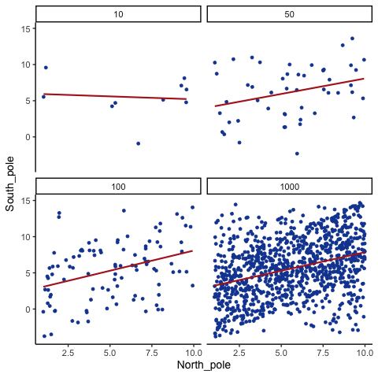

```{r, include = FALSE}
source("global_stuff.R")
library(tidyverse)
set.seed(538)
```

# Correlation {#Correlation}

> *Correlation does not equal causation.*
>
> Every Statistics Instructor Ever

In the last chapter, we worked with data that felt overwhelming at first. We used plots and histograms to make the data visible, and descriptive statistics to summarize their central tendency and variability.

We learned those tools because we want to use data to answer questions. That theme runs through this course. As you read each section, keep asking yourself: how does this concept help me answer questions with data?

In Chapter 1, we described a season of daily air quality measurements. The data were just numbers, but they already raised useful questions. How spread out were the ozone readings? Did most days cluster near the middle, or were there clusters of especially clean and especially polluted days?

We also saw that numbers are imperfect stand-ins for the thing we actually care about. Ozone concentration at one station is one way of capturing air quality, and it may not capture the whole idea, but it is meaningful enough to work with.

Every one of those questions was about **one variable at a time**. That is the limit we run into now. Describing a single variable well tells you nothing about whether it changes along with anything else, and most interesting questions are about exactly that. Does ozone rise on hotter days? Do wetter winters produce taller trees?

Answering those questions means moving from description to explanation. Rather than asking only how much of something we observed, we start asking what it changes along with, which is the core of correlation analysis.

## What data look like when one thing changes another

To use data for explanation, we need tools for recognizing when two things move together. Sometimes that reflects a real cause-and-effect relationship, and sometimes it doesn't. The challenge is learning to tell the difference. In this chapter we'll build intuition for what data look like when two variables are unrelated, when they move together, and when the pattern might mislead us.

### More Chocolate = More Happiness?

Suppose a person's chocolate supply has a causal influence on their happiness: more chocolate means more happiness, less chocolate means less. Because happiness is also caused by plenty of other things in a person's life, we'd expect the relationship between chocolate and happiness to be real but imperfect, not a perfect one-to-one match.

Our first step is to collect some imaginary data from 100 people. We walk around and ask the first 100 people we meet to answer two questions:

1.  how much chocolate do you have? and
2.  how happy are you?

For convenience, both the scales will go from 0 to 100. For the chocolate scale, 0 means no chocolate, 100 means lifetime supply of chocolate. Any other number is somewhere in between. For the happiness scale, 0 means no happiness, 100 means all of the happiness, and in between means some amount in between.

Here is some sample data from the first 10 imaginary subjects.

```{r 3chocHappy}
subject <- 1:100
chocolate <- round(1:100*runif(100,.5,1))
happiness <- round(1:100*runif(100,.5,1))

the_df_CC <- data.frame(subject,chocolate,happiness)


the_df_short <- the_df_CC[1:10,]

knitr::kable(the_df_short)
```

We asked each subject two questions so there are two scores for each subject, one for their chocolate supply, and one for their level of happiness. You might already notice some relationships between amount of chocolate and level of happiness in the table. To make those relationships even more clear, let's plot all of the data in a graph.

### Scatter plots

When you have two measurements worth of data, you can always turn them into dots and plot them in a scatter plot. A scatter plot has a horizontal x-axis, and a vertical y-axis. You get to choose which measurement goes on which axis. Let's put chocolate supply on the x-axis, and happiness level on the y-axis. @fig-2scatter1 shows 100 dots. Each dot is for one subject and represents both their happiness level and their chocolate supply.

```{r}
#| label: fig-2scatter1
#| fig-cap: "Imaginary data showing a positive correlation between amount of chocolate and amount happiness"

library(ggplot2)

ggplot(the_df_CC,aes(x=chocolate,y=happiness))+
  geom_point()


```

Each dot has two coordinates, an x-coordinate for chocolate, and a y-coordinate for happiness. Looking at the **scatter plot**, we can see that the dots show a pattern. People with less chocolate tend to report lower happiness, while those with more chocolate tend to report higher happiness. It looks like the more chocolate you have the happier you will be, and vice-versa. This kind of relationship is called a **positive correlation**.

### Positive, Negative, and No-Correlation

Two other patterns are worth seeing: a reversed relationship, where more chocolate means less happiness, and no relationship at all, where chocolate supply has nothing to do with happiness. @fig-2posnegrand shows all three side by side:

```{r}
#| label: fig-2posnegrand
#| fig-cap: "Three scatterplots showing negative, positive, and zero correlation"

subject_x<-1:100
chocolate_x<-round(1:100*runif(100,.5,1))
happiness_x<-round(1:100*runif(100,.5,1))

df_positive<-data.frame(subject_x,chocolate_x,happiness_x)

subject_x<-1:100
chocolate_x<-round(1:100*runif(100,.5,1))
happiness_x<-round(100:1*runif(100,.5,1))

df_negative<-data.frame(subject_x,chocolate_x,happiness_x)

subject_x<-1:100
chocolate_x<-round(runif(100,0,100))
happiness_x<-round(runif(100,0,100))

df_random<-data.frame(subject_x,chocolate_x,happiness_x)

all_data<-rbind(df_positive,df_negative,df_random)
all_data<-cbind(all_data,correlation=rep(c("positive","negative","random"),each=100))

ggplot(all_data,aes(x=chocolate_x,y=happiness_x))+
  geom_point()+
  theme(panel.border=element_rect(colour = "black", fill=NA))+
  facet_wrap(~correlation)+
  xlab("chocolate supply")+
  ylab("happiness")


```

The first panel shows a **negative correlation**: happiness goes down as chocolate supply increases, more of X means less of Y. The second panel shows a **positive correlation**: happiness goes up as chocolate supply increases, more of X means more of Y. The third panel shows **no correlation**: there's no obvious relationship between chocolate supply and happiness, changes in X don't relate to changes in Y.

::: {.callout-tip title="Tip: Always plot first"}
If the scatter shows a U-shape or other curve, a single straight-line correlation will mislead. Fit a curved model (e.g., add a quadratic term) or transform variables instead of reporting *r* alone.
:::

We've already covered how to generate descriptive statistics for individual variables through means, standard deviations, etc. But to summarize how two variables move together in a single descriptive statistic, we need a new one: Pearson's $r$. The path there starts with understanding covariance.

## How much does one variable vary?

Before we can measure how two variables move *together*, we need a number for how much a single variable moves at all. That turns out to be the same machinery, used twice, so we build it once here and then extend it on the next page.

### Difference Scores

It would be nice to summarize the amount of different*ness* in the data. Think about these 10 ordered numbers:

> 1 3 4 5 5 6 7 8 9 24

One idea is to compare every number to every other number. It works, but it scales badly: 10 numbers give 100 pairwise differences, and 500 numbers would give 250,000. If all the values were identical every difference would be 0 and the lack of variation would be obvious, but with real data we just get a large pile of differences. The natural way to summarize a pile of numbers is the one we just learned, so let's take their **average**.

Let's try it on a set small enough to see all at once:

> 1 2 3

```{r 2diffscoreSmall,echo=F}
numbers<-c(1, 2,3)
mat<-matrix(rep(numbers,3),ncol=3)
differences<-t(mat)-numbers
row.names(differences)<-numbers
colnames(differences)<-numbers
knitr::kable(differences, row.names=T)
```

The mean of these nine difference scores is:

$\text{mean of difference scores} = \frac{0+1+2-1+0+1-2-1+0}{9} = \frac{0}{9} = 0$

This will always happen: the positives and negatives cancel. So the mean of raw difference scores is not a useful measure of variation.

Notice also that the matrix is redundant: the diagonal is always zero, and values above and below the diagonal are the same except for sign.

These problems motivate why we compute **variance** and **standard deviation**. They solve the cancellation issue and give us a practical summary of spread.

### The Variance

We have used the words variability, variation, and variance a lot, and they all point at the same idea: numbers differ. The word *variance* does double duty, though. Loosely it means that general idea. Precisely it names a specific statistic, the **mean of the squared deviations from the mean**.

To calculate it, subtract the mean from each score to get its **difference score**, square those differences, then average them. Squaring is the trick that stops positive and negative deviations from cancelling. In short:

$variance = \frac{\text{Sum of squared difference scores}}{\text{Number of Scores}}$

A little further on we'll distinguish between dividing by $N$ (when you have the entire population) and $n-1$ (when you only have a sample, which is almost always the case). For now, just use $N$.

**Deviations from the mean.**

Earlier we compared every number to every other number, which got unmanageable fast. The simpler approach is to compare each score to the mean instead: find the mean, then subtract it from every score. What comes back tells us both how well the mean represents the data and how much spread there is around it.

```{r 2deviations,echo=F, message=F,warning=F}
library(dplyr)
scores<-1:6
values<-c(1,6,4,2,6,8)
mean_scores<-mean(values)
Difference_from_Mean<-values-mean_scores
the_df<-data.frame(scores,values,mean=rep(mean_scores,6),Difference_from_Mean)

the_df <- the_df %>%
  rbind(c("Sums",colSums(the_df[1:6,2:4]))) %>%
  rbind(c("Means",colMeans(the_df[1:6,2:4])))
knitr::kable(the_df)

```

The mean here is $\frac{1+6+4+2+6+8}{6} = \frac{27}{6} = 4.5$. The third column just repeats it on every row, which looks redundant but makes the earlier point concrete: six copies of 4.5 add back to the original total of 27. The fourth column is the **deviation from the mean**, $X_{i}-\bar{X}$, so the score of 1 sits 3.5 below and the score of 6 sits 1.5 above.

**And now the problem.** Those deviations sum to zero. The positives and negatives cancel exactly, which would suggest there is no variation at all, and that is obviously false. Squaring will fix it, but first it is worth seeing *why* the cancellation happens.

**Mean as the Balancing Point.**

The mean is the balancing point of the data. Imagine laying a ruler across your finger. The place where it balances is the point where the weight on each side is equal. Data works the same way: if we treat each value like a weight, the mean is where the total "mass" to the left and right cancel out.

This balancing property explains why the deviations always sum to zero. The values below the mean contribute negative deviations, the values above contribute positive ones, and together they cancel:

$-x + x = 0$

To see this more concretely, consider the numbers

$X = (1,2,6,7,9)$

```{r}
#| label: fig-number-line
#| fig-cap: "Values on a number line."
#| fig-width: 7
#| fig-height: 1.3
#| fig-alt: "Horizontal number line with dots at 1, 2, 6, 7, and 9, each labeled above."

library(tidyverse)

values <- c(1, 2, 6, 7, 9)
rng <- range(values)
pad <- diff(rng) * 0.12
xmin <- rng[1] - pad
xmax <- rng[2] + pad

tibble(values = values) %>%
  ggplot(aes(x = values, y = 0)) +
  # the number line (horizontal at y = 0)
  geom_segment(aes(x = xmin, xend = xmax, y = 0, yend = 0),
               linewidth = 1, color = "grey65") +
  # small end caps (optional)
  geom_point(data = tibble(xs = c(xmin, xmax), ys = 0),
             aes(x = xs, y = ys),
             shape = 22, size = 5, fill = "black", color = "grey50") +
  # points (the values)
  geom_point(size = 3, color = "#3B82F6") +
  # labels above each dot
  geom_text(aes(y = 0.02, label = values),
            vjust = 0, size = 6, color = "grey20") +
  # tidy canvas
  scale_y_continuous(NULL, breaks = NULL, limits = c(-0.15, 0.25)) +
  coord_cartesian(xlim = c(xmin, xmax), expand = FALSE) +
  labs(x = NULL, y = NULL) +
  theme_classic(base_size = 12) +
  theme(
    axis.text = element_blank(),
    axis.ticks = element_blank(),
    axis.line  = element_blank(),
    plot.margin = margin(0, 0, 0, 0)
  )
```

Now imagine the number line as a teeter-totter. Only when the fulcrum is placed at 5 does the board balance:

```{r}
#| label: fig-mean-balance-panels
#| fig-cap: "Mean as the unique balancing point. Only at the mean do signed deviations cancel."
#| fig-alt: "Three panels with a horizontal number line and a triangular fulcrum; the board tilts left/right when the fulcrum is not at the mean, and is level at the mean."

library(tidyverse)
library(patchwork)   # or ggpubr/cowplot if you prefer

# ---- Helper to draw one board given a candidate fulcrum 'a' ----
balance_board <- function(x, a, title = NULL) {
  rng <- range(x)
  pad <- diff(rng) * 0.12
  xmin <- rng[1] - pad; xmax <- rng[2] + pad
  
  # Tilt proportional to (mean - a): zero tilt at a = mean(x)
  tilt <- (mean(x) - a) / diff(rng) * 0.25
  
  fulcrum_drop <- 0.1
  
  tibble(x = x) %>%
    ggplot(aes(x = x)) +
    # the board
    geom_segment(aes(x = xmin, xend = xmax,
                     y = -tilt*(xmin - a), yend = -tilt*(xmax - a)),
                 linewidth = 1, color = "grey65") +
    # supports as light squares (purely decorative)
    geom_point(data = tibble(xs = c(xmin, xmax),
                             ys = c(-tilt*(xmin - a), -tilt*(xmax - a))),
               aes(x = xs, y = ys),
               shape = 22, size = 4, fill = "black", color = "grey50") +
    # dots (the "weights")
    geom_point(aes(y = -tilt*(x - a)), size = 3, color = "#3B82F6") +
    # labels above dots
    geom_text(aes(y = -tilt*(x - a) + 0.08, label = x),
              vjust = 0, size = 6, color = "grey20") +
    # fulcrum (triangle)
    geom_point(aes(x = a, y = -fulcrum_drop), shape = 24, size = 8,
               fill = "#F97316", color = "#F97316") +
    annotate("text", x = a, y = -0.3,
             label = format(a, trim = TRUE), size = 7) +
    coord_cartesian(ylim = c(-0.4, 0.35), xlim = c(xmin, xmax), expand = FALSE) +
    labs(title = NULL, x = NULL, y = NULL) +
    theme(axis.ticks = element_blank(),
          axis.line = element_blank(),
          axis.text = element_blank(),
          plot.title = element_blank())
}

# ---- Example vector and candidate fulcrums ----
x <- c(1, 2, 6, 7, 9)
mu <- mean(x)

p_left  <- balance_board(x, a = 3)
p_right <- balance_board(x, a = 7)
p_mean  <- balance_board(x, a = mu)

top <- (p_left| plot_spacer()) +
  plot_layout(widths = c(3, 2))
middle <- (plot_spacer() | p_right) +
  plot_layout(widths = c(2, 3)) 
bottom <- (plot_spacer() | p_mean | plot_spacer()) +
  plot_layout(widths = c(1, 3, 1))   # << apply to bottom row only

top / middle/ bottom
```

Formally, this means the signed distances from the mean always cancel out:

$(1−5)+(2−5)+(6−5)+(7−5)+(9−5)=0$

This makes the mean unique. It is the **only value** for which the sum of deviations equals zero:

$\sum_{i=1}^{n}(x_{i}-a) = 0 \quad \Rightarrow \quad a = \bar{x}$

The mean is not just a "typical" value, it is the one point where the data balance. And that balancing property is exactly why the raw deviations always sum to zero. To summarize variation, we need a way around this problem.

**The squared deviations.**

The standard trick is to square the deviations. Since $2^2 = 4$ and $(-2)^2 = 4$, squaring turns every negative into a positive, so the deviations can no longer cancel. We call these **squared deviations**. Here is the same table with a column for them:

```{r 2deviationssquared,echo=F}
scores<-1:6
values<-c(1,6,4,2,6,8)
mean_scores<-mean(values)
Difference_from_Mean<-values-mean_scores
Squared_Deviations <- Difference_from_Mean^2
the_df<-data.frame(scores,values,mean=rep(mean_scores,6),Difference_from_Mean,Squared_Deviations)

the_df <- the_df %>%
  rbind(c("Sums",colSums(the_df[1:6,2:5]))) %>%
  rbind(c("Means",colMeans(the_df[1:6,2:5])))
knitr::kable(the_df)

```

The first score of 1 sits 3.5 below the mean, so its deviation is $-3.5$ and its squared deviation is $(-3.5)^2 = 12.25$. Now that nothing is negative we can add them up, and that total is the **sum of squares (SS)**. You will meet this quantity again in the ANOVA chapter, but there is nothing more to it than the sum of those squared deviations.

**Finally, the variance.**

We have already computed the variance, one step at a time, without naming it. The goal was a single number summarizing spread, but deviations give us as many numbers as we have data points, so we want their *average*. Sum the squared deviations, divide by how many there are, and that is **the variance**:

$$variance = \frac{SS}{N}$$

For our data it comes to 5.916. On its own that number is hard to interpret, because squaring the deviations put it on a *squared* scale, so it is no longer in the same units as the data. The fix is to take the square root, $\sqrt{5.916} \approx 2.43$.

### The Standard Deviation

That square root is the **standard deviation (SD)**, so we had already computed it a step earlier without naming it:

$$\text{standard deviation} = \sqrt{Variance} = \sqrt{\frac{SS}{N}} = \sqrt{\frac{\sum_{i}^{n}(x_{i}-\bar{x})^2}{N}}$$

The square root "unsquares" the variance, putting the measure of spread back on the original scale of the data. Here is the table one more time:

```{r,echo=F}
scores<-1:6
values<-c(1,6,4,2,6,8)
mean_scores<-mean(values)
Difference_from_Mean<-values-mean_scores
Squared_Deviations <- Difference_from_Mean^2
the_df<-data.frame(scores,values,mean=rep(mean_scores,6),Difference_from_Mean,Squared_Deviations)

the_df <- the_df %>%
  rbind(c("Sums",colSums(the_df[1:6,2:5]))) %>%
  rbind(c("Means",colMeans(the_df[1:6,2:5])))
knitr::kable(the_df)

```

Our standard deviation, $\sqrt{5.916} \approx 2.43$, makes far more sense than the variance did. A variance of 5.916 feels too large for this data because it is on the squared scale, but an SD of 2.43 lines up with the actual deviations, since most scores fall within about 2.4 of the mean of 4.5.

**That is what makes the SD so useful.** Told only that a dataset has a mean of 4.5 and an SD of 2.4, you already have a picture of it: values cluster around 4.5, not exactly at it, with a typical spread of two to three units either way. It gives you the *typical deviation* from the mean while staying in the original units.

### Mean Absolute Deviation

So far we've handled the "differences cancel out" problem by squaring deviations. But there's another simple option: take the **absolute value** of each deviation from the mean. That way, every difference becomes positive, and when we add them up we don't end up at zero.

Here's what that looks like for our data:

```{r 2absolute,echo=F}
scores<-1:6
values<-c(1,6,4,2,6,8)
mean_scores<-mean(values)
Difference_from_Mean<-values-mean_scores
Absolute_Deviations <- abs(Difference_from_Mean)
the_df<-data.frame(scores,values,mean=rep(mean_scores,6),Difference_from_Mean,Absolute_Deviations)

the_df <- the_df %>%
  rbind(c("Sums",colSums(the_df[1:6,2:5]))) %>%
  rbind(c("Means",colMeans(the_df[1:6,2:5])))
knitr::kable(the_df)

```

The last column shows absolute deviations. If we take their mean, we get the mean absolute deviation (MAD). Notice this acts a lot like the standard deviation: it's the average size of a deviation from the mean, only without squaring. Both approaches, squaring and taking absolute values, solve the same problem in slightly different ways. Squaring is more common because it leads to nice mathematical properties (like in regression and ANOVA), but the MAD can be more intuitive to interpret.

## Covariance

We now have a number for how one variable varies. **Covariance** is the same idea for two: it tells us whether being above the mean on $X$ tends to come with being above the mean on $Y$ (positive), below the mean on $Y$ (negative), or neither (near zero).

In our chocolate--happiness example, the scatter plot suggested that higher chocolate tends to come with higher happiness. That means the deviations from each mean often have the same sign, so their products are mostly positive: evidence of *positive* covariance. Put simply, the two variables **vary together**.

Covariance is important because it underlies correlation, regression, and many other statistical tools. It can feel abstract at first, so keep the core idea in mind: look at how each variable's deviations from its mean behave together.

::: {.callout-note title="Note: Covariance intuition"}
Think of a three-legged race. When partners move forward together, their steps align (positive covariance). When one moves forward as the other moves back, their steps oppose (negative covariance). If their steps are uncoordinated, there's no consistent pattern (covariance near zero).
:::

### Turning the numbers into a measure of Covariance

To turn "chocolate and happiness vary together" into an actual number, we need a way to measure that relationship directly. Consider our chocolate and happiness scores.

```{r 3chochappyCOV,echo=F}
the_df_temp <- data.frame(subject,chocolate,happiness,Chocolate_X_Happiness=chocolate*happiness)

the_df_short <- the_df_temp[1:10,]

the_df_short <- the_df_short %>%
  rbind(c("Sums",colSums(the_df_short[1:10,2:4]))) %>%
  rbind(c("Means",colMeans(the_df_short[1:10,2:4])))
knitr::kable(the_df_short)

```

We've added a new column called `Chocolate_X_Happiness`, which is simply each person's chocolate score multiplied by their happiness score. Why multiply? Because the products reveal how the two values move together.

-   Small × small → small product
-   Large × large → large product
-   Small × large → product in between

Now extend this idea from pairs to the whole dataset. If chocolate and happiness rise together (both above average at the same time), the summed products will be large. If one tends to rise while the other falls, the summed products will shrink. This is the basic logic behind **covariance**.

Suppose we have two variables, $X$ and $Y$. If $X$ and $Y$ go up together (both small at the same time, both large at the same time), their products will also be large when summed across the dataset. If one goes up while the other goes down (large pairs with small), the summed products will be much smaller.

Here are two tables to illustrate:

::: columns
::: {.column width="50%"}
```{r}
library(kableExtra)
df_xy <- data.frame(
  X = 1:10,
  Y = 1:10,
  XY = (1:10) * (1:10)
)
df_xy <- rbind(df_xy, Sums = colSums(df_xy))
knitr::kable(df_xy, caption="Aligned: sum = 385",   table.attr = 'style="margin-right:14px"') %>%
    kable_styling(full_width = FALSE, position = "left", bootstrap_options = "bordered")
  
```
:::

::: {.column width="50%"}
```{r}
df_ab <- data.frame(
  A = 1:10,
  B = 10:1,
  AB = (1:10) * (10:1)
)
df_ab <- rbind(df_ab, Sums = colSums(df_ab))
knitr::kable(df_ab,caption = "Reversed: sum = 220", table.attr = 'style="margin-left:14px"') %>%
  kable_styling(full_width = FALSE, position = "left", bootstrap_options = "bordered")
```
:::
:::

$X$ and $Y$ are perfectly aligned: $1$ with $1$, $2$ with $2$, up to $10$ with $10$. Their products add up to **385**, the *largest* possible sum.

$A$ and $B$ are perfectly reversed: $1$ with $10$, $2$ with $9$, and so on. Their products add up to **220**, the *smallest* possible sum.

Any other pairing of 1--10 with 1--10 will fall between these two extremes. @fig-2simsum shows the sums of products from 1000 random pairings. Every result falls between 220 (perfect negative alignment) and 385 (perfect positive alignment).

```{r}
#| label: fig-2simsum
#| fig-cap: "Simulated sums of products showing the kinds of values that can be produced by randomly ordering the numbers in X and Y."

simulated_sums <- numeric(1000)
for (sim in 1:1000){
  X <- sample(1:10)
  Y <- sample(1:10)
  simulated_sums[sim] <- sum(X * Y)
}
sim_df <- data.frame(sims = 1:1000, simulated_sums)

ggplot(sim_df, aes(x = sims, y = simulated_sums)) +
  geom_point() +
  geom_hline(yintercept = 385, linetype = "dashed") +
  geom_hline(yintercept = 220, linetype = "dashed")
```

The **sum of the products** tells us about the direction of the relationship:

-   Close to 385 → strong positive relationship.
-   Close to 220 → strong negative relationship.
-   Near the middle → little or no relationship.

This is the foundation of *covariance*: products of paired values reveal whether two variables rise together, fall together, or move in opposite directions.

### Covariance, the measure

Earlier we saw that multiplying values from two variables can highlight how they vary together: large-with-large and small-with-small pairs push the product up, while mixed pairs keep it lower. That intuition is useful, but in statistics we define **covariance** more precisely.

Instead of multiplying raw values of $X$ and $Y$, we multiply their *deviations from the mean*. This centers each variable, so the product reflects how the two variables co-vary around their averages:

$cov(X,Y) = \frac{\sum_{i}^{n}(x_{i}-\bar{X})(y_{i}-\bar{Y})}{N}$

In practice, the steps are straightforward: subtract the mean of $X$ from each $x_i$, subtract the mean of $Y$ from each $y_i$, multiply the deviations, and then average those products. A positive covariance means the two variables tend to move together (above or below their means at the same time). A negative covariance means they move in opposite directions. A covariance near zero suggests no consistent relationship.

The following table shows this process:

```{r 3cov,echo=F}
the_df<-the_df_CC

the_df_short<-the_df[1:10,]

the_df_short<-cbind(the_df_short,
                    C_d = round((chocolate[1:10]-mean(chocolate[1:10])),digits=2),
                    H_d = round((happiness[1:10]-mean(happiness[1:10])),digits=2),
                    Cd_x_Hd = round(((chocolate[1:10]-mean(chocolate[1:10]))* (happiness[1:10]-mean(happiness[1:10]))),digits=2))

the_df_short <- the_df_short %>%
  rbind(c("Sums",round(colSums(the_df_short[1:10,2:6])),digits=2)) %>%
  rbind(c("Means",round(colMeans(the_df_short[1:10,2:6]),digits=2)))

knitr::kable(the_df_short)

```

Deviations from the mean for chocolate (column `C_d`), deviations from the mean for happiness (column `H_d`), and their products. The mean of those products (in the bottom right corner of the table) is the official **covariance**.

One note before moving on. The formula above divides by $N$, which is the population version, and that is what the table computes. R's `cov()` and `sd()` divide by $n-1$ instead, for the same reason the sample standard deviation did earlier in this chapter. The two differ only by a factor of $n/(n-1)$, and that factor cancels completely in Pearson's $r$ below, so $r$ comes out identical either way. If you compute the covariance itself in R, though, expect a slightly larger number than the one in this table.

Covariance is a powerful idea, but it has a major drawback: its magnitude is hard to interpret. Just as variance is tied to squared units, covariance is tied to the scales of both variables, so a covariance of 3.22 isn't inherently "large" or "small" the way a correlation is. All we can read directly from it is the sign, not the strength. To compare strength across variables with different units or scales, we need to normalize covariance, which leads to Pearson's $r$.

### Pearson's r

We often want a relationship measure that is **directional**, **unitless**, and **bounded**. **Pearson's** $r$ does exactly this by rescaling covariance to lie between $-1$ and $1$:

-   $r=1$: perfect positive linear relationship
-   $r=0$: no linear relationship
-   $r=-1$: perfect negative linear relationship

Values closer to $\pm1$ indicate stronger linear association; values near $0$ indicate weak or no linear association.

Let's take a look at a formula for Pearson's $r$:

$r = \frac{cov(X,Y)}{\sigma_{X}\sigma_{Y}} = \frac{cov(X,Y)}{SD_{X}SD_{Y}}$

Here, $\sigma$ is the standard deviation (SD), so $r$ is the covariance of X and Y divided by the product of their standard deviations. Dividing by the standard deviations **normalizes** the covariance, constraining $r$ to fall between -1 and 1, which makes correlation values comparable across variables measured in different units or on different scales.

::: {.callout-note title="Note: Computing *r*"}
You'll see several algebraically equivalent formulas for Pearson's *r*, some easier for hand calculation, others more compact. They all produce the same result. Since we rely on software for calculations, our focus is on what $r$ means and how to interpret it, not manual computation, you'll run the calculation in R during lab.
:::

To confirm $r$ really does stay between -1 and 1, @fig-2onethousandr shows a simulation: we randomly ordered the numbers 1 to 10 for both an X measure and a Y measure, computed Pearson's $r$ between them, and repeated the process 1000 times. Every dot falls between -1 and 1.

```{r}
#| label: fig-2onethousandr
#| fig-cap: "A simulation of correlations. Each dot is the r-value between an X and Y variable that each contain the numbers 1 to 10 in random orders."

simulated_sums <- numeric(0)
for(sim in 1:1000){
  X <- sample(1:10)
  Y <- sample(1:10)
  simulated_sums[sim] <- cor(X,Y)
}

sim_df <- data.frame(sims=1:1000,simulated_sums)

ggplot(sim_df, aes(x = sims, y = simulated_sums))+
  geom_point() +
  geom_hline(yintercept = -1)+
  geom_hline(yintercept = 1)+
  ggtitle("Simulation of 1000 r values")

```

## Regression: A mini intro

This section adds one more piece to our understanding of correlation: **linear regression**, at an introductory level.

@fig-2regression shows the same three scatter plots as before, now with a fitted line added to each.

```{r}
#| label: fig-2regression
#| fig-cap: "Three scatterplots showing negative, positive, and a random correlation (where the r-value is expected to be 0), along with the best fit regression line"

subject_x<-1:100
chocolate_x<-round(1:100*runif(100,.5,1))
happiness_x<-round(1:100*runif(100,.5,1))

df_positive<-data.frame(subject_x,chocolate_x,happiness_x)

subject_x<-1:100
chocolate_x<-round(1:100*runif(100,.5,1))
happiness_x<-round(100:1*runif(100,.5,1))

df_negative<-data.frame(subject_x,chocolate_x,happiness_x)

subject_x<-1:100
chocolate_x<-round(runif(100,0,100))
happiness_x<-round(runif(100,0,100))

df_random<-data.frame(subject_x,chocolate_x,happiness_x)

all_data<-rbind(df_positive,df_negative,df_random)
all_data<-cbind(all_data,correlation=rep(c("positive","negative","random"),each=100))

ggplot(all_data,aes(x=chocolate_x,y=happiness_x))+
  geom_point() +
  geom_smooth(method="lm",se=F, color="#b22222")+
  facet_wrap(~correlation)+
  xlab("chocolate supply")+
  ylab("happiness")

```

### The best fit line

Notice the red lines in these panels. Each is a **best fit** line: the single straight line that best summarizes the overall pattern of dots.

With one variable, we use the mean to describe central tendency in one dimension. With two variables plotted together, we need a two-dimensional equivalent. A line serves that purpose, capturing the average relationship across the cloud of points.

Many lines could be drawn through a scatter of points, but most would miss the pattern. The best fit line is the one with the least error, defined precisely below.

@fig-2regressionResiduals shows what that error looks like: a line runs through the dots, and short vertical lines drop from each dot to the line. These are **residuals**, the vertical differences between the observed data and the fitted line, showing how far off the line's prediction is for each point. Since not all dots fall exactly on the line, some error is inevitable; the best-fit line is the one that minimizes it overall.

```{r}
#| label: fig-2regressionResiduals
#| fig-cap: "Black dots are the data, white dots are the values the regression line predicts, and the red lines are the errors between them. R code for residual visualization adapted from Simon Jackson: <https://drsimonj.svbtle.com/visualising-residuals>"

d <- mtcars
fit <- lm(mpg ~ hp, data = d)
d$predicted <- predict(fit)   # Save the predicted values
d$residuals <- residuals(fit) # Save the residual values

ggplot(d, aes(x = hp, y = mpg)) +
  geom_smooth(method = "lm", se = FALSE, color = "#1446a0") +  # Plot regression slope
  geom_segment(aes(xend = hp, yend = predicted), color = "#b22222", alpha = .5) +  # alpha to fade lines
  geom_point(color = "black") +
  geom_point(aes(y = predicted), shape = 1, color = "black") +
  theme(legend.position="none")+
  xlab("X")+ylab("Y")

# Quick look at the actual, predicted, and residual values
#library(dplyr)
#d %>% select(mpg, predicted, residuals) %>% head()

```

@fig-2regressionResiduals shows a scatter plot of two variables $X$ and $Y$. Each black dot represents observed data; the blue line is the regression line, and the white dots show its predicted values. The red lines are **residuals**: they drop vertically from each observed value to its predicted value on the line, showing how far the prediction differs from what was actually observed.

The regression line is chosen to minimize the total size of these residuals. In practice, we compute the **sum of squared deviations**: square each residual, then add them together. The blue line produces the smallest possible total squared error; any other line would yield a larger one.

@fig-2regressionGIF animates this directly, comparing the best fit line (blue) to other possible lines (black) as the black line moves up and down. The red lines show the error between the black line and the data points at each position, and the shaded grey area shrinks to its minimum exactly when the black line reaches the best fit line, then expands again as it moves away.

::: {.content-visible when-format="html"}
```{r}
#| label: fig-2regressionGIF
#| fig-cap: "The black line moves through alternative positions while the blue best-fit line stays put. Red lines show each point's error, and the shaded grey area is their total, which shrinks to a minimum exactly at the best-fit line."
#| out-width: "75%"

knitr::include_graphics(path="imgs/gifs/regression-1.gif")
```
:::

::: {.content-visible when-format="pdf"}
{#fig-2regressionGIF width="75%"}
:::

Whenever the black line does not overlap with the blue line, it fits the data less well: the blue regression line is the one that minimizes the overall error, not too high, not too low, but the line with the least total deviation.

@fig-2minimizeSS makes that error concrete: for each position of the black line, we square the length of every red line from the animation above and add them up, giving the total sum of squared deviations at that position. The dots start high on the left, swoop down to a minimum in the middle, and rise again on the right. That minimum point is the best fit regression line.

```{r}
#| label: fig-2minimizeSS
#| fig-cap: "A plot of the sum of the squared deviations for different lines moving up and down, through the best fit line. The best fit line occurs at the position that minimizes the sum of the squared deviations."
#| out-width: "75%"

d <- mtcars
fit <- lm(mpg ~ hp, data = d)
d$predicted <- predict(fit)   # Save the predicted values
d$residuals <- residuals(fit) # Save the residual values

coefs<-coef(lm(mpg ~ hp, data = mtcars))
#coefs[1]
#coefs[2]

x<-d$hp
move_line<-seq(-5,5,.5)
total_error<-c(length(move_line))
cnt<-0
for(i in move_line){
  cnt<-cnt+1
  predicted_y <- coefs[2]*x + coefs[1]+i
  error_y <- (predicted_y-d$mpg)^2
  total_error[cnt]<-sum(error_y)
}
df<-data.frame(move_line,total_error)
ggplot(df,aes(x=move_line,y=total_error))+
  geom_point() +
  ylab("sum of squared deviations")+
  xlab("change to y-intercept")

```

This graph shows how the total error behaves as the line's y-intercept moves up and down: the error rises whether we shift the line down (0 to -5) or up (0 to +5), and is smallest right in the middle, at the original best fit line.

### Computing the best fit line

How do we find the line that minimizes the sum of squared deviations? In principle, you could try many possible lines and compare their errors, but that's not efficient. Instead, we use formulas (or, more realistically, software) to identify the line with the smallest total error.

Next we'll look at the formulas for calculating the slope and intercept of a regression line, and work through one example by hand. Many statistical formulas were designed to simplify hand calculations before computers were common. Today we rely on software, but working through examples by hand helps illustrate the logic behind the formulas.

Here are two formulas we can use to calculate the slope and the intercept, straight from the data. We won't go into why these formulas do what they do. These ones are for "easy" calculation.

$intercept = b = \frac{\sum{y}\sum{x^2}-\sum{x}\sum{xy}}{n\sum{x^2}-(\sum{x})^2}$

$slope = m = \frac{n\sum{xy}-\sum{x}\sum{y}}{n\sum{x^2}-(\sum{x})^2}$

In these formulas, the $x$ and the $y$ refer to the individual scores. Here's a table showing you how everything fits together.

```{r 3morcov}
scores<-c(1,2,3,4,5,6,7)
x<-c(1,4,3,6,5,7,8)
y<-c(2,5,1,8,6,8,9)
x_squared<-x^2
y_squared<-y^2
xy<-x*y

all_df<-data.frame(scores,x,y,x_squared,y_squared,xy)

all_df <- all_df %>%
  rbind(c("Sums",colSums(all_df[1:7,2:6]))) 

intercept=((sum(y)*sum(x_squared))-(sum(x)*sum(xy)))/((7*sum(x_squared))-sum(x)^2)
slope=(7*sum(xy)-sum(x)*sum(y))/(7*sum(x_squared)-sum(x)^2)

knitr::kable(all_df)

```

The table has 7 pairs of $x$ and $y$ scores, plus columns for $x^2$, $y^2$, and $xy$ (each $x$ score times its matching $y$ score), with column sums at the bottom. These sums are everything the formulas need. Here's what they look like with numbers plugged in:

$intercept = b = \frac{\sum{y}\sum{x^2}-\sum{x}\sum{xy}}{n\sum{x^2}-(\sum{x})^2} = \frac{39 * 200 - 34*231}{7*200-34^2} = -.221$

$slope = m = \frac{n\sum{xy}-\sum{x}\sum{y}}{n\sum{x^2}-(\sum{x})^2} = \frac{7*231-34*39}{7*200-34^2} = 1.19$

To check the work, plot the scores and draw a line through them with slope = 1.19 and y-intercept = -.221. As shown in @fig-2corwithLine, the line runs through the middle of the dots, as it should.

```{r}
#| label: fig-2corwithLine
#| fig-cap: "An example regression line going through a few data points in a scatterplot."
#| out-width: "75%"

plot_df<-data.frame(x,y)

ggplot(plot_df,aes(x=x,y=y))+
  geom_point() +
  geom_smooth(method="lm",se=FALSE, color="#b22222")
  
#coef(lm(y~x,plot_df))

```

## Interpreting Correlations: why caution is warranted

You've heard the warning that **correlation does not equal causation**. Interpreting correlations requires care, because the same number can arise from very different situations: random chance, confounding influences, or nonlinear patterns. In this section, we'll look at why correlations can be unreliable and how to recognize their limits.

### Spurious correlation: chance alone can look convincing

Correlations can be produced by random chance. You can find a positive or negative correlation between two measures that have nothing to do with one another, and you will, often enough that it matters. Unrelated measures produce these **spurious** correlations by chance alone.

Let's demonstrate how correlations can appear by chance when there is no causal connection between two measures. Imagine two independent participants, one at the North Pole and one at the South Pole. Each has a lottery machine containing balls numbered 1 through 10. With replacement, each participant randomly draws 10 balls and records the numbers. Because the draws occur independently and half a world apart, there is no possible causal link between the two sets of numbers. The outcomes are determined by chance alone.

Here is what the numbers on each ball could look like for each participant:

```{r 3northsouth}

Ball<-1:10
North_pole<-sample(1:10,10,replace=TRUE)
South_pole<-sample(1:10,10,replace=TRUE)

the_df_balls<-data.frame(Ball,North_pole,South_pole)

#the_df_balls <- the_df_balls %>%
#  rbind(c("Sums",colSums(the_df_balls[1:10,2:3]))) %>%
#  rbind(c("Means",colMeans(the_df_balls[1:10,2:3])))
knitr::kable(the_df_balls)

```

In this one case, if we computed Pearson's $r$, we would find that $r =$ `r round(cor(North_pole,South_pole), 2)`. But, we already know that this value does not tell us anything about the relationship between the balls chosen in the north and south pole. We know that relationship should be completely random, because that is how we set up the game.

The better question is what random chance alone can do: if we ran this game thousands of times, each time drawing new balls and computing the correlation, the $r$ value would fluctuate across the whole range. Looking at the shape of that fluctuation tells us what kinds of correlations chance can produce.

**Monte-carlo: what chance produces.**

We can use a computer to repeat the lottery game as many times as we like. This process, repeated random sampling to explore possible outcomes, is called a **Monte Carlo simulation**.

Running the game 1,000 times, each time generating 10 random numbers for both the North Pole and South Pole participants and computing the correlation between them, gives 1,000 different values of Pearson's $r$, each produced under conditions where we know no real relationship exists.

```{r}
#| label: fig-2anotherthousand
#| fig-cap: "Another figure showing a range of r-values that can be obtained by chance."
#| echo: false

simulated_correlations <- numeric(0)
for(sim in 1:1000){
  North_pole <- sample(1:10,10,replace=TRUE)
  South_pole <- sample(1:10,10,replace=TRUE)
  simulated_correlations[sim] <- cor(North_pole,South_pole)
}

sim_df <- data.frame(sims=1:1000,simulated_correlations)

ggplot(sim_df, aes(x = sims, y = simulated_correlations))+
  geom_point() +
  geom_hline(yintercept = -1)+
  geom_hline(yintercept = 1)+
  ggtitle("Simulation of 1000 r values")
```

@fig-2anotherthousand shows the outcome. Each dot is one simulated correlation. All of them fall between --1 and 1, but the values scatter widely: sometimes strongly positive, sometimes strongly negative, often near zero. The point is that **chance alone can generate correlations of any size**. Finding a correlation in your data does not by itself guarantee a meaningful relationship.

To visualize this process more concretely, we can animate a single run. In @fig-2randcor10gif, each frame shows two sets of 10 random values plotted against each other, along with the fitted regression line. Because the data are random, we expect no consistent pattern. Yet across repetitions, the line slopes upward, then downward, then occasionally flat. This is what spurious correlation looks like, and how quickly random samples can mimic a real pattern.

::: {.content-visible when-format="html"}
```{r}
#| label: fig-2randcor10gif
#| fig-cap: "Completely random data points drawn from a uniform distribution with a small sample size of 10. The red trend line twirls around sometimes showing large correlations that are produced by chance"
#| out.width: "75%"

knitr::include_graphics(path="imgs/gifs/corUnifn10-1.gif")
```
:::

::: {.content-visible when-format="pdf"}
{#fig-2randcor10gif width="75%"}
:::

```{r,echo=F, eval=FALSE}
#This needs to be saved out as the corUnifn10-1 file if I want it to show up in the textbook. 
library(gganimate)

all_df<-data.frame()
for(sim in 1:10){
  North_pole <- sample(1:10,10,replace=TRUE)
  South_pole <- sample(1:10,10,replace=TRUE)
  t_df<-data.frame(simulation=rep(sim,10),
                                  North_pole,
                                  South_pole)
  all_df<-rbind(all_df,t_df)
}


ggplot(all_df,aes(x=North_pole,y=South_pole))+
  geom_point() +
  geom_smooth(method=lm, se=FALSE, color="#b22222")+
  ggtitle("Pseudo correlations from two random variables")+
  transition_states(
    simulation,
    transition_length = 2,
    state_length = 1
  )+enter_fade() + 
  exit_shrink() +
  ease_aes('sine-in-out')
  
```

This leaves us with a real problem: **how do we know whether the correlation we observed is meaningful or just chance?** One way forward is to look at the whole distribution of outcomes chance produces, rather than at a single outcome. By simulating 1,000 random correlations and plotting them in a histogram, we can see which values occur frequently and which are rare.

```{r}
#| label: fig-2histrandcor
#| fig-cap: "A histogram showing the frequency distribution of r-values for completely random values between an X and Y variable (sample-size=10). A full range of r-values can be obtained by chance alone. Larger r-values are less common than smaller r-values"

ggplot(sim_df, aes(x = simulated_correlations)) +
  geom_histogram(breaks = seq(-1, 1, .1)) +
  xlab("Simulated r") +
  ylab("Count")
```

@fig-2histrandcor shows that most chance correlations cluster near zero. Moderate correlations (around $\pm 0.5$) occur less frequently, and near-perfect correlations ($\pm 0.95$) are almost absent. This distribution defines a "window of chance." When we compute a correlation in real data, we can ask: is our observed $r$ consistent with what chance alone could plausibly generate?

For example, if you observed $r=0.1$, the histogram shows that such values are common in random data, so chance could easily explain it. An observed $r=0.5$ is less common but still possible by chance. An observed $r=0.95$, however, falls outside what chance typically produces, suggesting that something more systematic is driving the relationship.

### Sample size and stability

So far, our lottery game has used 10 draws per participant. With such small samples, chance produces a wide range of correlations: sometimes strongly positive, sometimes strongly negative. But what happens if we increase the sample size?

We can repeat the simulation under four conditions: each participant draws 10, 50, 100, or 1000 numbers. In each case, we run 1000 simulations and record the correlation values.

@fig-2corrandN shows the resulting four histograms of Pearson $r$ values.

```{r}
#| label: fig-2corrandN
#| fig-cap: "Distributions of r-values between completely random X and Y variables, at four sample sizes. The distributions narrow as sample size grows."

all_df<-data.frame()
for(s_size in  c(10,50,100,1000)){
  simulated_correlations <- numeric(0)
  for(sim in 1:1000){
    North_pole <- runif(s_size,1,10)
    South_pole <- runif(s_size,1,10)
    simulated_correlations[sim] <- cor(North_pole,South_pole)
  }
sim_df <- data.frame(sample_size=rep(s_size,1000),sims=1:1000,simulated_correlations)
all_df<-rbind(all_df,sim_df)
}


ggplot(all_df,aes(x=simulated_correlations))+
  geom_histogram(breaks=seq(-1,1,.1))+
  facet_wrap(~sample_size, labeller = labeller(sample_size = function(x) paste0("n = ", x)))+
  xlab("Simulated r")+
  ylab("Count")

```

The pattern is clear:

-   With **n=10**, correlations spread widely across the range --1 to 1. Chance alone frequently produces values that would look "strong" in real data.
-   With **n=50 or 100**, the spread narrows, but moderate correlations still appear.
-   With **n=1000**, almost all simulated correlations fall close to zero.

The takeaway is that **larger samples reduce the influence of chance**. Small samples are highly unstable, making it difficult to distinguish signal from noise. As sample size increases, the distribution of chance correlations collapses toward zero, so observing a large $r$ becomes far less likely under randomness alone.

This illustrates why researchers place so much emphasis on collecting sufficient data. With too few observations, even strong-looking correlations may be spurious. With larger samples, a correlation of the same size is much harder to attribute to chance, and therefore more likely to reflect a real underlying relationship.

::: {.callout-tip title="Tip: Sample size"}
Bigger *n* narrows the "window of chance." If you expect a modest linear effect (e.g., \|r\| ≈ 0.2--0.3), plan for larger samples so random swings are less likely to mimic or mask the effect.
:::

**Visualizing the effect of sample size.**

Animations make it easier to see how sample size influences the stability of correlation estimates. When the sample is very small, chance variation can create apparent patterns in any direction. As the sample size increases, those chance fluctuations diminish.

**When there is no true correlation**

In @fig-2corRandfour, each panel shows two random variables sampled with no real relationship. The panels differ only in sample size: 10, 50, 100, or 1000 observations. Each frame of the animation re-samples the data, plots them, and fits a line.

With $n=10$, the line swings dramatically from positive to negative slopes. At $n=50$ and $n=100$, the line still shifts but is more restrained. At $n=1000$, the line is consistently flat, as expected when no correlation exists.

::: {.content-visible when-format="html"}
```{r}
#| label: fig-2corRandfour
#| fig-cap: "Animation of how correlation behaves for completely random X and Y variables as a function of sample size. The best fit line is not very stable for small sample-sizes, but becomes more reliably flat as sample-size increases."
#| out.width: "75%"

#Same with this one - want to make this in the same format, this is old one. 

knitr::include_graphics(path="imgs/gifs/corUnifFourNs-1.gif")
```
:::

::: {.content-visible when-format="pdf"}
{#fig-2corRandfour width="75%"}
:::

```{r, eval=F}
all_df<-data.frame()
for(sim in 1:10){
  for(n in c(10,50,100,1000)){
  North_pole <- runif(n,1,10)
  South_pole <- runif(n,1,10)
  t_df<-data.frame(nsize=rep(n,n),
                   simulation=rep(sim,n),
                                  North_pole,
                                  South_pole)
  all_df<-rbind(all_df,t_df)
  }
}


ggplot(all_df,aes(x=North_pole,y=South_pole))+
  geom_point() +
  geom_smooth(method=lm, se=FALSE)+
  facet_wrap(~nsize)+
  transition_states(
    simulation,
    transition_length = 2,
    state_length = 1
  )+enter_fade() + 
  exit_shrink() +
  ease_aes('sine-in-out')
  
```

The line from the sample with 1000 observations is the most reliable. It stays nearly flat across repetitions, as we would expect when no true correlation exists. The line from a sample of only 10 observations swings wildly. Claims about correlation are only as trustworthy as the sample size behind them.

**When there is a true correlation**

In @fig-2realcorFour, the simulation is repeated with a real positive correlation built into the data. Again, we vary the sample size from 10 to 1000.

With $n=10$, the regression line jumps around and occasionally even points downward, despite the underlying positive relationship. As the sample size grows, the line becomes more stable and consistently reflects the true positive slope. Sampling error still introduces some noise, but with larger samples the real correlation is much easier to detect.

::: {.content-visible when-format="html"}
```{r}
#| label: fig-2realcorFour
#| fig-cap: "How correlation behaves as a function of sample-size when there is a true correlation between X and Y variables."
#| out.width: "75%"

knitr::include_graphics(path="imgs/gifs/corRealgif-1.gif")
```
:::

::: {.content-visible when-format="pdf"}
{#fig-2realcorFour width="75%"}
:::

Even when a real positive correlation exists, a small sample might miss it, or even suggest the opposite, simply due to chance. Because we usually only have one sample, we can never know for certain whether we were "lucky" or "unlucky." The best protection is to collect more data.

### Nonlinearity: when r misses real relationships

Consider a snake plant. Like most plants, it needs water to stay alive, but also needs *the right amount* of water. Imagine we grow 1000 snake plants, each receiving a different amount of water per day, ranging from *no water* to *extreme overwatering* (say 1000 teaspoons a day), and measure their weekly growth. Water is clearly causally related to plant growth, so we'd expect to see a correlation.

Plants given no water at all will eventually die, showing little or no weekly growth. With only a few teaspoons per day, plants may survive but grow only modestly. In a scatter plot, those cases would appear near the bottom left (low water, low growth) and rise upward as water increases. Growth continues to improve until a threshold is reached, beyond which excess water harms the plants. Severely overwatered plants also fail to grow and eventually die, just as those given no water do.

The scatter plot would form an inverted U or V: as water increases, growth rises to a peak and then declines with overwatering. A relationship like this can produce a Pearson's $r$ close to zero, even though water clearly affects growth. @fig-2snakeplant illustrates this pattern.

```{r}
#| label: fig-2snakeplant
#| fig-cap: "Illustration of a possible relationship between amount of water and snake plant growth. Growth goes up with water, but eventually goes back down as too much water makes snake plants die."

water <- seq(0, 999, 1)
peak_growth <- 10
peak_water <- 500
spread <- 220
growth_mean <- peak_growth * exp(-((water - peak_water)^2) / (2 * spread^2))
noise <- rnorm(1000, mean = 0, sd = 1 + growth_mean / 2)
growth <- pmax(growth_mean + noise, 0)
snake_df <- data.frame(growth, water)

ggplot(snake_df, aes(x=water,y=growth))+
   geom_point() +
  xlab("Water (teaspoons)")+
  ggtitle("Imaginary snake plant growth \n as a function of water")

```

There is clearly a relationship between watering and snake plant growth. But, the correlation isn't in one direction. As a result, when we compute the correlation in terms of Pearson's r, we get a value very close to zero, suggesting no relationship.

```{r}
cor(growth,water)
```

What this really means is there is no relationship that can be described by a *single straight line*. When we need lines or curves going in more than one direction, we have a nonlinear relationship.

This example shows why correlations can be tricky to interpret. Water is clearly necessary for plant growth, yet the overall correlation can be misleading. The first half of the data suggests a positive relationship, the second half a negative one, and the full dataset little or none. Even with a real causal link, a single correlation coefficient may fail to capture it. This is one reason plotting matters: if you see an upside-down U in the scatter, correlation is probably not the right analysis for your data.

### Anscombe's Quartet: same statistics, different data

Everything so far has compressed a relationship into a number: a covariance, an $r$, a slope. Those numbers are summaries, and summaries lose things. The most famous demonstration of how much they can lose is a set of four datasets built to share almost every statistic you would think to compute.

Francis Anscombe (@Anscombe1973) made this point with a famous example, now called *Anscombe's Quartet*. Each panel in @fig-anscombe shows pairs of $x$ and $y$ values as a scatterplot.

Visually, the four panels are very different: one looks linear, one curved, one is mostly linear except for an outlier, and one forms a near-vertical line except for one point.

```{r}
#| label: fig-anscombe
#| fig-cap: "Anscombe's Quartet"
#| fig-alt: "Anscombe's Quartet, a set of four scatter plots each with a different pattern, despite having identical descriptive statistics. This illustrates the importance of graphing data to understand underlying relationships beyond basic statistical measures" 

library(data.table)
ac <- fread("data/anscombe.txt")
ac<-as.data.frame(ac)

ac_long<-data.frame(x=c(ac[,1],
                        ac[,3],
                        ac[,5],
                        ac[,7]),
                    y=c(ac[,2],
                        ac[,4],
                        ac[,6],
                        ac[,8]),
                    quartet = as.factor(rep(1:4,each=11))
                        )

ggplot(ac_long, aes(x=x, y=y))+
  geom_point(size=1.8, color="#1446a0")+
  geom_smooth(method="lm", se=FALSE, color="#b22222")+
  theme_classic(base_size=16)+
  facet_wrap(~quartet)

```

Yet if we summarize each quartet with just its descriptive statistics:

```{r}
library(dplyr)

ac_long_summary <- ac_long %>%
                    dplyr::group_by(quartet) %>%
                    dplyr::summarise(mean_x = mean(x),
                              var_x = var(x),
                              mean_y = mean(y),
                              var_y = var(y),
                              cor_xy = cor(x, y))

knitr::kable(ac_long_summary, digits = 2)

```

Rounded to two decimals, all four datasets have the **same descriptive statistics**:

-   same mean and variance for $x$

-   same mean and variance for $y$

-   same correlation between $x$ and $y$

Yet the scatterplots could not look more different. (Anscombe constructed the four sets to agree to two decimal places, so they differ very slightly beyond that. Carry more decimals and the variances of $y$ separate in the third one.)

### Confounding variables (third-variable problem)

Correlations can arise because of a third variable: something not directly measured that influences both variables of interest. Returning to the snake plant example: imagine we measure water and plant growth, but ignore sunlight. If plants in sunnier windows both receive more water and grow faster, we might attribute the effect to water alone, when in fact sunlight is doing much of the work.

The same issue appears in human data. Suppose we find that income and happiness are positively correlated. Money itself might be the cause, but other factors, such as housing quality, healthcare access, or social opportunities, may be the true drivers, correlated with income and independently influencing happiness.

## Chapter Summary

**Why it matters.** Correlation is how we quantify whether two variables move together. It's essential for describing patterns (e.g., temperature and canopy cover, chocolate and happiness) and for deciding whether a relationship is worth modeling or acting on.

**Core ideas**

-   **Scatter first, always.** A scatter plot shows direction (up, down, none), form (straight vs curved), and outliers. If the pattern is curved, don't stop at *r*: fit a suitable model (e.g., add a quadratic term) or transform a variable instead.
-   **Covariance → correlation.** Covariance measures whether deviations from each mean tend to align. Pearson's *r* rescales covariance by the standard deviations so the result is unitless and bounded (\[-1, 1\]).
-   **Interpreting *r*.** Sign indicates direction; magnitude indicates strength of a *linear* relationship. *r* near 0 can still hide a strong *nonlinear* pattern.
-   **Regression link.** The best-fit line summarizes the average relationship; residuals are the vertical gaps between data and the line. The line is chosen to minimize the **sum of squared residuals**.
-   **Chance alone can manufacture a correlation.** Small samples can produce large \|*r*\| by accident, and larger samples shrink the "chance window" toward 0. Always report *r* alongside its sample size (*n*) and, when possible, a confidence interval. If a result hinges on a small sample, say so and treat the conclusion as tentative.
-   **Nonlinearity hides real effects.** Curved relationships (e.g., too little or too much water harming plant growth) can yield *r* ≈ 0 even when the underlying effect is strong.
-   **Confounding.** A third variable can create or inflate a correlation (e.g., sunlight affecting both watering patterns and plant growth). This is why the honest phrasing is "associated with," not "caused by."
