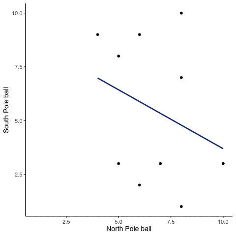

```{r, include = FALSE}
source("global_stuff.R")
library(tidyverse)
set.seed(538)
source("imgs/gifs/ch2_cor_true_r.R")  # true_r, the true correlation in fig-2realcorFour
```

# Correlation {#Correlation}

> *Correlation does not equal causation.*
>
> Every Statistics Instructor Ever

Chapter 1 worked with one variable at a time. It covered the center in full (mean, median, mode) and gave a first, rough measure of spread, the range. Many interesting questions are about whether two variables move together. Does ozone rise on hotter days? Do wetter winters produce taller trees?

The chapter starts with what two related variables look like side by side, in a scatter plot. It then builds the measure of *differentness* that Chapter 1 promised, to replace the range. That same measure, extended to two variables, gives us covariance, then Pearson's $r$, a first look at regression, and finally the specific ways a correlation can mislead you.

## What data look like when one thing changes another

To use data for explanation, we need tools for recognizing when two things move together. Sometimes that reflects a cause-and-effect relationship, and sometimes it doesn't. The last section of this chapter shows several ways a correlation can appear without one.

### More chocolate = more happiness?

Suppose that having more chocolate causes a person to be happier, and having less chocolate makes them less happy. Happiness also depends on plenty of other things in a person's life, so we'd expect more chocolate to go with more happiness on average, but not as a perfect one-to-one match.

Our first step is to collect data from 100 people. We walk around and ask the first 100 people we meet to answer two questions:

1.  how much chocolate do you have? and
2.  how happy are you?

For convenience, both the scales will go from 0 to 100. For the chocolate scale, 0 means no chocolate, 100 means lifetime supply of chocolate. Any other number is somewhere in between. For the happiness scale, 0 means no happiness and 100 means all of the happiness.

The numbers in this example are invented. We built them so that each extra unit of chocolate adds 0.6 units of happiness on average, plus other influences. Here are the first 10 subjects.

```{r 3chocHappy}
subject <- 1:100
# Own seed, restored afterwards, so the chapter's other random draws are unchanged
withr::with_seed(13, {
  chocolate <- sample(0:100, 100, replace = TRUE)
  happiness <- round(pmin(100, pmax(0, 20 + 0.6 * chocolate + rnorm(100, 0, 20))))
})

the_df_CC <- data.frame(subject,chocolate,happiness)


the_df_short <- the_df_CC[1:10,]

knitr::kable(the_df_short)
```

Each subject has two scores, one for chocolate supply and one for happiness. Some relationship between them may already show in the table, and a graph of all 100 subjects makes it clearer.

### Scatter plots

When you have two measurements for each subject, you can plot each subject as a dot in a **scatter plot**. A scatter plot has a horizontal x-axis and a vertical y-axis. You get to choose which measurement goes on which axis. We put chocolate supply on the x-axis and happiness level on the y-axis. @fig-2scatter1 shows 100 dots. Each dot is for one subject and represents both their happiness level and their chocolate supply.

```{r}
#| label: fig-2scatter1
#| fig-cap: "Invented data showing a positive correlation between amount of chocolate and amount of happiness."
#| fig-alt: "Scatter plot of 100 invented people, chocolate supply on the x-axis and happiness on the y-axis, with dots rising from lower left to upper right."

library(ggplot2)

ggplot(the_df_CC,aes(x=chocolate,y=happiness))+
  geom_point()


```

Each dot has two coordinates, an x-coordinate for chocolate, and a y-coordinate for happiness. The dots rise from the lower left to the upper right. People with less chocolate tend to report lower happiness, while those with more chocolate tend to report higher happiness. This kind of relationship is called a **positive correlation**.

### Positive, negative, and no correlation

Two other patterns are possible: a reversed relationship, where more chocolate means less happiness, and no relationship at all, where chocolate supply has nothing to do with happiness. @fig-2posnegrand shows all three side by side:

```{r}
#| label: fig-2posnegrand
#| fig-cap: "Three scatter plots showing a negative correlation, a positive correlation, and no correlation."
#| fig-alt: "Three scatter plots labeled negative, positive and none. Dots fall left to right, rise left to right, and show no pattern."

# the positive panel is the chocolate and happiness data from above
df_positive <- data.frame(subject_x = subject, chocolate_x = chocolate, happiness_x = happiness)

subject_x<-1:100
chocolate_x<-round(1:100*runif(100,.5,1))
happiness_x<-round(100:1*runif(100,.5,1))

df_negative<-data.frame(subject_x,chocolate_x,happiness_x)

subject_x<-1:100
chocolate_x <- sample(0:100, 100, replace = TRUE)
happiness_x <- sample(0:100, 100, replace = TRUE)

df_random<-data.frame(subject_x,chocolate_x,happiness_x)

all_data<-rbind(df_positive,df_negative,df_random)
# factor levels keep the panels in the order negative, positive, none
all_data<-cbind(all_data,correlation=factor(rep(c("positive","negative","none"),each=100),
                                           levels=c("negative","positive","none")))

ggplot(all_data,aes(x=chocolate_x,y=happiness_x))+
  geom_point()+
  theme(panel.border=element_rect(colour = "black", fill=NA))+
  facet_wrap(~correlation)+
  xlab("chocolate supply")+
  ylab("happiness")


```

The first panel shows a **negative correlation**. Happiness goes down as chocolate supply increases, so more of $X$ goes with less of $Y$. The second panel shows a positive correlation, where more of $X$ goes with more of $Y$. The third panel shows **no correlation**. Changes in chocolate supply do not go with any consistent change in happiness.

## How much does one variable vary?

Before we can measure how two variables move *together*, we need the measure of *differentness* that Chapter 1 promised, a number for how much a single variable varies. The same calculation, applied to two variables at once, gives covariance, so we build it here and extend it in the next section.

### Pairwise differences

One way to summarize the amount of different*ness* in the data is to compare every number to every other number. Pick a first number, pick a second number, and subtract them. For the numbers 6 and 1, $6 - 1 = 5$. The difference says how far apart those two numbers are. Do that across a whole dataset and you have a complete picture of how different every number is from every other number.

Pairwise comparisons have two problems. The first is the count, which grows fast. 10 numbers means 10 × 10 = 100 comparisons, and 500 numbers means 500 × 500 = 250,000. The second is that the positive and negative differences cancel out. Every $6 - 1 = 5$ has a matching $1 - 6 = -5$, so the average of all the differences is zero no matter what the data look like. A much simpler approach compares each score to one reference point, the mean.

### The variance

We have used the words variability, variation, and variance a lot, and all three refer to the same idea, that numbers differ. The word *variance* does double duty, though. Loosely it means that general idea. Precisely it names a specific statistic, the mean of the squared deviations from the mean.

To calculate it, subtract the mean from each score to get its **deviation score** (its deviation from the mean), square those deviations, then average them. Squaring stops positive and negative deviations from canceling. In short:

$variance = \frac{\text{Sum of squared deviation scores}}{\text{Number of Scores}}$

Chapter 3 explains when to divide by $N$ (when you have the entire population) and when to divide by $n-1$ (when you only have a sample, which is almost always the case). For now, just use $N$.

**Deviations from the mean.**

Find the mean, then subtract it from every score. The result tells us both how well the mean represents the data and how much spread there is around it.

```{r 2deviations,echo=F, message=F,warning=F}
library(dplyr)
scores<-1:6
values<-c(1,6,4,2,6,8)
mean_scores<-mean(values)
Difference_from_Mean<-values-mean_scores
the_df<-data.frame(scores,values,mean=rep(mean_scores,6),Difference_from_Mean)

the_df <- the_df %>%
  rbind(c("Sums",colSums(the_df[1:6,2:4]))) %>%
  rbind(c("Means",colMeans(the_df[1:6,2:4])))
knitr::kable(the_df)

```

The mean here is $\frac{1+6+4+2+6+8}{6} = \frac{27}{6} = 4.5$. The third column just repeats it on every row, which looks redundant but shows the point from Chapter 1 that the mean spreads the total evenly: six copies of 4.5 add back to the original total of 27. The fourth column is the deviation from the mean, $x_{i}-\bar{x}$, so the score of 1 is 3.5 below and the score of 6 is 1.5 above.

**The deviations sum to zero.** In the table, the three negative deviations add to $-6.5$ and the three positive ones add to $6.5$, so the Sums row shows 0. A total of zero would suggest there is no variation at all, and that is obviously false, since the scores run from 1 to 8. Squaring will fix the cancellation, but first we look at *why* it happens.

**Mean as the balancing point.**

The mean is the balancing point of the data. The values below it are, in total, exactly as far below it as the values above it are above it. For 1, 2, 6, 7 and 9, the mean is 5. The values below it are 4 and 3 away, 7 in total, and the values above it are 1, 2 and 4 away, also 7.

The deviations always sum to zero because of how the mean is built. Adding up the deviations gives the sum of the scores minus $n$ copies of the mean, and $n$ copies of the mean add up to the sum of the scores: $\sum(x_i - \bar{x}) = \sum x_i - n\bar{x} = 0$. For the table above, $27 - 6 \times 4.5 = 0$.

@fig-number-line plots the same five values, $X = (1,2,6,7,9)$, on a number line.

```{r}
#| label: fig-number-line
#| fig-cap: "Values on a number line."
#| fig-width: 7
#| fig-height: 1.3
#| fig-alt: "Horizontal number line with dots at 1, 2, 6, 7, and 9, each labeled above."

library(tidyverse)

values <- c(1, 2, 6, 7, 9)
rng <- range(values)
pad <- diff(rng) * 0.12
xmin <- rng[1] - pad
xmax <- rng[2] + pad

tibble(values = values) %>%
  ggplot(aes(x = values, y = 0)) +
  # the number line (horizontal at y = 0)
  geom_segment(aes(x = xmin, xend = xmax, y = 0, yend = 0),
               linewidth = 1, color = "grey65") +
  # small end caps (optional)
  geom_point(data = tibble(xs = c(xmin, xmax), ys = 0),
             aes(x = xs, y = ys),
             shape = 22, size = 5, fill = "black", color = "grey50") +
  # points (the values)
  geom_point(size = 3, color = "#008cff") +
  # labels above each dot
  geom_text(aes(y = 0.02, label = values),
            vjust = 0, size = 6, color = "grey20") +
  # tidy canvas
  scale_y_continuous(NULL, breaks = NULL, limits = c(-0.15, 0.25)) +
  coord_cartesian(xlim = c(xmin, xmax), expand = FALSE) +
  labs(x = NULL, y = NULL) +
  theme_classic(base_size = 12) +
  theme(
    axis.text = element_blank(),
    axis.ticks = element_blank(),
    axis.line  = element_blank(),
    plot.margin = margin(0, 0, 0, 0)
  )
```

Now imagine the number line as a teeter-totter. In @fig-mean-balance-panels, the board balances only when the fulcrum is at 5, the mean.

```{r}
#| label: fig-mean-balance-panels
#| fig-cap: "Mean as the unique balancing point. Only at the mean do signed deviations cancel."
#| fig-alt: "Three panels with a horizontal number line and a triangular fulcrum; the board tilts left/right when the fulcrum is not at the mean, and is level at the mean."

library(tidyverse)
library(patchwork)   # or ggpubr/cowplot if you prefer

# ---- Helper to draw one board given a candidate fulcrum 'a' ----
balance_board <- function(x, a, title = NULL) {
  rng <- range(x)
  pad <- diff(rng) * 0.12
  xmin <- rng[1] - pad; xmax <- rng[2] + pad
  
  # Tilt proportional to (mean - a): zero tilt at a = mean(x)
  tilt <- (mean(x) - a) / diff(rng) * 0.25
  
  fulcrum_drop <- 0.1
  
  tibble(x = x) %>%
    ggplot(aes(x = x)) +
    # the board
    geom_segment(aes(x = xmin, xend = xmax,
                     y = -tilt*(xmin - a), yend = -tilt*(xmax - a)),
                 linewidth = 1, color = "grey65") +
    # supports as light squares (purely decorative)
    geom_point(data = tibble(xs = c(xmin, xmax),
                             ys = c(-tilt*(xmin - a), -tilt*(xmax - a))),
               aes(x = xs, y = ys),
               shape = 22, size = 4, fill = "black", color = "grey50") +
    # fulcrum (triangle), drawn first so a dot at the fulcrum sits on top of it
    geom_point(aes(x = a, y = -fulcrum_drop), shape = 24, size = 8,
               fill = "#f5d547", color = "#f5d547") +
    # dots (the "weights")
    geom_point(aes(y = -tilt*(x - a)), size = 3, color = "#008cff") +
    # labels above dots
    geom_text(aes(y = -tilt*(x - a) + 0.08, label = x),
              vjust = 0, size = 6, color = "grey20") +

    annotate("text", x = a, y = -0.3,
             label = format(a, trim = TRUE), size = 7) +
    coord_cartesian(ylim = c(-0.5, 0.35), xlim = c(xmin, xmax), expand = FALSE) +
    labs(title = NULL, x = NULL, y = NULL) +
    theme(axis.ticks = element_blank(),
          axis.line = element_blank(),
          axis.text = element_blank(),
          plot.title = element_blank())
}

# ---- Example vector and candidate fulcrums ----
x <- c(1, 2, 6, 7, 9)
mu <- mean(x)

p_left  <- balance_board(x, a = 3)
p_right <- balance_board(x, a = 7)
p_mean  <- balance_board(x, a = mu)

top <- (p_left| plot_spacer()) +
  plot_layout(widths = c(3, 2))
middle <- (plot_spacer() | p_right) +
  plot_layout(widths = c(2, 3)) 
bottom <- (plot_spacer() | p_mean | plot_spacer()) +
  plot_layout(widths = c(1, 3, 1))   # << apply to bottom row only

top / middle/ bottom
```

Formally, this means the signed distances from the mean always cancel out:

$(1-5)+(2-5)+(6-5)+(7-5)+(9-5)=0$

The mean is the only value for which the sum of deviations equals zero:

$\sum_{i=1}^{n}(x_{i}-a) = 0 \quad \Rightarrow \quad a = \bar{x}$

Because the deviations always cancel, their sum cannot summarize variation, so we need a way around the cancellation.

**The squared deviations.**

The standard trick is to square the deviations. Since $2^2 = 4$ and $(-2)^2 = 4$, squaring turns every negative into a positive, so the deviations can no longer cancel. We call these **squared deviations**. Here is the same table with a column for them:

```{r 2deviationssquared,echo=F}
scores<-1:6
values<-c(1,6,4,2,6,8)
mean_scores<-mean(values)
Difference_from_Mean<-values-mean_scores
Squared_Deviations <- Difference_from_Mean^2
the_df<-data.frame(scores,values,mean=rep(mean_scores,6),Difference_from_Mean,Squared_Deviations)

the_df <- the_df %>%
  rbind(c("Sums",round(colSums(the_df[1:6,2:5]),2))) %>%
  rbind(c("Means",round(colMeans(the_df[1:6,2:5]),2)))
knitr::kable(the_df)

```

The first score of 1 is 3.5 below the mean, so its deviation is $-3.5$ and its squared deviation is $(-3.5)^2 = 12.25$. Now that nothing is negative, we can add them up. That total is the **sum of squares (SS)**, 35.5 for these six scores:

$$SS = \sum_{i=1}^{N}(x_{i}-\bar{x})^2$$

You will meet this quantity again in Chapters 8 and 9, and it is always this sum of squared deviations.

**Finally, the variance.**

The goal was a single number summarizing spread, but deviations give us as many numbers as we have data points, so we want their *average*. Sum the squared deviations, divide by how many there are, and that is **the variance**:

$$variance = \frac{SS}{N}$$

For our data it comes to $35.5 / 6 = 5.917$. On its own that number is hard to interpret, because squaring the deviations put it on a *squared* scale, so it is no longer in the same units as the data. The fix is to take the square root, $\sqrt{5.917} \approx 2.43$.

### The standard deviation

That square root is the **standard deviation (SD)**:

$$\text{standard deviation} = \sqrt{Variance} = \sqrt{\frac{SS}{N}} = \sqrt{\frac{\sum_{i=1}^{N}(x_{i}-\bar{x})^2}{N}}$$

Our standard deviation, $\sqrt{5.917} \approx 2.43$, is easier to read than the variance. The deviations in the table range in size from 0.5 to 3.5. A variance of 5.917 is larger than every one of them because it is on the squared scale, while an SD of 2.43 falls within that range and lines up with the actual deviations.

**The SD is in the units of the data.** It gives the *typical deviation* from the mean. Told only that a dataset has a mean of 4.5 and an SD of 2.4, you can picture values clustered around 4.5, not exactly at it, with a typical spread of two to three units either way.

### Mean absolute deviation

So far we've handled the "differences cancel out" problem by squaring deviations. Another way around the problem is to take the absolute value of each deviation from the mean, so a deviation of $-3.5$ becomes 3.5. That way, every difference becomes positive, and when we add them up we don't end up at zero.

The table adds a column of absolute deviations for the same six scores.

```{r 2absolute,echo=F}
scores<-1:6
values<-c(1,6,4,2,6,8)
mean_scores<-mean(values)
Difference_from_Mean<-values-mean_scores
Absolute_Deviations <- abs(Difference_from_Mean)
the_df<-data.frame(scores,values,mean=rep(mean_scores,6),Difference_from_Mean,Absolute_Deviations)

the_df <- the_df %>%
  rbind(c("Sums",round(colSums(the_df[1:6,2:5]),2))) %>%
  rbind(c("Means",round(colMeans(the_df[1:6,2:5]),2)))
knitr::kable(the_df)

```

The last column shows absolute deviations. If we take their mean, we get the **mean absolute deviation (MAD)**. For these six scores the absolute deviations add to 13, so the MAD is $13 / 6 \approx 2.17$. Like the standard deviation (2.43 here), the MAD measures the typical size of a deviation from the mean, but without squaring. Squaring is more common because the sum of squares is what ANOVA and regression are built on (Chapters 8 and 9), but the MAD is easier to read as the average distance from the mean.

R's `mad()` function computes a different statistic, the median absolute deviation, so use `mean(abs(x - mean(x)))` for the MAD.

@tbl-2spread sets the range from Chapter 1 beside the three measures from this section, all computed for the same six scores.

```{r}
#| label: tbl-2spread
#| tbl-cap: "Four measures of spread for the scores 1, 6, 4, 2, 6 and 8."

spread_x <- c(1, 6, 4, 2, 6, 8)
spread_dev <- spread_x - mean(spread_x)
spread_tbl <- data.frame(
  measure = c("Range", "Variance", "Standard deviation", "Mean absolute deviation"),
  how = c("largest minus smallest", "mean of squared deviations",
          "square root of the variance", "mean of absolute deviations"),
  value = as.character(round(c(diff(range(spread_x)), mean(spread_dev^2),
                               sqrt(mean(spread_dev^2)), mean(abs(spread_dev))), 2)),
  units = c("data units", "squared units", "data units", "data units"),
  every = c("No", "Yes", "Yes", "Yes")
)
knitr::kable(spread_tbl,
             col.names = c("Measure", "How it is computed", "Value", "Units", "Uses every score?"))
```

## Covariance

We now have a number for how one variable varies. **Covariance** is the same idea for two variables. It tells us whether being above the mean on $X$ tends to come with being above the mean on $Y$ (positive), below the mean on $Y$ (negative), or neither (near zero).

In our chocolate--happiness example, the scatter plot suggested that higher chocolate tends to come with higher happiness. So a person above the chocolate mean is usually also above the happiness mean, and a person below one mean is usually below the other. Their two deviations then have the same sign, and multiplying them gives a positive number. Covariance is built from those products, so it is positive.

Covariance underlies correlation, regression, and many other statistical tools. Pearson's $r$, later in this section, is the covariance divided by the two standard deviations.

::: {.callout-note title="Note: Covariance as two people walking side by side"}
Picture two people walking side by side. If they step forward and back in step, their movements have positive covariance. If one steps forward whenever the other steps back, negative covariance. If their steps have no pattern, covariance near zero.
:::

### Turning the numbers into a measure of covariance

To turn "chocolate and happiness vary together" into a number, we start from the chocolate and happiness scores of the first 10 subjects.

```{r 3chochappyCOV,echo=F}
the_df_temp <- data.frame(subject,chocolate,happiness,Chocolate_X_Happiness=chocolate*happiness)

the_df_short <- the_df_temp[1:10,]

the_df_short <- the_df_short %>%
  rbind(c("Sums",colSums(the_df_short[1:10,2:4]))) %>%
  rbind(c("Means",colMeans(the_df_short[1:10,2:4])))
knitr::kable(the_df_short)

```

We've added a new column called `Chocolate_X_Happiness`, which is each person's chocolate score multiplied by their happiness score. The products show how the two values move together.

-   Small × small → small product
-   Large × large → large product
-   Small × large → product in between

Now extend this idea from pairs to the whole dataset. If chocolate and happiness rise together (both above average at the same time), the summed products will be large. If one tends to rise while the other falls, the summed products will be smaller.

To see just how large or small those summed products can get, set chocolate and happiness aside for a moment and look at two idealized cases, using plain numbers instead of a real scenario. The first table pairs two variables, $X$ and $Y$, so every value lines up with its match: 1 with 1, 2 with 2, and so on. The second table uses a different pair, $A$ and $B$, with the same ten numbers paired in the opposite order: 1 with 10, 2 with 9, and so on.

::: columns
::: {.column width="50%"}
```{r}
library(kableExtra)
df_xy <- data.frame(
  X = 1:10,
  Y = 1:10,
  XY = (1:10) * (1:10)
)
df_xy <- rbind(df_xy, Sums = colSums(df_xy))
knitr::kable(df_xy, caption="Aligned: sum = 385",   table.attr = 'style="margin-right:14px"') %>%
    kable_styling(full_width = FALSE, position = "left", bootstrap_options = "bordered")
  
```
:::

::: {.column width="50%"}
```{r}
df_ab <- data.frame(
  A = 1:10,
  B = 10:1,
  AB = (1:10) * (10:1)
)
df_ab <- rbind(df_ab, Sums = colSums(df_ab))
knitr::kable(df_ab,caption = "Reversed: sum = 220", table.attr = 'style="margin-left:14px"') %>%
  kable_styling(full_width = FALSE, position = "left", bootstrap_options = "bordered")
```
:::
:::

$X$ and $Y$ are perfectly aligned: $1$ with $1$, $2$ with $2$, up to $10$ with $10$. Their products add up to 385, the *largest* possible sum.

$A$ and $B$ are perfectly reversed: $1$ with $10$, $2$ with $9$, and so on. Their products add up to 220, the *smallest* possible sum.

Any other pairing of 1 to 10 with 1 to 10 gives a sum between these two extremes, 220 and 385.

The sum of the products tells us about the direction of the relationship:

-   Close to 385 → strong positive relationship.
-   Close to 220 → strong negative relationship.
-   Near the middle → little or no relationship.

Products of paired values show whether two variables move in the same direction or in opposite directions, and covariance is built from them.

### Covariance, the measure

Instead of multiplying raw values of $X$ and $Y$, we multiply their *deviations from the mean*. The raw sum of products only made sense next to the 220 and 385 for those particular numbers. Once we subtract each mean, a pair that is above both means or below both means gives a positive product, and a mixed pair gives a negative one. For unrelated variables, the positive and negative products roughly cancel, so their average is near 0, whatever the scales.

$cov(X,Y) = \frac{\sum_{i=1}^{N}(x_{i}-\bar{x})(y_{i}-\bar{y})}{N}$

To compute it, subtract the mean of $X$ from each $x_i$, subtract the mean of $Y$ from each $y_i$, multiply the deviations, and then average those products. A positive covariance means the two variables tend to move together (above or below their means at the same time). A negative covariance means they move in opposite directions. A covariance near zero suggests no consistent relationship.

The following table shows this process for our chocolate and happiness data. `Cd` and `Hd` are each person's deviation from the chocolate mean and the happiness mean, and `Cd_x_Hd` is their product:

```{r 3cov,echo=F}
the_df<-the_df_CC

the_df_short<-the_df[1:10,]

the_df_short<-cbind(the_df_short,
                    Cd = round((chocolate[1:10]-mean(chocolate[1:10])),digits=2),
                    Hd = round((happiness[1:10]-mean(happiness[1:10])),digits=2),
                    Cd_x_Hd = round(((chocolate[1:10]-mean(chocolate[1:10]))* (happiness[1:10]-mean(happiness[1:10]))),digits=2))

the_df_short <- the_df_short %>%
  rbind(c("Sums",round(colSums(the_df_short[1:10,2:6]),digits=2))) %>%
  rbind(c("Means",round(colMeans(the_df_short[1:10,2:6]),digits=2)))

knitr::kable(the_df_short)

# values for the hand calculation of r below (dividing by N)
c10 <- chocolate[1:10]
h10 <- happiness[1:10]
cov_N <- mean((c10 - mean(c10)) * (h10 - mean(h10)))
sd_c <- sqrt(mean((c10 - mean(c10))^2))
sd_h <- sqrt(mean((h10 - mean(h10))^2))
r_10 <- cov_N / (sd_c * sd_h)
n_pos <- sum((c10 - mean(c10)) * (h10 - mean(h10)) > 0)
```

The mean of those products (in the bottom right corner of the table) is the covariance, `r sprintf('%.1f', cov_N)` for these ten people.

@fig-2covquadrants plots the same ten people, with dashed lines at the chocolate mean (`r round(mean(c10), 1)`) and the happiness mean (`r round(mean(h10), 1)`). The two lines split the plot into four quadrants, and each quadrant gives the product one sign. `r n_pos` of the ten points fall in the upper-right or lower-left quadrant, where the product is positive, so the covariance is positive.

```{r}
#| label: fig-2covquadrants
#| fig-cap: !expr paste0("The ten people from the covariance table. Points in the upper-right and lower-left quadrants have positive products. ", if (n_pos == 10) "All ten points fall there" else "Most points fall there", ", so the covariance is positive.")
#| fig-alt: "Scatter of ten people, chocolate on the x-axis and happiness on the y-axis, split into four quadrants by dashed lines at the two means. Quadrant labels show that above-above and below-below pairs give positive products and mixed pairs give negative ones. Each point is labeled with its product."

quad_df <- data.frame(chocolate = c10, happiness = h10,
                      product = (c10 - mean(c10)) * (h10 - mean(h10)))
quad_df$sign <- factor(ifelse(quad_df$product >= 0, "positive product", "negative product"),
                       levels = c("positive product", "negative product"))
quad_labels <- data.frame(
  x = c(100, 0, 100, 0),
  y = c(114, -9, -9, 114),
  hjust = c(1, 0, 1, 0),
  label = c("(+)(+) = +", "(-)(-) = +", "(+)(-) = -", "(-)(+) = -")
)

ggplot(quad_df, aes(x = chocolate, y = happiness)) +
  geom_vline(xintercept = mean(c10), linetype = "dashed", color = "grey40") +
  geom_hline(yintercept = mean(h10), linetype = "dashed", color = "grey40") +
  geom_text(data = quad_labels, aes(x = x, y = y, label = label, hjust = hjust),
            size = 4.5, color = "grey30") +
  geom_point(aes(fill = sign), shape = 21, size = 3.5, color = "black") +
  ggrepel::geom_text_repel(aes(label = sprintf("%.1f", product)), size = 3.5,
                           box.padding = 0.5, point.padding = 0.4, min.segment.length = Inf, seed = 538) +
  scale_fill_manual(values = c("positive product" = "#008cff", "negative product" = "#b22222"),
                    name = NULL) +
  coord_cartesian(xlim = c(0, 100), ylim = c(-10, 116)) +
  xlab("chocolate") + ylab("happiness") +
  theme(legend.position = "bottom")
```

The formula above divides by $N$, which is the population version, and that is what the table computes. R's `cov()` and `sd()` divide by $n-1$ instead, for a reason Chapter 3 explains. The two differ only by a factor of $n/(n-1)$, and that factor cancels completely in Pearson's $r$ below, so $r$ comes out identical either way. If you compute the covariance itself in R, though, expect a number 10/9 times the one in this table, about 11% larger, because the table has $n = 10$.

The size of a covariance is hard to interpret. Just as variance is tied to squared units, covariance is tied to the scales of both variables. If happiness were scored from 0 to 10 instead of 0 to 100, every happiness deviation would be one-tenth as large, and so would the covariance, even though the relationship between chocolate and happiness would be the same. A covariance of `r sprintf('%.1f', cov_N)` therefore isn't inherently "large" or "small" the way a correlation is. All we can read directly from it is the sign, not the strength. To compare strength across variables with different units or scales, we need to normalize covariance, which leads to Pearson's $r$.

### Pearson's $r$

We often want a relationship measure that is directional, unitless, and bounded. **Pearson's $r$** does exactly this by rescaling covariance to lie between $-1$ and $1$:

-   $r=1$: perfect positive linear relationship
-   $r=0$: no linear relationship
-   $r=-1$: perfect negative linear relationship

Values closer to $\pm1$ indicate a stronger linear association. Values near $0$ indicate a weak linear association or none.

One formula for Pearson's $r$ is

$$r = \frac{cov(X,Y)}{\sigma_X \sigma_Y}$$

$r$ is the covariance of $X$ and $Y$ divided by the product of their standard deviations. Here $\sigma_X$ and $\sigma_Y$ are the standard deviations computed by dividing by $N$, the same way the covariance was computed. The covariance is in chocolate units times happiness units, and $\sigma_X \sigma_Y$ is in the same units, so dividing cancels them. Dividing by the standard deviations also keeps $r$ between $-1$ and $1$, which makes correlation values comparable across variables measured in different units or on different scales.

For the ten people in the covariance table, the covariance is `r sprintf('%.1f', cov_N)`. Dividing by $N$, the standard deviation of chocolate is `r sprintf('%.3f', sd_c)` and the standard deviation of happiness is `r sprintf('%.3f', sd_h)`. So $r = \frac{`r sprintf('%.1f', cov_N)`}{`r sprintf('%.3f', sd_c)` \times `r sprintf('%.3f', sd_h)`} = \frac{`r sprintf('%.1f', cov_N)`}{`r sprintf('%.3f', sd_c * sd_h)`} = `r sprintf('%.2f', r_10)`$. That is a moderate positive correlation. For all 100 people in @fig-2scatter1, R gives $r$ = `r sprintf('%.2f', cor(chocolate, happiness))`, which matches the upward pattern in the scatter plot.

::: {.callout-note title="Note: The formulas for $r$ are equivalent"}
You'll see several algebraically equivalent formulas for Pearson's $r$, some easier for hand calculation, others more compact. They all produce the same result. In practice, you'll compute $r$ with software, so this chapter focuses on what $r$ means and how to interpret it. Working through one example by hand shows where $r$ comes from, which is why lecture walks through a full hand calculation before you run it in R during lab.
:::

## Regression: a mini intro

**Linear regression** fits the straight line that best predicts one variable from another. It is closely tied to correlation, since the fitted line slopes up when $r$ is positive and down when $r$ is negative, and this section gives a first look at it.

@fig-2regression shows the same three scatter plots as @fig-2posnegrand, now with a fitted line added to each.

```{r}
#| label: fig-2regression
#| fig-cap: "The same three scatter plots with the best fit line added. In the no-correlation panel the true correlation is 0, so the line is nearly flat."
#| fig-alt: "The three negative, positive and no-correlation scatter plots, each with a blue fitted line sloping down, up, and nearly flat."

ggplot(all_data,aes(x=chocolate_x,y=happiness_x))+
  geom_point() +
  geom_smooth(method="lm",se=F, color="#008cff", linewidth=1.2)+
  facet_wrap(~correlation)+
  xlab("chocolate supply")+
  ylab("happiness")

```

### The best fit line

Each panel now has a blue line, called a **best fit line**. It is the single straight line that best summarizes the overall pattern of dots. The line slopes down in the negative panel, up in the positive panel, and is nearly flat in the no-correlation panel.

With one variable, we use the mean to describe central tendency in one dimension. With two variables plotted together, we need a two-dimensional equivalent. A line does that job. For each value of $x$, the line gives the average $y$ the pattern predicts, so it describes the average relationship across the cloud of points.

We could draw many lines through a scatter of points, but most would miss the pattern. The best fit line is the one with the least error, defined precisely below.

Most dots do not fall exactly on the line, so some error is inevitable. @fig-2regressionResiduals shows what that error looks like. A blue line runs through the black dots, and a short red vertical line drops from each dot to the line. The white circles on the line are the line's predicted values. The red lines are **residuals**, the vertical differences between the observed data and the fitted line, showing how far off the line's prediction is for each point.

```{r}
#| label: fig-2regressionResiduals
#| fig-cap: "Black dots are the data, white dots are the values the regression line predicts, and the red lines are the errors between them. R code for residual visualization adapted from Simon Jackson: <https://drsimonj.svbtle.com/visualising-residuals>"
#| fig-alt: "Scatter of black points around a downward blue regression line, with red vertical segments from each point to a hollow predicted point on the line."

d <- mtcars
fit <- lm(mpg ~ hp, data = d)
d$predicted <- predict(fit)   # Save the predicted values
d$residuals <- residuals(fit) # Save the residual values

ggplot(d, aes(x = hp, y = mpg)) +
  geom_smooth(method = "lm", se = FALSE, color = "#008cff", linewidth = 1.2) +  # Plot regression slope
  geom_segment(aes(xend = hp, yend = predicted), color = "#b22222", alpha = .5) +  # alpha to fade lines
  geom_point(color = "black") +
  geom_point(aes(y = predicted), shape = 21, fill = "white", color = "black", size = 2.2) +
  theme(legend.position="none")+
  xlab("X")+ylab("Y")

# Quick look at the actual, predicted, and residual values
#library(dplyr)
#d %>% select(mpg, predicted, residuals) %>% head()

```

We choose the regression line to make the residuals as small as possible in total, measured by the sum of squared residuals. Square each residual, then add them together, the same way we built the sum of squares for one variable earlier in this chapter. The blue line produces the smallest possible sum of squared residuals.

@fig-2regressionGIF animates this directly, comparing the best fit line (blue) to other possible lines (black) as the black line moves up and down. The red lines show the error between the black line and the data points at each position, and the grey band is narrowest exactly when the black line reaches the best fit line, then widens again as it moves away.

::: {.content-visible when-format="html"}
```{r}
#| label: fig-2regressionGIF
#| fig-cap: "The black line moves through alternative positions while the blue best-fit line stays put. Red lines show each point's error. The grey band's width is the typical size of those errors, and the band is narrowest when the black line lies on the best-fit line."
#| fig-alt: "Animation of a scatter plot with a fixed blue best-fit line and a black line that moves through other positions. Red vertical segments connect each point to the black line, and a grey band whose width shows the typical size of those errors is narrowest when the black line lies on the blue one."
#| out-width: "75%"

knitr::include_graphics(path="imgs/gifs/regression-1.gif")
```
:::

::: {.content-visible when-format="pdf"}
{#fig-2regressionGIF width="75%"}
:::

In @fig-2minimizeSS, each dot is one position of the black line. The x-axis is the shift in the line's y-intercept, from $-6$ to $+6$, and 0 is the best fit line. For each position we square the length of every red line from the animation above and add them up, giving the total sum of squared residuals. The dots start high on the left, fall to a minimum in the middle, and rise again on the right. The minimum is at 0, the best fit regression line.

```{r}
#| label: fig-2minimizeSS
#| fig-cap: "A plot of the sum of squared residuals for lines moved up and down through the best fit line. The best fit line is at the position with the smallest sum of squared residuals."
#| fig-alt: "U-shaped set of dots for the sum of squared residuals against change to the y-intercept from -6 to 6, lowest at 0."
#| out-width: "75%"

d <- mtcars
fit <- lm(mpg ~ hp, data = d)
d$predicted <- predict(fit)   # Save the predicted values
d$residuals <- residuals(fit) # Save the residual values

coefs<-coef(lm(mpg ~ hp, data = mtcars))
#coefs[1]
#coefs[2]

x<-d$hp
move_line<-seq(-6,6,.5)
total_error<-c(length(move_line))
cnt<-0
for(i in move_line){
  cnt<-cnt+1
  predicted_y <- coefs[2]*x + coefs[1]+i
  error_y <- (predicted_y-d$mpg)^2
  total_error[cnt]<-sum(error_y)
}
df<-data.frame(move_line,total_error)
ggplot(df,aes(x=move_line,y=total_error))+
  geom_point() +
  ylab("sum of squared residuals")+
  xlab("change to y-intercept")

```

### Computing the best fit line

In principle, you could find the line that minimizes the sum of squared residuals by trying many lines and comparing their errors, but that is slow. @fig-2minimizeSS tried 25 positions and only moved the line up and down, and a full search would also have to change its slope. In practice, we let software identify the line with the smallest total error, the same `lm()` fit behind every regression line drawn in this chapter's figures.

@fig-2corwithLine shows a small example: seven $x,y$ pairs, plotted with their fitted line.

```{r}
#| label: fig-2corwithLine
#| fig-cap: "An example regression line going through a few data points in a scatterplot."
#| fig-alt: "Seven points rising left to right with a blue fitted line."
#| out-width: "75%"

x<-c(1,4,3,6,5,7,8)
y<-c(2,5,1,8,6,8,9)
plot_df<-data.frame(x,y)

ggplot(plot_df,aes(x=x,y=y))+
  geom_point() +
  geom_smooth(method="lm",se=FALSE, color="#008cff", linewidth=1.2)

```

Chapter 9 returns to this example and computes the line's slope and intercept by hand.

## Interpreting correlations: why caution is warranted

You've heard the warning that correlation does not equal causation. Interpreting correlations requires care, because the same number can arise from very different situations: random chance, confounding influences, or nonlinear patterns.

### Spurious correlation: chance alone can look convincing

Two measures that have nothing to do with one another can still show a positive or negative correlation by random chance, and with small samples this happens often, as the lottery game below shows. These chance correlations are one kind of **spurious** correlation, a correlation that does not come from a link between the two variables. The confounding section below shows the other kind.

Imagine two independent participants, one at the North Pole and one at the South Pole. Each has a lottery machine containing balls numbered 1 through 10. With replacement, each participant randomly draws 10 balls and records the numbers. The draws are independent and half a world apart, so chance alone determines both sets of numbers.

Here is what the numbers on each ball could look like for each participant:

```{r 3northsouth}

Ball<-1:10
North_pole<-sample(1:10,10,replace=TRUE)
South_pole<-sample(1:10,10,replace=TRUE)

the_df_balls<-data.frame(Ball,North_pole,South_pole)

#the_df_balls <- the_df_balls %>%
#  rbind(c("Sums",colSums(the_df_balls[1:10,2:3]))) %>%
#  rbind(c("Means",colMeans(the_df_balls[1:10,2:3])))
knitr::kable(the_df_balls)

```

For these ten pairs of draws, Pearson's $r =$ `r round(cor(North_pole,South_pole), 2)`. That value says nothing about a relationship between the draws at the two poles, because we set up the game so that no relationship exists.

@fig-2randcor10gif runs the game 10 more times. Each frame is one run, with the North Pole's 10 numbers on the x-axis, the South Pole's 10 numbers on the y-axis, and the fitted line. We built the game with no relationship, so we might expect a flat line every time. The line instead tilts up in some runs and down in others.

::: {.content-visible when-format="html"}
```{r}
#| label: fig-2randcor10gif
#| fig-cap: "Ten runs of the lottery game, with 10 draws at each pole. The fitted line tilts up in some runs and down in others, although the game has no relationship built in."
#| fig-alt: "Animation of 10 random points with a blue fitted line that swings to a different slope with each new sample, sometimes steeply up or down, even though the two variables are unrelated."
#| out.width: "75%"

knitr::include_graphics(path="imgs/gifs/corUnifn10-1.gif")
```
:::

::: {.content-visible when-format="pdf"}
{#fig-2randcor10gif width="75%"}
:::

```{r, eval=FALSE}
# The animation is built by imgs/gifs/ch2_cor_gifs.R
```

**Monte Carlo: what chance produces.**

We can use a computer to repeat the lottery game as many times as we like. This process, repeated random sampling to explore possible outcomes, is called a **Monte Carlo simulation**.

We ran the game 1,000 times. Each time, the computer generated 10 random numbers for the North Pole participant and 10 for the South Pole participant and computed the correlation between them. That gives 1,000 values of Pearson's $r$, each produced under conditions where we know no real relationship exists. @fig-2histrandcor sorts those 1,000 values into a histogram.

**Before you look.** Each bar in @fig-2histrandcor counts the runs whose $r$ fell in one 0.1-wide interval. Decide how often you expect a game with no relationship built in to give an $r$ above 0.5 or below $-0.5$.

```{r}
#| label: fig-2histrandcor
#| fig-cap: "Values of $r$ from the lottery game with 10 draws at each pole, where no relationship was built in. Chance alone produced values from about -0.9 to 0.9, and values far from 0 are less common than values near 0."
#| fig-alt: "Histogram of 1000 simulated r values for n = 10, centered on 0, with few values beyond plus or minus 0.7."

simulated_correlations <- numeric(0)
for(sim in 1:1000){
  North_pole <- sample(1:10,10,replace=TRUE)
  South_pole <- sample(1:10,10,replace=TRUE)
  simulated_correlations[sim] <- cor(North_pole,South_pole)
}
sim_df <- data.frame(sims=1:1000,simulated_correlations)
n_beyond_half <- sum(abs(simulated_correlations) > 0.5)

ggplot(sim_df, aes(x = simulated_correlations)) +
  geom_histogram(breaks = seq(-1, 1, .1)) +
  xlab("Simulated r") +
  ylab("Count")
```

Each of the 1,000 values in @fig-2histrandcor is the $r$ from one run of the lottery game, with 10 draws at each pole. Even though we built the game so that no relationship exists, `r n_beyond_half` of the 1,000 runs gave a correlation above 0.5 or below $-0.5$.

@fig-2histrandcor also shows that most chance correlations cluster near zero. Moderate correlations (around $\pm 0.5$) occur less frequently, and near-perfect correlations ($\pm 0.95$) are almost absent.

This distribution defines a "chance window." When we compute a correlation in real data, we compare it with this window to judge whether chance alone could plausibly have produced it.

For example, if you observed $r=0.1$, the histogram shows that such values are common in random data, so chance could easily explain it. An observed $r=0.5$ is less common but still possible by chance. An observed $r=0.95$, however, falls outside what chance typically produces, suggesting that something more systematic than chance produced the relationship.

### Sample size and stability

So far, our lottery game has used 10 draws per participant. With $n = 10$, chance produces correlations from about $-0.9$ to $0.9$.

We can repeat the simulation at four sample sizes: each participant draws 10, 50, 100, or 1,000 numbers. At each size we run the game 1,000 times and record the correlation.

@fig-2corrandN shows the resulting four histograms of Pearson $r$ values.

```{r}
#| label: fig-2corrandN
#| fig-cap: "Values of $r$ between unrelated X and Y at four sample sizes. The distributions narrow as sample size grows."
#| fig-alt: "Four histograms of simulated r values for n = 10, 50, 100 and 1000. Each is centered on 0 and gets narrower as n grows."

all_df<-data.frame()
for(s_size in  c(10,50,100,1000)){
  simulated_correlations <- numeric(0)
  for(sim in 1:1000){
    North_pole <- sample(1:10, s_size, replace = TRUE)
    South_pole <- sample(1:10, s_size, replace = TRUE)
    simulated_correlations[sim] <- cor(North_pole,South_pole)
  }
sim_df <- data.frame(sample_size=rep(s_size,1000),sims=1:1000,simulated_correlations)
all_df<-rbind(all_df,sim_df)
}


ggplot(all_df,aes(x=simulated_correlations))+
  geom_histogram(breaks=seq(-1,1,.1))+
  facet_wrap(~sample_size, labeller = labeller(sample_size = function(x) paste0("n = ", x)))+
  xlab("Simulated r")+
  ylab("Count")

```

```{r}
#| label: tbl-2corrandN
#| tbl-cap: "Summary of the 1,000 values of $r$ at each sample size in @fig-2corrandN."

size_summary <- all_df %>%
  dplyr::group_by(sample_size) %>%
  dplyr::summarise(sd_r = sd(simulated_correlations),
                   share_half = mean(abs(simulated_correlations) > 0.5),
                   share_02 = mean(abs(simulated_correlations) >= 0.2),
                   max_r = max(abs(simulated_correlations)))
pct <- function(p) sprintf("%.0f%%", 100 * p)
size_row <- function(n) size_summary[size_summary$sample_size == n, ]

knitr::kable(data.frame(format(size_summary$sample_size, big.mark = ","),
                        sprintf("%.2f", size_summary$sd_r),
                        pct(size_summary$share_half),
                        pct(size_summary$share_02),
                        sprintf("%.2f", size_summary$max_r)),
             col.names = c("Sample size", "SD of the 1,000 values of $r$",
                           "Share beyond $\\pm 0.5$", "Share at or beyond $\\pm 0.2$",
                           "Largest $\\lvert r \\rvert$"),
             align = "rrrrr", format = "pipe")
```

Each histogram contains 1,000 values of $r$, one per run of the game at that sample size, and @tbl-2corrandN summarizes each one. With $n = 10$, the correlations spread across nearly the whole range from $-1$ to $1$, and `r pct(size_row(10)$share_half)` of the runs gave $r$ above 0.5 or below $-0.5$. With $n = 50$ or $n = 100$, the spread narrows, but `r pct(size_row(50)$share_02)` and `r pct(size_row(100)$share_02)` of the runs still gave $r$ at or beyond $\pm 0.2$. With $n = 1{,}000$, the largest $\lvert r \rvert$ in 1,000 runs was `r sprintf("%.2f", size_row(1000)$max_r)`. Larger samples shrink the range of correlations that chance alone produces, so a large $r$ from a large sample is much harder to attribute to chance.

::: {.callout-tip title="Tip: Sample size"}
Bigger $n$ narrows the chance window. If you expect a modest linear effect (e.g., \|$r$\| ≈ 0.2--0.3), plan for larger samples so random swings are less likely to mimic or mask the effect.
:::

**When there is a true correlation.**

In @fig-2realcorFour, we built a true correlation of `r true_r` into the population, then drew a new sample in every frame at each of the same four sample sizes.

::: {.content-visible when-format="html"}
```{r}
#| label: fig-2realcorFour
#| fig-cap: !expr paste0("How the fitted line behaves at four sample sizes when X and Y have a true correlation of ", true_r, ". Each frame is a new sample at each size.")
#| fig-alt: "Animation of four scatter plots with sample sizes of 10, 50, 100 and 1000, drawn from variables with a real positive relationship, each with a blue fitted line. The slope varies a lot at 10 points and settles on a steady upward slope at 1000 points."
#| out.width: "75%"

knitr::include_graphics(path="imgs/gifs/corRealgif-1.gif")
```
:::

::: {.content-visible when-format="pdf"}
{#fig-2realcorFour width="75%"}
:::

With $n=10$, the regression line jumps around and occasionally even points downward, despite the underlying positive relationship. As the sample size grows, the line becomes more stable and consistently reflects the true positive slope. Sampling error still moves the line from frame to frame, but with larger samples the true correlation of `r true_r` is much easier to detect.

Because we usually only have one sample, we can never know for certain whether our sample's line is close to the true slope or is like one of the $n = 10$ frames where the line points downward. The best protection is to collect more data.

### Nonlinearity: when $r$ misses real relationships

Consider a snake plant. Like most plants, it needs water to stay alive, but also needs *the right amount* of water. Imagine we grow 1,000 snake plants, each receiving a different amount of water per day, ranging from *no water* to *extreme overwatering* (say 1000 teaspoons a day), and measure their weekly growth. Water is clearly causally related to plant growth, so we'd expect to see a correlation.

Plants given no water at all will eventually die, showing little or no weekly growth. With only a few teaspoons per day, plants may survive but grow only modestly. In a scatter plot, those cases would appear near the bottom left (low water, low growth) and rise upward as water increases. Growth continues to improve until a threshold is reached, beyond which excess water harms the plants. Severely overwatered plants also fail to grow and eventually die, just as those given no water do.

The scatter plot would form an inverted U or V, with growth rising to a peak as water increases and then declining with overwatering. A relationship like this can produce a Pearson's $r$ close to zero, even though water clearly affects growth. The numbers in this example are invented, with growth built to peak at 500 teaspoons a day. @fig-2snakeplant illustrates this pattern.

```{r}
#| label: fig-2snakeplant
#| fig-cap: "Illustration of a possible relationship between amount of water and snake plant growth. Growth goes up with water, but eventually goes back down as too much water makes snake plants die. Each half has a clear straight-line trend, but the line through all the plants is flat."
#| fig-alt: "Scatter of 1,000 plants with growth rising from 0 at no water to a peak near 500 teaspoons, then falling back to 0 near 1000 teaspoons. A fitted line through the first half rises, a fitted line through the second half falls, and a fitted line through all the plants is nearly flat."

water <- seq(0, 999, 1)
peak_growth <- 10
peak_water <- 500
spread <- 220
growth_mean <- peak_growth * exp(-((water - peak_water)^2) / (2 * spread^2))
noise <- rnorm(1000, mean = 0, sd = 1 + growth_mean / 2)
growth <- pmax(growth_mean + noise, 0)
snake_df <- data.frame(growth, water)
snake_df$half <- ifelse(snake_df$water < 500, "first", "second")
r_first <- with(subset(snake_df, half == "first"), cor(water, growth))
r_second <- with(subset(snake_df, half == "second"), cor(water, growth))
r_all <- cor(snake_df$water, snake_df$growth)
half_cols <- c(first = "#008cff", second = "#b22222")

ggplot(snake_df, aes(x=water,y=growth))+
   geom_point(alpha = 0.5) +
  geom_smooth(data = subset(snake_df, half == "first"), method = "lm", se = FALSE,
              color = half_cols[["first"]], linewidth = 1.2) +
  geom_smooth(data = subset(snake_df, half == "second"), method = "lm", se = FALSE,
              color = half_cols[["second"]], linewidth = 1.2) +
  geom_smooth(method = "lm", se = FALSE, color = "#10377f", linewidth = 1.2) +
  annotate("label", x = 250, y = max(growth) * 0.97, label = sprintf("first half: r = %.2f", r_first),
           color = half_cols[["first"]], size = 4) +
  annotate("label", x = 750, y = max(growth) * 0.97, label = sprintf("second half: r = %.2f", r_second),
           color = half_cols[["second"]], size = 4) +
  annotate("label", x = 500, y = -0.6, label = sprintf("all plants: r = %.3f", r_all),
           color = "#10377f", size = 4) +
  xlab("Water (teaspoons)")+
  ggtitle("Invented snake plant growth \n as a function of water")

```

Growth rises and then falls as water increases, so the relationship does not run in one direction. When we compute Pearson's $r$ for these 1,000 plants, we get `r sprintf("%.3f", cor(growth, water))`, very close to zero.

This means no *single straight line* describes the relationship. Any relationship that a straight line does not describe is a **nonlinear relationship**. The snake plant is an extreme case because the direction reverses: growth rises with water and then falls.

In @fig-2snakeplant, the first half of the data gives $r =$ `r sprintf("%.2f", r_first)`, the second half gives $r =$ `r sprintf("%.2f", r_second)`, and the full dataset gives $r =$ `r sprintf("%.3f", r_all)`, even though water causes the growth.

Plot the data before computing $r$. If the scatter shows an upside-down U, correlation is probably not the right analysis for your data.

::: {.callout-tip title="Tip: A curved scatter needs a curved model"}
If the scatter shows a U-shape or other curve, a single straight-line correlation will mislead. Fit a curved model (e.g., add a quadratic term) or transform variables instead of reporting $r$ alone.
:::

### Anscombe's quartet: same statistics, different data

Everything so far has compressed a relationship into a number: a covariance, an $r$, a slope. A single number leaves out the shape of the data. Francis Anscombe (@Anscombe1973) built four datasets, now called *Anscombe's Quartet*, that share almost every statistic you would think to compute, to show how much that can hide.

Each panel in @fig-anscombe shows one dataset's pairs of $x$ and $y$ values as a scatterplot.

```{r}
#| label: fig-anscombe
#| fig-cap: "Anscombe's Quartet."
#| fig-alt: "Four scatter plots with the same fitted line, y = 3 + 0.5x. Panel 1 is a linear cloud, panel 2 a smooth curve, panel 3 a tight line with one high outlier, and panel 4 ten points stacked at x = 8 with one point far to the right at x = 19. The four sets have nearly identical means, variances and correlations."

library(data.table)
ac <- fread("data/anscombe.txt")
ac<-as.data.frame(ac)

ac_long<-data.frame(x=c(ac[,1],
                        ac[,3],
                        ac[,5],
                        ac[,7]),
                    y=c(ac[,2],
                        ac[,4],
                        ac[,6],
                        ac[,8]),
                    quartet = as.factor(rep(1:4,each=11))
                        )

ggplot(ac_long, aes(x=x, y=y))+
  geom_point(size=1.8)+
  geom_smooth(method="lm", se=FALSE, color="#008cff", linewidth=1.2)+
  facet_wrap(~quartet)

```

The four panels look nothing alike, yet their summary statistics match:

```{r}
library(dplyr)

ac_long_summary <- ac_long %>%
                    dplyr::group_by(quartet) %>%
                    dplyr::summarise(mean_x = mean(x),
                              var_x = var(x),
                              mean_y = mean(y),
                              var_y = var(y),
                              cor_xy = cor(x, y),
                              b0 = coef(lm(y ~ x))[1],
                              b1 = coef(lm(y ~ x))[2])

ac_long_summary$shape <- c("Linear cloud", "Smooth curve",
                           "Straight line with one outlier",
                           "Ten points at $x = 8$, one at $x = 19$")
ac_long_summary$line <- sprintf("$y = %.2f + %.2fx$", ac_long_summary$b0, ac_long_summary$b1)

ac_num <- c("mean_x", "var_x", "mean_y", "var_y", "cor_xy")
ac_long_summary[ac_num] <- lapply(ac_long_summary[ac_num], function(v) sprintf("%.2f", v))

knitr::kable(ac_long_summary[, c("quartet", "shape", "mean_x", "var_x", "mean_y",
                                 "var_y", "cor_xy", "line")],
             format = "pipe", align = "llrrrrrl",
             col.names = c("Set", "Shape", "Mean of $x$", "Variance of $x$", "Mean of $y$",
                           "Variance of $y$", "$r$", "Fitted line"))

```

Rounded to two decimals, all four datasets have the same mean and variance for $x$, the same mean for $y$, the same correlation, and the same fitted line. The variances of $y$ agree to one decimal (4.12 or 4.13). (Anscombe built the four sets to agree closely, not exactly, so the values separate once you carry more decimals.) Only the scatter plots show that set 2 is a curve, set 3 has one outlier, and set 4 depends on a single point at $x = 19$.

### Confounding variables

A correlation can also arise from a **confounding variable**, a third variable, often not directly measured, that influences both variables of interest. Now suppose we did not set the water ourselves. We survey snake plants in people's homes and record how much each owner waters and how much each plant grows, but we ignore sunlight. If owners with sunny windows water more, and sunny plants also grow faster, we might credit water with growth that sunlight is producing.

The same issue appears in human data. Suppose we find that, across an elementary school, children with bigger feet read better. Shoe size does not improve reading. Age makes feet bigger, and age also improves reading. If we compared shoe size and reading ability without accounting for age, we would credit shoe size with an effect that comes from age. @fig-2confound draws the arrows.

```{r}
#| label: fig-2confound
#| fig-cap: "Age causes both bigger feet and better reading, so shoe size and reading are correlated without either causing the other."
#| fig-alt: "Diagram with Age at the top and Shoe size and Reading ability below it. Solid arrows run from Age to Shoe size and from Age to Reading ability. A dashed double-headed line between Shoe size and Reading ability is labeled correlation, no causal arrow."
#| fig-width: 6
#| fig-height: 3.2

boxes <- data.frame(x = c(0.5, 0.15, 0.85), y = c(0.85, 0.2, 0.2),
                    label = c("Age", "Shoe size", "Reading ability"))
ggplot() +
  annotate("segment", x = 0.45, y = 0.76, xend = 0.2, yend = 0.3,
           arrow = arrow(length = unit(0.25, "cm"), type = "closed"), linewidth = 0.8) +
  annotate("segment", x = 0.55, y = 0.76, xend = 0.8, yend = 0.3,
           arrow = arrow(length = unit(0.25, "cm"), type = "closed"), linewidth = 0.8) +
  annotate("segment", x = 0.3, y = 0.2, xend = 0.65, yend = 0.2, linetype = "dashed",
           arrow = arrow(length = unit(0.2, "cm"), ends = "both"), linewidth = 0.6,
           color = "grey35") +
  annotate("text", x = 0.475, y = 0.08, label = "correlation, no causal arrow",
           size = 4, color = "grey35") +
  geom_label(data = boxes, aes(x = x, y = y, label = label), size = 5,
             label.padding = unit(0.4, "lines")) +
  coord_cartesian(xlim = c(0, 1), ylim = c(0, 1)) +
  theme_void()
```

## Chapter Summary

**Why it matters.** Correlation is how we quantify whether two variables move together. We use it to describe patterns (e.g., chocolate and happiness, water and plant growth) and to decide whether a relationship is worth modeling or acting on.

**Core ideas**

-   **Variance and standard deviation.** Deviations from the mean always sum to zero, so we square them. The variance is the mean of the squared deviations, and the standard deviation is its square root, back in the units of the data.
-   **Plot the scatter before computing $r$.** A scatter plot shows direction (up, down, none), form (straight vs curved), and outliers. If the pattern is curved, don't stop at $r$: fit a suitable model (e.g., add a quadratic term) or transform a variable instead.
-   **Pearson's $r$ is covariance rescaled.** Covariance measures whether deviations from each mean tend to align. Pearson's $r$ rescales covariance by the standard deviations so the result is unitless and bounded (\[-1, 1\]).
-   **Interpreting $r$.** The sign of $r$ gives the direction, and its magnitude gives the strength of a *linear* relationship. $r$ near 0 can still hide a strong *nonlinear* pattern.
-   **Regression link.** The best-fit line summarizes the average relationship. Residuals are the vertical gaps between data and the line. The line is chosen to minimize the sum of squared residuals.
-   **Chance alone can manufacture a correlation.** Small samples can produce large \|$r$\| by accident, and larger samples shrink the "chance window" toward 0. Always report $r$ alongside its sample size ($n$). If a result hinges on a small sample, say so and treat the conclusion as tentative.
-   **Nonlinearity hides real effects.** Curved relationships (e.g., too little or too much water harming plant growth) can yield $r$ ≈ 0 even when the underlying effect is strong.
-   **Confounding.** A third variable can create or inflate a correlation (e.g., sunlight affecting both watering patterns and plant growth). Without a design that rules out third variables, write "associated with," not "caused by."
