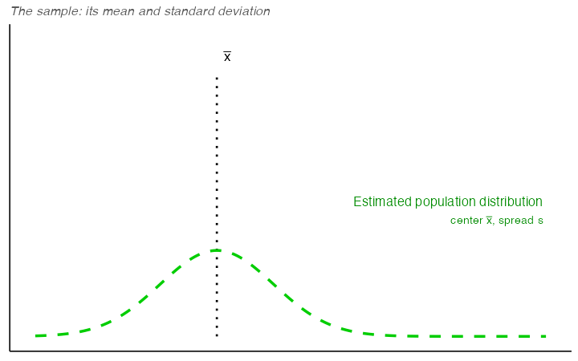
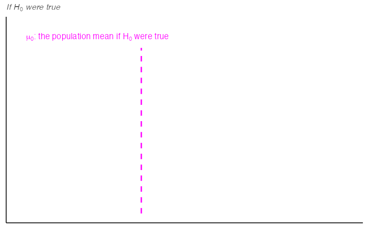

---
author:
  - Mallory L. Barnes
aliases: [redirects/foundations-for-inference.html]
---

```{r, include = FALSE}
source("global_stuff.R")
set.seed(538)
```

# Inference and Hypothesis Testing

> *Data and data sets are not objective; they are creations of human design. We give numbers their voice, draw inferences from them, and define their meaning through our interpretations.*
>
> Kate Crawford

**Inferential statistics** is the branch of statistics concerned with drawing conclusions about populations or causal relationships from sample data. It provides the tools to answer questions like: did our manipulation actually cause a change, or could the pattern we observed have arisen by random chance alone?

This chapter does that in two parts. The first part builds the logic by simulation, with no formulas: we work out what chance alone can produce, then compare a real result against it. The rest of the chapter replaces the simulation with the standard hypothesis testing machinery, because once you can assume a known reference distribution you no longer have to rebuild the chance window from scratch every time.

```{r, include=FALSE}
library(ggplot2)
library(dplyr)
library(gridExtra)
library(kableExtra)

# COLOUR SCHEME (decided 2026-08-18): keep this bespoke six-colour scheme, do not
# convert to e538_palette. This figure carries six semantic roles (null, sampling
# distribution, estimated population, true population, mu_0, rejection region) and the
# house palette has five, one of which (beige) is unusable as a data colour. The palette
# literally cannot express this figure without collapsing two distinctions.
# Consistency with Ch 3 was handled from the other side instead: Ch 3's CLT figures were
# recoloured to match this scheme where the roles overlap (population = orange,
# sampling distribution of the sample mean = dark green). Before that, Ch 3 used red for the
# population and blue for the sampling distribution, which collided with red = rejection
# region and blue = null here.

plot_distributions <- function(null_mean, null_sd, sample_mean, sample_sd, inferred_mean, inferred_sd, true_mean, true_sd, show_ci = TRUE, show_samp = TRUE, y_top = 1.4, show_null = TRUE, show_true = TRUE, show_xbar = FALSE) {
  x_vals <- seq(-6, 6, by=0.01)
  
  h0 <- dnorm(x_vals, mean=null_mean, sd=null_sd)
  sampling_mean <- dnorm(x_vals, mean=sample_mean, sd=sample_sd)
  inferred_parent <- dnorm(x_vals, mean=inferred_mean, sd=inferred_sd)
  true_parent <- dnorm(x_vals, mean=true_mean, sd=true_sd)
  CI_left <- qnorm(0.025, mean=sample_mean, sd=sample_sd)
  CI_right <- qnorm(0.975, mean=sample_mean, sd=sample_sd)
  y_intersect = dnorm(null_mean, mean=null_mean, sd=null_sd)

  
  p <- ggplot() + 
    { if (show_null) geom_line(aes(x=x_vals, y=h0, color="Null Population Distribution"), size=1.5) } +
    { if (show_samp) geom_line(aes(x=x_vals, y=sampling_mean, color="Sampling Distribution of the Sample Mean"), linetype="dotdash", size=1) } +
    { if (show_true) geom_line(aes(x=x_vals, y=true_parent, color="True Population Distribution"), size=1.5) } +
    geom_line(aes(x=x_vals, y=inferred_parent, color="Estimated Population Distribution"), linetype="dashed", size=1.5) +
    { if (show_ci) geom_segment(aes(x = CI_left, xend = CI_right, y = 0., yend = 0), color="darkgreen", size=1.5) } +
    { if (show_xbar) annotate("segment", x = inferred_mean, xend = inferred_mean, y = 0, yend = y_top * 0.92, colour = "limegreen", linetype = "dotted", linewidth = 1.6) } +
    { if (show_xbar) annotate("text", x = inferred_mean, y = y_top * 0.97, label = "bar(x)", parse = TRUE, colour = "#1E9E1E", fontface = "bold", size = 4.5) } +
    { if (show_null) geom_segment(aes(x = null_mean, xend = null_mean, y = y_intersect, yend = 0), linetype="dashed", color="magenta", size=1) } +
    coord_cartesian(xlim = c(-4.5, 4.5), ylim = c(0, y_top)) +  # shared axes across the four-color figures
    theme_classic() + 
    theme(legend.position='bottom', 
          axis.text = element_blank(), 
          axis.title = element_blank(), 
          axis.ticks = element_blank(), 
          legend.text = element_text(size = 12)) + 
    guides(color=guide_legend(title=NULL, nrow=2)) +
    scale_color_manual(values=c("Null Population Distribution"="blue", 
                                "Sampling Distribution of the Sample Mean"="darkgreen", 
                                "Estimated Population Distribution"="green3", 
                                "True Population Distribution"="orange"))

  return(p)
}

plot_distributions_no_error <- function(
  null_mean, null_sd,
  sample_mean, sample_sd,     # sample_sd here is the SE used for the sampling dist + CI
  inferred_mean, inferred_sd,
  show_ci = TRUE
){
  x_vals <- seq(-6, 6, by = 0.01)

  h0              <- dnorm(x_vals, mean = null_mean,    sd = null_sd)
  sampling_mean   <- dnorm(x_vals, mean = sample_mean,  sd = sample_sd)
  inferred_parent <- dnorm(x_vals, mean = inferred_mean, sd = inferred_sd)

  # 95% CI for the sample mean (normal approx)
  CI_left  <- qnorm(0.025, mean = sample_mean, sd = sample_sd)
  CI_right <- qnorm(0.975, mean = sample_mean, sd = sample_sd)

  # height at mu0 for the magenta reference drop line
  y_intersect <- dnorm(null_mean, mean = null_mean, sd = null_sd)

  p <- ggplot() +
    geom_line(aes(x = x_vals, y = h0,             color = "Null Population Distribution"), size = 1.5) +
    geom_line(aes(x = x_vals, y = sampling_mean,  color = "Sampling Distribution of the Sample Mean"),
              linetype = "dotdash", size = 1) +
    geom_line(aes(x = x_vals, y = inferred_parent, color = "Estimated Population Distribution"),
              linetype = "dashed", size = 1.5) +
    # mu0 (magenta dashed)
    geom_segment(aes(x = null_mean, xend = null_mean, y = y_intersect, yend = 0),
                 linetype = "dashed", color = "magenta", size = 1) +
    # CI bar (thick dark green): keep this!
    { if (show_ci) geom_segment(aes(x = CI_left, xend = CI_right, y = 0, yend = 0),
                                color = "darkgreen", size = 1.8) } +
    coord_cartesian(xlim = c(-4.5, 4.5), ylim = c(0, 1.4)) +  # shared axes across the four-color figures
    theme_classic() +
    theme(
      legend.position = "bottom",
      axis.text = element_blank(),
      axis.title = element_blank(),
      axis.ticks = element_blank(),
      legend.text = element_text(size = 12)
    ) +
    guides(color = guide_legend(title = NULL, nrow = 2)) +
    scale_color_manual(values = c(
      "Null Population Distribution" = "blue",
      "Sampling Distribution of the Sample Mean" = "darkgreen",
      "Estimated Population Distribution" = "green3"
    ))

  p
}

```

## What chance alone can produce

An experiment asks whether a manipulation causes a change in what we measure. Some manipulations are so overwhelming that no statistics are required to see them. Flip a light switch up and the light comes on; flip it down and it goes off, every time. You don't need a $t$-test to tell you that flipping the light switch is the cause of the change in brightness.

Nothing in environmental science behaves like this. Effects are real signals buried in noisy measurements. Flipping the switch changes the outcome *on average*, but not in every instance and not by the same amount every time.

Random chance can produce apparent differences between groups even when no real difference exists. We have already seen this with sampling: two samples from the same distribution come out differently. The same principle applies when we compare group means. So a difference between group means is not, by itself, evidence of a real effect.

Consider a scenario where we expect to find no real difference. A researcher surveys 10 caves for white-nose syndrome, a fungal disease that has killed millions of North American bats, capturing 20 bats at each cave and counting how many show visible signs of infection. @fig-4batdesign lays out the design.

```{r}
#| label: fig-4batdesign
#| fig-cap: "The bat-cave scenario study design. The split into two groups is arbitrary, so there is no real difference for the test to find."
#| fig-alt: "Study design schematic. IV: group assignment, arbitrary. Two boxes labeled Group A and Group B, each with n = 5 caves. DV: infected bats out of 20 captured."
#| fig-asp: 0.34
#| out-width: "100%"

design_groups("Group assignment (arbitrary)", c("Group A", "Group B"), 5, "caves",
              "Infected bats (of 20 captured)",
              "With no real difference, what can chance alone produce?")
```

All 10 caves are drawn from the same population. There is no treatment, no environmental gradient, nothing systematic separating them, so the true infection rate is identical everywhere. Splitting them into two groups of 5 is arbitrary. Any difference we see between those groups therefore *has* to be sampling error, so this scenario shows what chance alone can produce.

@fig-4gumballA shows one run of this scenario: the mean number of infected bats in each group.

```{r}
#| label: fig-4gumballA
#| fig-cap: "Mean number of infected bats per site for two groups drawn from the same population. Note the zoomed y-axis, which does not start at 0."
#| fig-alt: "Bar chart with two bars, Group A and Group B, showing the mean number of infected bats. The y-axis is zoomed to run from 6 to 10, so a modest difference between the two bars looks larger than it would on a full 0-to-20 scale."

group <- rep(c("A", "B"), each = 5)
infected <- rbinom(10, size = 20, prob = 0.40)
df <- data.frame(group, infected)

mean_df <- aggregate(infected ~ group, df, mean)
ggplot(mean_df, aes(x = group, y = infected)) +
  xlab("Group") +
  ylab("Mean infected bats") +
  geom_bar(stat = "identity") +
  coord_cartesian(ylim = c(6, 10)) +
  theme_classic(base_size = 20)

```

The bars are not the same height: Group A and Group B have different mean counts. But both groups were drawn from the very same population of sites, so this isn't a real difference in infection risk, it's sampling error.

This is the core inference problem: differences appear even when nothing real caused them. **How can we tell whether an observed difference is real or just the result of chance?**

Chapter 2 showed that chance alone can produce spurious correlations. The same is true for group means, and we can measure how large those chance differences get: run the same arbitrary split many times and record each result. We summarize each run as a single **difference score**: the mean count for Group A minus the mean count for Group B. @fig-4gumballdiffs shows the difference scores for 10 replications of the survey, each one sampling all 10 caves from the same population, splitting them 5 and 5, and computing the means.

```{r}
#| label: fig-4gumballdiffs
#| fig-cap: "Difference in mean infected count between Group A and Group B across 10 replications. The true difference is zero, but sampling error produces non-zero differences each time."
#| fig-alt: "Bar chart of the A-minus-B difference score for each of 10 replications, with a horizontal reference line at zero. Bars extend above and below the line by varying amounts, some replications favoring Group A, others favoring Group B."

group <- rep(rep(c("A", "B"), each = 5), 10)
experiment <- rep(1:10, each = 10)
infected <- rbinom(10 * 10, size = 20, prob = 0.40)
df <- data.frame(experiment, group, infected)
mean_df <- aggregate(infected ~ experiment * group, df, mean)

differences <- mean_df[mean_df$group == "A", ]$infected -
  mean_df[mean_df$group == "B", ]$infected

dif_df <- data.frame(experiment = c(1:10), differences)
dif_df$experiment <- as.factor(dif_df$experiment)

ggplot(dif_df, aes(y = differences, x = experiment)) +
  geom_bar(stat = "identity") +
  geom_hline(yintercept = 0) +
  theme_classic(base_size = 18) +
  xlab("Replication") +
  ylab("Difference in mean count (A - B)")
```

A bar at zero means the two groups had the same mean count in that replication. Positive values indicate Group A was higher; negative values indicate Group B was higher. Chance produces a new difference every time, but not an unlimited one. To see which sizes are common and which are rare, we run 10,000 replications and plot the difference scores as a histogram.

```{r}
#| label: fig-4histdiffgumball
#| fig-cap: "Histogram of mean count differences between Group A and Group B over 10,000 replications. All differences arise from chance alone. The most frequent difference is near zero; larger differences occur less often. Differences beyond about ±3 almost never occur."
#| fig-alt: "Histogram of 10,000 A-minus-B difference scores, tallest at zero in the center and tapering off symmetrically toward both larger positive and larger negative differences, with almost nothing beyond roughly plus or minus 3."

group <- rep(rep(c("A", "B"), each = 5), 10000)
experiment <- rep(1:10000, each = 10)
infected <- rbinom(10 * 10000, size = 20, prob = 0.40)
df <- data.frame(experiment, group, infected)
mean_df <- aggregate(infected ~ experiment * group, df, mean)

differences <- mean_df[mean_df$group == "A", ]$infected -
  mean_df[mean_df$group == "B", ]$infected

ggplot(data.frame(differences), aes(x = differences)) +
  geom_histogram(bins = 50, color = "white", linewidth = 0.2, binwidth = 1) +
  labs(x = "Difference in mean count (A - B)", y = "Count")
```

This histogram is the **chance window** for this study design. It shows that chance most often produces a difference near zero, the tallest bar in the center. Larger differences in either direction occur less and less frequently. Differences beyond about $\pm 3$ are possible, but rare.

We can use this window to evaluate any observed difference. If a study found a difference of 1 infected bat between two groups, that falls well inside the chance window: differences of that size occur frequently by random sampling alone. If the study found a difference of 6 bats, that would fall far outside the window; chance produced a difference that large 0 times out of 10,000. When an observed result almost never happens by chance, we have grounds to conclude that *something other than chance* produced it.

::: {.callout-note title="Note: Which direction?"}
**Still probability, model → data.** The chance window starts from a world we chose, every cave at the same infection rate, and shows the differences that world produces. The 1-bat and 6-bat results above are hypothetical, used to show what the window can tell us. No real study's data have entered yet.
:::

## Chance vs. not chance

The window tells us what chance can do. It does not tell us where to draw the line between "chance could have" and "chance didn't." Where to draw that line is a judgment call.

@fig-4simdecision draws lines on the same bat histogram from above. The boundaries are the smallest and largest differences chance actually produced across the 10,000 replications.

```{r}
#| label: fig-4simdecision
#| fig-cap: "Decision boundaries applied to the histogram of mean count differences from @fig-4histdiffgumball. Grey marks the range chance did produce across 10,000 replications; gold marks the edges of that range, which chance reached only rarely; red marks the differences chance never produced at all."
#| fig-alt: "The same histogram of 10,000 difference scores, now overlaid with colored zones. A grey band across the middle, labeled CHANCE, covers the full range chance actually produced. Narrow gold slivers sit at the two edges of that grey band, and red zones beyond them on both sides, labeled NOT CHANCE, mark differences chance never produced in any of the 10,000 replications."

diff_min <- min(differences)
diff_max <- max(differences)
pad <- (diff_max - diff_min) * 0.6
grey_width <- (diff_max - diff_min) * 0.15

ggplot(data.frame(differences), aes(x = differences)) +
  annotate("rect", xmin = diff_min, xmax = diff_max, ymin = 0, ymax = Inf,
           alpha = 0.35, fill = "grey75") +
  annotate("rect", xmin = diff_min, xmax = diff_min + grey_width, ymin = 0, ymax = Inf,
           alpha = 0.5, fill = "#f5d547") +
  annotate("rect", xmin = diff_max - grey_width, xmax = diff_max, ymin = 0, ymax = Inf,
           alpha = 0.5, fill = "#f5d547") +
  annotate("rect", xmin = -Inf, xmax = diff_min, ymin = 0, ymax = Inf,
           alpha = 0.35, fill = "#b22222") +
  annotate("rect", xmin = diff_max, xmax = Inf, ymin = 0, ymax = Inf,
           alpha = 0.35, fill = "#b22222") +
  geom_histogram(binwidth = 1, center = 0, color = "white") +
  geom_vline(xintercept = c(diff_min, diff_max)) +
  coord_cartesian(xlim = c(diff_min - pad, diff_max + pad)) +
  annotate("text", x = 0, y = Inf, vjust = 2, fontface = "bold", label = "CHANCE") +
  annotate("text", x = diff_min - pad * 0.4, y = Inf, vjust = 2, fontface = "bold", label = "NOT\nCHANCE") +
  annotate("text", x = diff_max + pad * 0.4, y = Inf, vjust = 2, fontface = "bold", label = "NOT\nCHANCE") +
  xlab("Difference in mean count (Group A - Group B)") +
  ylab("Count")

```

Across the 10,000 replications, chance produced differences from about `r round(diff_min,1)` to `r round(diff_max,1)` bats.

- **Chance (grey).** Chance produced differences like this routinely. No grounds for suspicion.
- **Ambiguous (gold).** The edges of what chance produced. Chance *can* produce differences this large, but rarely, so chance is unlikely here but not ruled out.
- **Not chance (red).** Chance never produced a difference this large in 10,000 tries. Real grounds to suspect something beyond sampling error.

### How rare is rare enough?

**Question**: How many times does something need to happen for it to happen "a lot"? How rare does something need to be before you stop worrying about it?

Environmental scientists already have a working vocabulary for this: the **100-year flood**. A "100-year flood" doesn't mean floods that size happen once a century on a schedule; it means that in any given year, there's about a 1-in-100 chance of a flood that severe. Would you build a house in that floodplain? 

Many people do, and often regret it, because a 1% annual chance still adds up over a 30-year mortgage (roughly a 26% chance of at least one such flood in that span). A location with a 1-in-10,000 annual flood risk is very different: over the same 30 years, the cumulative chance is under 0.3%.

Rare events still happen, and how rare an event is changes what we are willing to conclude from seeing it.

Where the gold zone ends is a judgment call. A stricter line means fewer false alarms and more missed real effects; a looser line means the reverse. Science standardizes that call with a convention, $\alpha = .05$, defined later in this chapter. It is about 1 in 20, far looser than the red zone's never in 10,000.

## Hypothesis tests

### The null and alternative hypotheses

The chance window described a world where nothing but chance is at work. A formal test gives that world a name. In the bat example, "nothing but chance" meant no real difference between groups. From here on we compare a single sample against a specific value, such as a regulatory limit or a historical average.

**The null hypothesis, $H_0$,** is the claim that the population mean equals that specific value, written $\mu_0$. If $H_0$ is true, any gap between the sample mean and $\mu_0$ is sampling error.

**The alternative hypothesis, $H_a$,** is the claim that the population mean does not equal $\mu_0$. It can also point in one direction only, larger or smaller; @sec-tails covers when that is justified.

$$H_0:\ \mu = \mu_0 \qquad H_a:\ \mu \neq \mu_0$$

**Null value notation.** In this chapter, hypotheses are about the population mean $\mu$, compared with the constant $\mu_0$. The sample mean $\bar{x}$ is never part of $H_0$ or $H_a$; it is the evidence we bring to test them.

### From simulation to a formal test

Everything so far was built by brute force: thousands of replications, piled into a histogram, with hypothetical results laid against the pile. Nobody wants to rebuild a chance window for every question. Chapter 3 already supplies a shortcut. Sample means have a predictable distribution of their own: centered on the population mean, with spread $\sigma/\sqrt{n}$, and close to normal once the sample is large enough (the Central Limit Theorem). That lets us replace the simulated chance window with a curve whose shape we already know. The reasoning is the same as with the simulated chance window.

::: {.callout-note title="Note: Which curves have to be normal"}
The tests in this chapter and the next two read their answers off a normal curve, or its close relative, the $t$ curve. Two different reasons put a normal curve there.

- **For the sampling distribution of the sample mean**, it is the Central Limit Theorem at work: whatever the population looks like, sample means pile up in a roughly normal shape once the sample is large enough.

- **For a population, it is not required.** A test reads its answer off the sampling distribution of the sample mean, not off the population. The population's shape only matters when the sample is small, because the Central Limit Theorem needs a large enough sample to promise a normal shape for sample means. With a small sample, the normal curve for $\bar{x}$ requires the population itself to be roughly normal, and the only check we have is the sample: a histogram with no strong skew and no extreme outliers.

When the sample says the normal assumption is not reasonable, the nonparametric tests in Chapter 7 take over.
:::

### The players

A test is about $\mu$, the true population mean, which we never observe; everything we know about it comes from one sample. The null hypothesis proposes a value for it, $\mu_0$. To reject $H_0$, the sample has to be hard to explain if the null were true: its mean, $\bar{x}$, has to land farther from $\mu_0$ than sampling error would plausibly carry it.

Several distributions and values take part in that comparison. @tbl-4players lists every one, with the line each is drawn with in this chapter's figures. They fall into three groups: what we would expect if $H_0$ were true, what the sample gives us, and the truth we never see.

```{r}
#| label: tbl-4players
#| html-table-processing: none
#| results: asis
#| tbl-cap: "The players in a hypothesis test, and the line each is drawn with in this chapter's figures."

swatch <- function(name, col, lt, lw, vertical = FALSE) {
  f <- file.path("imgs", "ch4_players", paste0(name, ".png"))
  p <- ggplot() + theme_void() + coord_cartesian(xlim = c(0, 1), ylim = c(0, 1))
  p <- if (vertical) {
    p + annotate("segment", x = 0.5, xend = 0.5, y = 0.05, yend = 0.95, colour = col, linetype = lt, linewidth = lw)
  } else {
    p + annotate("segment", x = 0.05, xend = 0.95, y = 0.5, yend = 0.5, colour = col, linetype = lt, linewidth = lw)
  }
  ggsave(f, p, width = 1.2, height = 0.4, dpi = 200, bg = "white")
  f
}
dir.create(file.path("imgs", "ch4_players"), showWarnings = FALSE, recursive = TRUE)

players <- data.frame(
  group = c("If $H_0$ were true", "If $H_0$ were true", "If $H_0$ were true",
            "From the sample", "From the sample", "From the sample", "From the sample",
            "The truth"),
  line = "",
  player = c("$\\mu_0$", "Null population distribution",
             "Sampling distribution of the sample mean under $H_0$",
             "$\\bar{x}$", "Estimated population distribution",
             "Sampling distribution of the sample mean", "Confidence interval",
             "True population distribution"),
  what = c("The population mean if $H_0$ were true",
           "The population if $H_0$ were true: centered at $\\mu_0$, as wide as the population",
           "Where $\\bar{x}$ would land across many samples if $H_0$ were true: centered at $\\mu_0$, spread = standard error",
           "The sample mean: the one value we observe",
           "Centered at $\\bar{x}$, with the sample's standard deviation as its spread: our best picture of the true population",
           "Where $\\bar{x}$ would land across many samples: centered at $\\bar{x}$, spread = standard error",
           "$\\bar{x} \\pm 1.96$ standard errors, built from the sampling distribution of the sample mean",
           "The population the data actually came from. Never known. $H_a$ is a claim about where it sits")
)
swatches <- c(
  swatch("mu0",     "magenta",   "22",      2.2, vertical = TRUE),
  swatch("nullpop", "blue",      "solid",   1.4),
  swatch("sampH0",  "blue",      "dotdash", 1.2),
  swatch("xbar",    "limegreen", "11",      3.0, vertical = TRUE),
  swatch("estpop",  "green3",    "dashed",  1.4),
  swatch("samp",    "darkgreen", "dotdash", 1.2),
  swatch("ci",      "darkgreen", "solid",   4),
  swatch("truepop", "orange",    "solid",   1.4)
)

# The page's MathJax reads \( \) in raw HTML tables; the PDF build reads $ $.
if (knitr::is_html_output()) {
  players[] <- lapply(players, function(col) gsub("\\$([^$]+)\\$", "\\\\(\\1\\\\)", col))
}

# HTML: hand-built table so the group labels can span their rows, sideways, in their own
# column. PDF: a plain kable with the group in the first column.
if (knitr::is_html_output()) {
  # Rotated text and MathJax do not mix: plain HTML subscript for the group label
  players$group <- gsub("\\(H_0\\)", "H<sub>0</sub>", players$group, fixed = TRUE)
  groups <- rle(players$group)
  first_row <- cumsum(c(1, head(groups$lengths, -1)))
  rows <- vapply(seq_len(nrow(players)), function(i) {
    g <- match(i, first_row)
    group_cell <- if (!is.na(g)) sprintf(
      '<td rowspan="%d" style="vertical-align: middle; border-right: 1px solid #ccc; padding: 0 6px; box-shadow: none; background: white;"><span style="writing-mode: vertical-rl; transform: rotate(180deg); font-style: italic; color: #555; white-space: nowrap;">%s</span></td>',
      groups$lengths[g], groups$values[g]) else ""
    top <- if (!is.na(g)) "border-top: 1px solid #999;" else ""
    sprintf('<tr style="%s">%s<td style="padding: 6px 10px; text-align: left; vertical-align: middle; box-shadow: none; background: white;"></td><td style="padding: 6px 10px; text-align: left; vertical-align: middle; box-shadow: none; background: white; font-weight: 600;">%s</td><td style="padding: 6px 10px; text-align: left; vertical-align: middle; box-shadow: none; background: white;">%s</td></tr>',
            top, group_cell, swatches[i], players$player[i], players$what[i])
  }, character(1))
  cat('```{=html}', '<table style="width: auto; margin: 0 auto 1em auto; border-collapse: collapse; background: white; font-size: 0.95em;">',
      '<thead><tr style="border-bottom: 2px solid #333;"><th></th><th style="text-align: left;">Line</th><th style="text-align: left;">Player</th><th style="text-align: left;">What it is</th></tr></thead><tbody>',
      rows, '</tbody></table>', '```', sep = "\n")
} else {
  kbl(players, escape = FALSE, col.names = c("", "Line", "Player", "What it is"), booktabs = TRUE) |>
    column_spec(2, image = spec_image(swatches, 120, 40))
}
```

### Seeing them together

The figures below draw the players a curve or two at a time.

The population curves in these figures are drawn as normal for clarity; the note in the previous section explains why a test does not need them to be.

**Notation reminder.** Chapter 3's shorthand for a normal curve: $X \sim N(\mu, \sigma^2)$ reads "the random variable $X$ is normally distributed with mean $\mu$ and variance $\sigma^2$." A normal curve needs just those two numbers, a center and a spread. The second number is the variance, the square of the standard deviation.

**1. The null population distribution.**

Start with the null population distribution: the population we would have if $H_0$ were true. Its center, $\mu_0$, comes from $H_0$ itself. Its spread is the population standard deviation, $\sigma$. In practice $\sigma$ is almost never known and the sample's standard deviation stands in for it; this chapter treats $\sigma$ as known as a simplification. The $t$-tests in Chapter 6 are the adjustment used in practice.

```{r}
#| label: fig-4key.null_alone
#| fig-height: 1.47
#| fig-cap: 'Null population distribution: the population we would have if $H_0$ were true, centered at $\mu_0$.'
#| fig-alt: "A single blue bell-shaped curve centered on a magenta dashed vertical line. Text reads H sub 0 colon mu equals mu sub 0."
#| out-width: "100%"

x_vals <- seq(-4.5, 4.5, by=0.01)
h0 <- dnorm(x_vals, mean=0, sd=1)

p_null <- ggplot() +
  geom_line(aes(x_vals, h0, color="Null Population Distribution"), linetype="solid", size=1) +
  annotate("text", x = -2.5, y = 0.35, label = expression("H"[0] ~ ": " ~ mu == mu[0]), size = 5) +
  geom_vline(aes(xintercept=0), linetype="dashed", color="magenta", size=0.5) +
  scale_color_manual(values=c("Null Population Distribution"="blue")) +
  theme_classic() +
  theme(legend.position="none", axis.text = element_blank(), axis.title = element_blank(), axis.ticks = element_blank())

# Same vertical scale as the four-color figures, with the empty space above the curve cropped
print(p_null + annotate("text", x = 0.12, y = 0.43, label = "mu[0]", parse = TRUE, hjust = 0, colour = "magenta", size = 5) +
      coord_cartesian(xlim = c(-4.5, 4.5), ylim = c(0, 0.45)))
```

**2. Null vs. true population.**

In an idealized world where $H_0$ is exactly true, the true population and the null population distribution are identical. In reality, we never know the true population.

```{r}
#| label: fig-4key.null_identical_sample
#| fig-height: 1.47
#| fig-cap: 'True population distribution equals the null population distribution ($H_0$ true): $\mu=\mu_0$.'
#| fig-alt: "A single bell-shaped curve, since the orange true population curve and the blue null population distribution curve sit exactly on top of each other, both centered at the same point marked with a dashed vertical line. Text reads H sub 0 colon mu equals mu sub 0."
#| out-width: "100%"

# Define the data and functions
x_vals <- seq(-4.5, 4.5, by=0.01)
h0 <- dnorm(x_vals, mean=0, sd=1)

# Plot: Two identical distributions
p3 <- ggplot() + 
  geom_line(aes(x_vals, h0, color="True Population Distribution"), linetype="solid", size=4, alpha=1) +
  geom_line(aes(x_vals, h0, color="Null Population Distribution"), linetype="solid", size=1) +
  annotate("text", x = -2.5, y = 0.35, label = expression("H"[0] ~ ": " ~ mu == mu[0]), size = 5) +
  geom_vline(aes(xintercept=0), linetype="dashed", color="magenta", size=0.5) +
scale_color_manual(values=c("Null Population Distribution"="blue", "True Population Distribution"="orange"))+
  theme_classic() + 
  theme(legend.position="none", axis.text = element_blank(), axis.title = element_blank(), axis.ticks = element_blank())

# Same vertical scale as the four-color figures, with the empty space above the curve cropped
print(p3 + coord_cartesian(xlim = c(-4.5, 4.5), ylim = c(0, 0.45)))
```

::: {.callout-note title="Note: Which direction?"}
**The switch to statistics, data → model.** Steps 1 and 2 came from $H_0$, a model we proposed. Step 3 starts from the sample we actually have and works back toward the population it came from.
:::

**3. The sample's picture of the truth.** We never see the true population, but we do have a sample. From the sample's mean, $\bar{x}$, and its standard deviation we build the **estimated population distribution**: our best picture of the true population, drawn here as a normal curve. With a representative sample, the two line up closely.

```{r}
#| label: fig-4key.perfectly_representative_sample
#| fig-height: 2.52
#| fig-cap: 'A representative sample: the estimated population distribution, built from the sample, lines up closely with the true population distribution.'
#| fig-alt: "Two wide bell curves nearly on top of one another: the solid orange true population and the light-green dashed estimated population."
#| out-width: "100%"

p4 <-  plot_distributions(null_mean=0.5, null_sd=1, sample_mean=0.52, sample_sd=0.3, inferred_mean=0.52, inferred_sd=1, true_mean=0.54, true_sd=1, show_ci = FALSE, show_samp = FALSE, show_null = FALSE, show_xbar = TRUE, y_top = 0.53)  # wide curves only: crop the empty space, same scale
print(p4)

```

**4. From individual readings to sample means.** By the Central Limit Theorem, the **sampling distribution of the sample mean** is close to a normal curve once the sample is large enough, so it needs only a center and a spread. Its center is $\bar{x}$, the same as the estimated population. Its spread is the standard error: the sample's standard deviation divided by $\sqrt{n}$. (Not $\sqrt{n-1}$: the $n-1$ already went into computing the standard deviation itself, back in Chapter 3.) In the shorthand, it is $N(\bar{x}, SE_{\bar{x}}^2)$: same center, much narrower. @fig-4key.sample_to_sampling shows the Central Limit Theorem at work: make the population right-skewed, and the sampling distribution of the sample mean keeps the same normal shape and the same spread.

```{r}
#| label: fig-4key.sample_to_sampling
#| fig-cap: 'From individual readings to sample means. The sampling distribution of the sample mean (dark-green dot-dash) shares the estimated population''s center, $\bar{x}$, with the standard error as its spread. When the population turns right-skewed, the sampling distribution keeps the same normal shape and spread, once the sample is large enough.'
#| fig-alt: "Animation. A wide light-green dashed bell curve centered on a lime-green dotted line labeled x-bar, labeled estimated population, center x-bar, spread s. A much narrower dark-green dot-dash curve appears at the same center, labeled sampling distribution of the sample mean, N of x-bar and SE squared. The wide curve then gradually becomes right-skewed, with a long right tail, while the narrow dot-dash curve stays exactly the same; the final label reads same sampling distribution of the sample mean, once n is large enough."
#| out-width: "100%"


```

**5. From the null population to sample means.** The **sampling distribution of the sample mean under $H_0$** is centered at $\mu_0$, and its spread is again the standard error, the null population's standard deviation divided by $\sqrt{n}$ (with $\sigma$ treated as known, the same standard error as in step 4): $N(\mu_0, SE_{\bar{x}}^2)$. It describes where $\bar{x}$ would land across many samples if $H_0$ were true, which makes it the formal version of the chance window. The critical values later in the chapter come from it.

```{r}
#| label: fig-4key.null_to_sampling
#| fig-cap: 'From the null population to sample means: the null population distribution (blue solid) and the sampling distribution of the sample mean under $H_0$ (blue dot-dash) share a center, $\mu_0$. Dividing the spread by $\sqrt{n}$ makes the second much narrower.'
#| fig-alt: "A wide solid blue bell curve and a much narrower, taller blue dot-dash bell curve, both centered on a magenta dashed line."
#| out-width: "100%"

xs_null <- seq(-6, 6, by = 0.01)
null_pair <- rbind(
  data.frame(x = xs_null, y = dnorm(xs_null, 0, 1),   curve = "Null Population Distribution"),
  data.frame(x = xs_null, y = dnorm(xs_null, 0, 0.4), curve = "Sampling Distribution of the Sample Mean under H0")
)
ggplot(null_pair, aes(x, y, color = curve, linetype = curve)) +
  geom_line(linewidth = 1.3) +
  annotate("segment", x = 0, xend = 0, y = 0, yend = 1.3, linetype = "dashed", color = "magenta", linewidth = 1) +
  annotate("text", x = 0.12, y = 1.34, label = "mu[0]", parse = TRUE, hjust = 0, colour = "magenta", size = 5) +
  scale_color_manual(values = c("Null Population Distribution" = "blue",
                                "Sampling Distribution of the Sample Mean under H0" = "blue")) +
  scale_linetype_manual(values = c("Null Population Distribution" = "solid",
                                   "Sampling Distribution of the Sample Mean under H0" = "dotdash")) +
  coord_cartesian(xlim = c(-4.5, 4.5), ylim = c(0, 1.4)) +  # shared axes across the four-color figures
  theme_classic() +
  theme(legend.position = "bottom", legend.title = element_blank(), legend.text = element_text(size = 12),
        axis.text = element_blank(), axis.title = element_blank(), axis.ticks = element_blank()) +
  guides(color = guide_legend(nrow = 2), linetype = guide_legend(nrow = 2))
```

**All of them at once.** Put every player on one set of axes and the picture gets crowded fast, which is why the rest of the book shows only the pieces a given question needs. @fig-4players-gif adds them one at a time, grouped as in @tbl-4players, and ends with all of them together.

```{r}
#| label: fig-4players-gif
#| fig-cap: 'The players, added one at a time: first everything built from $H_0$, then everything built from the sample, then the true population, ending with all of them on one set of axes.'
#| fig-alt: "Animation. Curves appear one at a time on shared axes, each with a colored label: a magenta dashed line for mu sub 0; a wide blue null population curve; a narrow blue dot-dash sampling distribution under H sub 0; a lime-green dotted line for x-bar; a wide light-green dashed estimated population; a narrow dark-green dot-dash sampling distribution of the sample mean; a wide orange true population. The last frame shows all of them together, crowded."
#| out-width: "100%"


```

**The two curves a decision uses.** Strip the picture back to the two sampling distributions of the sample mean (@fig-4two-sampling). The next section uses only these two: the critical values and the $p$-value come from the one built from $H_0$, and the confidence interval comes from the one built from the sample.

```{r}
#| label: fig-4two-sampling
#| fig-cap: 'The two curves a decision uses: the sampling distribution of the sample mean under $H_0$ (blue dot-dash), centered at $\mu_0$, and the sampling distribution of the sample mean from the sample (dark-green dot-dash), centered at $\bar{x}$. Both have the standard error as their spread.'
#| fig-alt: "Two narrow dot-dash bell curves of the same width on shared axes: a blue one centered on a magenta dashed line labeled mu sub 0, and a dark-green one centered on a lime-green dotted line labeled x-bar, to its right."
#| out-width: "100%"

mu0_2 <- -1.2; xbar_2 <- 0.6; se_2 <- 0.4
xs2 <- seq(-4.5, 4.5, by = 0.01)
ggplot() +
  geom_line(aes(xs2, dnorm(xs2, mu0_2, se_2)), colour = "blue", linetype = "dotdash", linewidth = 1.2) +
  geom_line(aes(xs2, dnorm(xs2, xbar_2, se_2)), colour = "darkgreen", linetype = "dotdash", linewidth = 1.2) +
  annotate("segment", x = mu0_2, xend = mu0_2, y = 0, yend = 1.22, colour = "magenta", linetype = "dashed", linewidth = 1) +
  annotate("segment", x = xbar_2, xend = xbar_2, y = 0, yend = 1.22, colour = "limegreen", linetype = "dotted", linewidth = 1.6) +
  annotate("text", x = mu0_2 - 0.1, y = 1.3, label = "mu[0]", parse = TRUE, hjust = 1, colour = "magenta", size = 5) +
  annotate("text", x = xbar_2 + 0.1, y = 1.3, label = "bar(x)", parse = TRUE, hjust = 0, colour = "#1E9E1E", fontface = "bold", size = 5) +
  annotate("text", x = -4.4, y = 1.12, label = "'Under '*H[0]", parse = TRUE, hjust = 0, colour = "blue", size = 4.5) +
  annotate("text", x = -4.4, y = 1.03, label = "N*'('*mu[0]*', '*SE[bar(x)]^2*')'", parse = TRUE, hjust = 0, colour = "blue", size = 4) +
  annotate("text", x = 4.45, y = 1.12, label = "'From the sample'", parse = TRUE, hjust = 1, colour = "darkgreen", size = 4.5) +
  annotate("text", x = 4.45, y = 1.03, label = "N*'('*bar(x)*', '*SE[bar(x)]^2*')'", parse = TRUE, hjust = 1, colour = "darkgreen", size = 4) +
  coord_cartesian(xlim = c(-4.5, 4.5), ylim = c(0, 1.38)) +  # shared axes across the four-color figures
  labs(x = NULL, y = NULL) +
  theme_classic() +
  theme(axis.text = element_blank(), axis.ticks = element_blank())
```


## Making the decision

### Terms for decision rules

When running a hypothesis test, four terms guide our decision. The first is the quantity every test computes.

**Test statistic.** A test statistic is a ratio. On top goes the effect you observed, the distance between what you measured and what $H_0$ predicted. On the bottom goes an estimate of how much that distance could move around by chance alone:

$$\text{statistic}=\frac{\text{effect}}{\text{error}}$$

| Term | In this chapter |
|---|---|
| effect | $\bar{x} - \mu_0$, the distance between the sample mean and the value $H_0$ proposes |
| error | $SE_{\bar{x}} = \sigma/\sqrt{n}$, how far sample means move around by chance alone |

Put together, this chapter's test statistic is $z$:

$$z = \frac{\bar{x} - \mu_0}{\sigma/\sqrt{n}}$$

That is the whole idea, and every test in this book is a version of it. A difference of 2 units is not impressive or unimpressive on its own. It is impressive only relative to how much difference chance produces for a study of this size, which is exactly what the chance window measured earlier in this chapter. The test statistic writes that comparison as a single number: how many standard errors the effect spans.

**How the $z$ statistic relates to Chapter 3's $z$-score.**

| Chapter 3: $z$-score for one value | This chapter: $z$ statistic for a sample mean |
|---|---|
| $z = \dfrac{x - \mu}{\sigma}$ | $z = \dfrac{\bar{x} - \mu_0}{\sigma/\sqrt{n}}$ |
| How many SDs one value sits from the population mean | How many SEs the sample mean sits from $\mu_0$ |

Both divide a distance by a spread, but the spread comes from a different distribution. A $z$-score places one value on the population distribution, where the spread is $\sigma$. A $z$ statistic places $\bar{x}$ on the sampling distribution of the sample mean under $H_0$, which is narrower, so the spread is $SE = \sigma/\sqrt{n}$. Dividing $\bar{x} - \mu_0$ by $\sigma$ instead of $SE$ is a mistake to watch for: it uses the wide curve to answer a question about the narrow one.

Large statistic means the effect is big compared to the noise. Small statistic means it is not. The rest of this section sets where to draw the line between a large statistic and a small one.

**Significance level (**$\alpha$). Chosen *before* the test. $\alpha$ is the long-run probability of a Type I error (rejecting a true $H_0$; more on error types next chapter). A common choice is $\alpha = 0.05$. Smaller $\alpha$ makes tests more cautious and produces wider confidence intervals.

**$p$-value.** Assuming $H_0$ is true, the $p$-value is the probability of seeing a test statistic at least as extreme as what we observed. Small $p$ means our data look unusual under $H_0$.

**Confidence level.** Confidence level is the long-run proportion of confidence intervals that contain the true parameter when we repeat the entire data collection and interval procedure.

$$\text{Confidence Level} = 1 - \alpha$$

With $\alpha=0.05$, about 95% of intervals constructed this way will capture the true value.

::: {.callout-caution title="Warning: Don't misread a confidence interval"}
Do **not** say:

> "There is a 95% probability this interval contains $\mu$."

Instead say:

> "We used a procedure that captures $\mu$ about 95% of the time in the long run."
:::

### Three equivalent ways to test $H_0$

All three routes below run on the same quantity: the **test statistic** defined above.

1.  **Test statistic / critical values.** Choose $\alpha$, find the corresponding **critical value(s)** for your test statistic, and compute your observed statistic. Reject $H_0$ if the statistic falls in the **rejection region**.

2.  **Confidence interval (two-sided).** Build a $(1-\alpha)$ CI for the parameter. Reject $H_0$ if $\mu_0$ lies **outside** the CI; fail to reject if it lies **inside**.

3.  **$p$-value.** Compute the $p$-value for your observed statistic under $H_0$ and compare to $\alpha$. Reject $H_0$ if $p<\alpha$.

**Note.** Methods 1 and 2 yield a yes/no at $\alpha$; method 3 yields a yes/no plus a graded measure of evidence (exact $p$).


### Route 1: test statistic and critical values

Critical values come from the sampling distribution of the sample mean under $H_0$, built in @fig-4key.null_to_sampling.

@fig-rejection-region draws it for a two-tailed test at $\alpha = 0.05$, marked off in standard errors from $\mu_0$. The red lines are the **critical values**, 1.96 standard errors on either side of $\mu_0$. They cut off the most extreme 5% of the curve, 2.5% in each tail, and those shaded tails are the **rejection regions**. Here the observed $\bar{x}$ lands 2.4 standard errors above $\mu_0$, inside the right-hand rejection region. Counting that distance in standard errors is exactly the test statistic from earlier, $z = (\bar{x} - \mu_0)/SE = 2.4$.

Here's the decision rule:

- If the observed test statistic falls inside the central region, we **fail to reject** $H_0$ because the result is consistent with chance variation.
- If it falls in either rejection region, we **reject** $H_0$ because the result is too extreme to attribute to chance alone at the 5% level.

This picture makes clear why $\alpha$ and the $p$-value are linked. $\alpha$ sets the cutoff for how extreme is "too extreme," while the $p$-value tells us how far into the tails our actual result lies.

```{r}
#| label: fig-rejection-region
#| fig-cap: 'Two-tailed test at $\alpha = 0.05$: the sampling distribution of the sample mean under $H_0$ (blue dot-dash), centered at $\mu_0$ (magenta) and marked off in standard errors. Red lines are the critical values at $\pm 1.96$ SE; the shaded tails are the rejection regions. The observed $\bar{x}$ (dotted) falls 2.4 SE above $\mu_0$, in the rejection region.'
#| fig-alt: "A blue dot-dash bell curve centered on a magenta dashed line labeled mu sub 0. The x-axis is marked mu sub 0 minus 2 SE, minus 1 SE, mu sub 0, plus 1 SE, plus 2 SE. Red vertical lines at plus and minus 1.96 SE, each labeled critical value, with the small tail areas beyond them shaded red and labeled rejection region. A lime-green dotted line labeled x-bar sits at 2.4 SE, inside the right-hand shaded region."
#| fig-width: 7
#| fig-height: 4.5

alpha <- 0.05
crit  <- qnorm(1 - alpha/2)
xbar_se <- 2.4    # observed x-bar, in standard errors above mu0
rr <- tibble::tibble(x = seq(-4, 4, length.out = 2000), y = dnorm(x))
y_peak <- dnorm(0)

ggplot(rr, aes(x, y)) +
  geom_area(data = dplyr::filter(rr, x <= -crit), fill = "red", alpha = 0.15) +
  geom_area(data = dplyr::filter(rr, x >=  crit), fill = "red", alpha = 0.15) +
  geom_line(color = "blue", linewidth = 1.2, linetype = "dotdash") +
  annotate("segment", x = 0, xend = 0, y = 0, yend = y_peak, colour = "magenta", linetype = "dashed", linewidth = 1) +
  geom_vline(xintercept = c(-crit, crit), color = "red", linewidth = 0.9) +
  annotate("text", x =  crit, y = y_peak * 1.02, label = "critical value\n(1.96 SE)", hjust = -0.05, size = 3.6) +
  annotate("text", x = -crit, y = y_peak * 1.02, label = "critical value\n(1.96 SE)", hjust =  1.05, size = 3.6) +
  annotate("text", x =  3.1, y = 0.12, label = "rejection\nregion", size = 3.4) +
  annotate("text", x = -3.1, y = 0.12, label = "rejection\nregion", size = 3.4) +
  annotate("segment", x = xbar_se, xend = xbar_se, y = 0, yend = 0.3, colour = "limegreen", linetype = "dotted", linewidth = 1.6) +
  annotate("text", x = xbar_se, y = 0.33, label = "bar(x)", parse = TRUE, colour = "#1E9E1E", fontface = "bold", size = 4.5) +
  scale_x_continuous(breaks = -2:2,
                     labels = c(expression(mu[0] - 2*SE), expression(mu[0] - SE), expression(mu[0]),
                                expression(mu[0] + SE), expression(mu[0] + 2*SE))) +
  labs(x = NULL, y = NULL) +
  coord_cartesian(xlim = c(-4, 4), ylim = c(0, y_peak * 1.1)) +
  theme_classic(base_size = 12) +
  theme(axis.text.y = element_blank(), axis.ticks.y = element_blank())
```

### Route 2: confidence interval

The confidence-interval route makes the same decision from the sample's side. It never uses the null population distribution, only the single value $\mu_0$.

Start from the sampling distribution of the sample mean built in @fig-4key.sample_to_sampling: centered at $\bar{x}$, with the standard error as its spread. A sample mean lands within 1.96 standard errors of the true mean $\mu$ about 95% of the time, so the middle 95% of this curve, $\bar{x} \pm 1.96\,SE$, is the 95% confidence interval: the values of $\mu$ that are consistent with our sample (@fig-ci-lens-build). Then ask where $\mu_0$ falls (@fig-ci-lens-decision).

```{r}
#| label: fig-ci-lens-build
#| fig-cap: 'The 95% confidence interval: the middle 95% of the sampling distribution of the sample mean, $\bar{x} \pm 1.96$ standard errors.'
#| fig-alt: "A narrow dark-green dot-dash bell curve centered on a lime-green dotted vertical line labeled x-bar, with a thick dark-green bar along the baseline under its middle, labeled 95% CI."
#| fig-width: 4.5
#| fig-height: 3.6
#| out-width: "50%"

xbar <- 0.42; pop_sd <- 1; SE <- 0.4; alpha <- 0.05
ci_lo <- xbar - qnorm(1 - alpha/2) * SE
ci_hi <- xbar + qnorm(1 - alpha/2) * SE
xs <- seq(-4.5, 4.5, by = 0.01)

ci_panel <- function() {
  ggplot() +
    coord_cartesian(xlim = c(-4.5, 4.5), ylim = c(-0.16, 1.4)) +
    theme_classic(base_size = 12) + labs(x = NULL, y = NULL) +
    theme(axis.text = element_blank(), axis.ticks = element_blank()) +
    annotate("segment", x = xbar, xend = xbar, y = 0, yend = 1.2, colour = "limegreen", linetype = "dotted", linewidth = 1.6) +
    annotate("text", x = xbar, y = 1.28, label = "bar(x)", parse = TRUE, colour = "#1E9E1E", fontface = "bold", size = 4.5)
}
with_ci <- function(p) {
  p +
    geom_line(aes(xs, dnorm(xs, xbar, SE)), color = "darkgreen", linetype = "dotdash", linewidth = 1.1) +
    annotate("segment", x = ci_lo, xend = ci_hi, y = 0, yend = 0, colour = "darkgreen", linewidth = 3) +
    annotate("text", x = xbar, y = -0.1, label = "95% CI", colour = "darkgreen", size = 4)
}

p_est <- ci_panel() +
  geom_line(aes(xs, dnorm(xs, xbar, pop_sd)), color = "green3", linetype = "dashed", linewidth = 1.2) +
  annotate("text", x = -4.4, y = 0.6, label = "Estimated population", color = "green3", size = 3.8, hjust = 0)
p_samp <- with_ci(ci_panel()) +
  annotate("text", x = -4.4, y = 0.6, label = "Sampling distribution\nof the sample mean", color = "darkgreen", size = 3.8, hjust = 0)

print(p_samp)
```

Decision rule:

- If $\mu_0$ lies **inside** the CI bar, we **fail to reject** $H_0$.
- If $\mu_0$ lies **outside** the CI bar, we **reject** $H_0$ at $\alpha=0.05$.

```{r}
#| label: fig-ci-lens-decision
#| fig-cap: 'The decision, same sample in both panels. Left: $\mu_0$ (magenta) falls inside the 95% confidence interval, so we fail to reject $H_0$. Right: a different $\mu_0$ falls outside it, so we reject $H_0$.'
#| fig-alt: "Two panels, each showing the same narrow dark-green dot-dash curve centered on a lime-green dotted line labeled x-bar, with a thick dark-green confidence interval bar underneath. Left: a magenta dashed line labeled mu sub 0 sits just left of x-bar, inside the bar, with a box reading Fail to reject. Right: the magenta line sits further left, outside the bar, with a box reading Reject."
#| fig-width: 9
#| fig-height: 3.6
#| out-width: "100%"

mu0_panel <- function(mu0) {
  inside <- mu0 >= ci_lo && mu0 <= ci_hi
  with_ci(ci_panel()) +
    annotate("segment", x = mu0, xend = mu0, y = 0, yend = 1.2, colour = "magenta", linetype = "dashed", linewidth = 1) +
    annotate("text", x = mu0 - 0.1, y = 1.28, label = "mu[0]", parse = TRUE, hjust = 1, colour = "magenta", size = 5) +
    annotate("label", x = 3.1, y = 1.0, label = ifelse(inside, "Fail to reject", "Reject"),
             size = 3.8, fill = "white", label.size = 0.2)
}

grid.arrange(mu0_panel(0), mu0_panel(-0.9), ncol = 2)
```

In the right panel, a single reading at that $\mu_0$ would be unremarkable: it falls well inside the wide estimated population of @fig-4key.sample_to_sampling. It is not a plausible value for the *mean*, because sample means vary much less than individual readings do.

For common models, a two-tailed level-$\alpha$ test of $H_0:\ \mu=\mu_0$ is equivalent to checking whether $\mu_0$ lies inside the $100(1-\alpha)\%$ confidence interval. The **CI** is often the most intuitive way to see this: it shows both the decision (reject or not) *and* the range of parameter values still consistent with the data.

### Route 3: $p$-value

The $p$-value is an area under the curve, so it comes from `pnorm()`, which Chapter 3 introduced as the area to the left of a value. For the observed $z = 1.85$ in @fig-pvalue-lens, `pnorm(-1.85)` gives the area below $-1.85$, about 0.032, which by symmetry equals the area above $+1.85$. A two-tailed test counts both tails, so $p$ = `2 * pnorm(-1.85)` $\approx 0.064$. Reject if $p<\alpha$; here $0.064 > 0.05$, so we fail to reject.

```{r}
#| label: fig-pvalue-lens
#| fig-cap: 'p-value lens: the two-tailed $p$-value is the shaded area beyond the observed statistic (vertical line), in both tails, under the null.'
#| fig-alt: "A blue dot-dash standard normal curve centered at zero, marked with a dashed vertical line at the center for the null value and a solid black vertical line further right labeled 'observed z' at about 1.85. The areas beyond plus and minus 1.85 in both tails are shaded red. Text on the left reports a two-tailed p-value of 0.064, labeled fail to reject."
#| out-width: "100%"

library(tidyverse)

alpha <- 0.05
z_obs <- 1.85     # observed z (edit this)
p_two <- 2*pnorm(-abs(z_obs))   # two-tailed p under N(0,1)

x <- tibble(
  x = seq(-4, 4, length.out = 2000),
  y = dnorm(x)
)

ggplot(x, aes(x, y)) +
  # shaded tails: the two-tailed p-value is this area
  geom_area(data = filter(x, x >=  abs(z_obs)), fill = "red", alpha = 0.2) +
  geom_area(data = filter(x, x <= -abs(z_obs)), fill = "red", alpha = 0.2) +
  geom_line(color = "blue", linewidth = 1.2, linetype = "dotdash") +
  # observed statistic (black)
  geom_vline(xintercept = z_obs, color = "black", linewidth = 0.9) +
  # mu0 reference (magenta dashed at 0)
  annotate("segment", x = 0, xend = 0, y = 0, yend = dnorm(0),
           linetype = "dashed", colour = "magenta", linewidth = 1) +
  annotate("text", x = z_obs, y = dnorm(0)*0.95,
           label = expression(paste("observed ", z)),
           hjust = ifelse(z_obs > 0, -0.05, 1.05), size = 3.6) +
  annotate("text", x = -2.2, y = dnorm(0)*0.75,
           label = paste0("two-tailed p = ", sprintf("%.3f", p_two),
                          ifelse(p_two < alpha, "\n(reject)", "\n(fail to reject)")),
           size = 4.2) +
  labs(x = "z", y = "Density") +
  coord_cartesian(ylim = c(0, dnorm(0)*1.05)) +
  theme_classic(base_size = 12)
```

**A $p$-value is a conditional probability.** Chapter 3 introduced conditional probability: the probability of one thing given that something else is true, written $P(A \mid B)$ and read "the probability of $A$ given $B$." A $p$-value has exactly that form:

$$p = P(\text{a statistic at least this extreme} \mid H_0 \text{ is true})$$

What sits to the right of the bar is what you have assumed, that $H_0$ is true. What sits to the left is the data. The $p$-value is the probability of data like yours in a world where $H_0$ holds.

**What a $p$-value is not.** It is tempting to flip the two sides of the bar and read $p = 0.03$ as "a 3% chance the null is true." That is a different conditional probability, and a test cannot give it to you:

| Probability | What it means | Does a test give it? |
|---|---|---|
| $P(\text{data this extreme} \mid H_0 \text{ true})$ | How often chance alone produces data like yours, if $H_0$ holds | Yes, this is the $p$-value |
| $P(H_0 \text{ true} \mid \text{data})$ | How likely the null is, given what you observed | No |

Swapping the two sides of a conditional probability changes the answer, often by a lot. Suppose an air-quality monitor recorded 200 days: 30 with wildfire smoke, 60 with unhealthy air, and 24 with both. Of the smoke days, 24 out of 30 were unhealthy, so $P(\text{unhealthy} \mid \text{smoke}) = 0.80$. Of the unhealthy days, only 24 out of 60 had smoke, so $P(\text{smoke} \mid \text{unhealthy}) = 0.40$. Both numbers come from the same 24 days. They differ because they answer different questions.

A $p$-value works the same way. The test assumes $H_0$ and asks how unusual the data would be under it. It never computes how likely $H_0$ is: under the approach in this book, $H_0$ is either true or false, and it has no probability for the test to report. In the example above, $p \approx 0.064$ means that if $H_0$ were true, a statistic at least 1.85 standard errors from $\mu_0$ in either direction would turn up about 6.4% of the time. It does not mean there is a 6.4% chance that $H_0$ is true.

### Reject or fail to reject

Test outcomes are **binary**: we either **reject** $H_0$ or **fail to reject** $H_0$. We never *accept* $H_0$, because sampling variability means we can't prove it's true, only that the data are consistent with it. Similarly, we don't formally *accept* $H_a$, but we can say the results provide **support for** $H_a$ when $H_0$ is rejected.

Report the exact $p$ and an effect size or CI.

Here are our options (for a two-tailed test).

1.  **Reject the Null Hypothesis (Two-Tailed Test).** The sample mean falls beyond the critical values, in the rejection region. The confidence interval also excludes the null mean. In this example, $\bar{x}$ is 3.75 standard errors from $\mu_0$ ($z = -3.75$), well past the critical values of $\pm 1.96$, and the two-tailed $p$-value is about 0.0002, far below $\alpha = 0.05$. All three routes say reject.

```{r}
#| label: fig-4key.reject_2_two_tailed
#| fig-cap: 'Two-tailed test, reject $H_0$. Blue: the sampling distribution of the sample mean under $H_0$, with its rejection regions shaded beyond $\pm 1.96$ SE; $\bar{x}$ lands in one. Green: the sampling distribution of the sample mean from the sample, with its 95% confidence interval; $\mu_0$ falls outside it.'
#| fig-alt: "A blue dot-dash bell curve centered on a magenta dashed line labeled mu sub 0, with red critical-value lines and shaded tails. A dark-green dot-dash bell curve of the same width sits well to the left, centered on a lime-green dotted line labeled x-bar, which lies inside the left shaded rejection region. A thick dark-green confidence interval bar under the green curve does not reach mu sub 0."
#| out-width: "100%"

decision_panel <- function(xbar, se = 0.4, mu0 = 0, xlim = c(-3.2, 1.8)) {
  xs_d <- seq(xlim[1], xlim[2], by = 0.005)
  crit <- 1.96 * se
  h0 <- data.frame(x = xs_d, y = dnorm(xs_d, mu0, se))
  ggplot() +
    geom_area(data = subset(h0, x <= mu0 - crit), aes(x, y), fill = "red", alpha = 0.18) +
    geom_area(data = subset(h0, x >= mu0 + crit), aes(x, y), fill = "red", alpha = 0.18) +
    geom_line(data = h0, aes(x, y), colour = "blue", linetype = "dotdash", linewidth = 1.2) +
    geom_line(aes(xs_d, dnorm(xs_d, xbar, se)), colour = "darkgreen", linetype = "dotdash", linewidth = 1.2) +
    annotate("segment", x = mu0 + c(-crit, crit), xend = mu0 + c(-crit, crit), y = 0, yend = dnorm(crit, 0, se), colour = "red", linewidth = 0.8) +
    annotate("segment", x = xbar - crit, xend = xbar + crit, y = -0.04, yend = -0.04, colour = "darkgreen", linewidth = 3) +
    annotate("segment", x = mu0, xend = mu0, y = -0.04, yend = 1.22, colour = "magenta", linetype = "dashed", linewidth = 1) +
    annotate("segment", x = xbar, xend = xbar, y = -0.04, yend = 1.22, colour = "limegreen", linetype = "dotted", linewidth = 1.6) +
    annotate("text", x = mu0 + 0.1, y = 1.3, label = "mu[0]", parse = TRUE, hjust = 0, colour = "magenta", size = 5) +
    annotate("text", x = xbar - 0.1, y = 1.3, label = "bar(x)", parse = TRUE, hjust = 1, colour = "#1E9E1E", fontface = "bold", size = 5) +
    annotate("text", x = xlim[2] - 0.05, y = 1.12, label = "'Under '*H[0]", parse = TRUE, hjust = 1, colour = "blue", size = 4.5) +
    annotate("text", x = xlim[1] + 0.05, y = 1.12, label = "From the sample", hjust = 0, colour = "darkgreen", size = 4.5) +
    coord_cartesian(xlim = xlim, ylim = c(-0.08, 1.38)) +  # narrower x range: only the two sampling distributions
    labs(x = NULL, y = NULL) +
    theme_classic() +
    theme(axis.text = element_blank(), axis.ticks = element_blank())
}

decision_panel(xbar = -1.5)
```

2.  **Fail to Reject the Null Hypothesis (Two-Tailed Test).** The sample mean falls in the non-rejection region, and the confidence interval includes the null mean. Here $\bar{x}$ is 1 standard error from $\mu_0$ ($z = -1.00$), inside the critical values, and the two-tailed $p$-value is 0.32, above $\alpha = 0.05$. All three routes say the evidence is consistent with chance variation, so we fail to reject $H_0$.

```{r}
#| label: fig-4key.reject_1
#| fig-cap: 'Two-tailed test, fail to reject $H_0$. $\bar{x}$ lands 1 standard error from $\mu_0$, inside the critical values of $\pm 1.96$ SE, and the confidence interval from the sample includes $\mu_0$.'
#| fig-alt: "A blue dot-dash bell curve centered on a magenta dashed line labeled mu sub 0, with red critical-value lines and shaded tails. A dark-green dot-dash bell curve of the same width sits just to its left, heavily overlapping it, centered on a lime-green dotted line labeled x-bar that lies between the critical values. The thick dark-green confidence interval bar under the green curve reaches past mu sub 0."
#| out-width: "100%"

decision_panel(xbar = -0.4)
```

::: {.callout-caution title="Warning: Beyond ruling out chance"}
Every hypothesis test in this book asks one question: could chance alone have produced this result? It is not the only question available.

Other methods start from two or more candidate explanations, say a steady linear decline versus a sharp threshold response, and ask which one the data support better.

Ruling out chance tells you that *something* is going on, but not always *what*. "Significant" answers only the first of those questions.
:::

## One- and two-tailed tests {#sec-tails}

$H_a$ is a claim about where the true population could sit. A two-tailed alternative says it might sit below $\mu_0$ or above it. A one-tailed alternative says it can only sit on one side (@fig-4tails-claims).

```{r}
#| label: fig-4tails-claims
#| fig-cap: 'What $H_a$ claims. The null population distribution (blue) sits at $\mu_0$. The orange dashed curves are possible true population distributions under $H_a$: on either side for a two-tailed alternative (left), on one side only for a one-tailed alternative (middle and right).'
#| fig-alt: "Three panels. Left, titled H sub a colon mu not equal to mu sub 0: a blue bell curve in the center with an orange dashed bell curve of the same shape shifted to each side. Middle, titled H sub a colon mu less than mu sub 0: the blue curve with one orange dashed curve to its left. Right, titled H sub a colon mu greater than mu sub 0: the blue curve with one orange dashed curve to its right."
#| fig-width: 9
#| fig-height: 2.4
#| out-width: "100%"

xc <- seq(-6, 6, by = 0.01)
claims_panel <- function(shifts, ttl) {
  p <- ggplot() + geom_line(aes(xc, dnorm(xc)), color = "blue", linewidth = 1.1)
  alt <- do.call(rbind, lapply(shifts, function(m) data.frame(x = xc, y = dnorm(xc, m), g = m)))
  p <- p + geom_line(data = alt, aes(x, y, group = g), color = "orange", linetype = "dashed", linewidth = 1.1)
  p + annotate("segment", x = 0, xend = 0, y = 0, yend = dnorm(0), colour = "magenta", linetype = "dashed", linewidth = 0.8) +
    labs(x = NULL, y = NULL, title = ttl) +
    coord_cartesian(xlim = c(-6, 6), ylim = c(0, 0.45)) +
    theme_classic(base_size = 11) +
    theme(axis.text = element_blank(), axis.ticks = element_blank(), plot.title = element_text(size = 11, hjust = 0.5))
}
grid.arrange(
  claims_panel(c(-3, 3), expression(H[a] * ": " * mu != mu[0])),
  claims_panel(-3,       expression(H[a] * ": " * mu < mu[0])),
  claims_panel(3,        expression(H[a] * ": " * mu > mu[0])),
  ncol = 3)
```

The test builds in those claims by where it places $\alpha$. A two-tailed test splits $\alpha$ between both tails of the sampling distribution of the sample mean under $H_0$. A one-tailed test puts all of $\alpha$ in the one tail $H_a$ points toward (@fig-4tails).

```{r}
#| label: fig-4tails
#| fig-cap: 'Where $\alpha$ goes. Both panels show the sampling distribution of the sample mean under $H_0$ (blue dot-dash), in standard-error units. Left, two-tailed ($H_a:\ \mu \neq \mu_0$): $\alpha/2$ in each tail, critical values at $\pm 1.96$. Right, one-tailed ($H_a:\ \mu > \mu_0$): all of $\alpha$ in the right tail, critical value at 1.645.'
#| fig-alt: "Two panels, each a blue dot-dash bell curve centered on a magenta dashed line. Left panel, titled two-tailed with an arrow pointing both ways: small red shaded areas in both tails beyond red vertical lines at minus 1.96 and plus 1.96. Right panel, titled one-tailed with an arrow pointing right: a single, larger red shaded area in the right tail beyond a red vertical line at 1.645, which sits closer to the center than 1.96."
#| fig-width: 9
#| fig-height: 3.6
#| out-width: "100%"

alpha <- 0.05
z2 <- qnorm(1 - alpha/2); z1 <- qnorm(1 - alpha)
tail_df <- tibble::tibble(x = seq(-4, 4, length.out = 2000), y = dnorm(x))

tail_panel <- function(cuts, ttl, arrow_dir) {
  p <- ggplot(tail_df, aes(x, y))
  for (cv in cuts) {
    shade <- if (cv > 0) dplyr::filter(tail_df, x >= cv) else dplyr::filter(tail_df, x <= cv)
    p <- p + geom_area(data = shade, fill = "red", alpha = 0.2)
  }
  p <- p +
    geom_line(color = "blue", linewidth = 1.1, linetype = "dotdash") +
    annotate("segment", x = 0, xend = 0, y = 0, yend = dnorm(0), colour = "magenta", linetype = "dashed", linewidth = 0.9) +
    geom_vline(xintercept = cuts, color = "red") +
    annotate("text", x = cuts + ifelse(cuts > 0, 0.12, -0.12), y = 0.3, hjust = ifelse(cuts > 0, 0, 1),
             label = ifelse(abs(abs(cuts) - 1.645) < 0.01, "1.645", sprintf("%.2f", cuts)), size = 3.6) +
    labs(x = "Standard errors from the null mean", y = NULL, title = ttl) +
    coord_cartesian(ylim = c(0, 0.55)) +
    theme_classic(base_size = 12) +
    theme(axis.text.y = element_blank(), axis.ticks.y = element_blank())
  if (arrow_dir == "both") {
    p <- p + annotate("segment", x = 0.3, xend = 2.9, y = 0.52, yend = 0.52, arrow = arrow(length = unit(0.15, "cm"))) +
      annotate("segment", x = -0.3, xend = -2.9, y = 0.52, yend = 0.52, arrow = arrow(length = unit(0.15, "cm")))
  } else {
    p <- p + annotate("segment", x = 0.3, xend = 2.9, y = 0.52, yend = 0.52, arrow = arrow(length = unit(0.15, "cm")))
  }
  p
}

grid.arrange(
  tail_panel(c(-z2, z2), expression("Two-tailed:  " * H[a] * ": " * mu != mu[0]), "both"),
  tail_panel(z1,         expression("One-tailed:  " * H[a] * ": " * mu > mu[0]), "right"),
  ncol = 2)
```

### One- or two-tailed: which and why?

**Use this rule of thumb:**

- Two-tailed (default): You care whether $\mu$ differs from $\mu_0$ **in either direction**.
- One-tailed (only if justified): Differences in the opposite direction are **scientifically irrelevant** and **would not change your decision or action**.

Default to two-tailed. Go one-tailed only when a result in the other direction would lead you to do the same thing as no result at all. At $\alpha = .05$, a one-tailed test's critical value is 1.645 instead of 1.96, so it rejects on less evidence, but only in the direction you named in advance. If the effect goes the other way, a one-tailed test cannot detect it at all, however large it is. That is usually too high a price, because a result in the unexpected direction is often the most useful thing a study finds.

That is why the direction has to be chosen before you see the data. Picking the tail afterward, because it gives the smaller $p$-value, makes your real chance of a false positive higher than the $\alpha$ you report.

## Chapter Summary

**Why it matters.** This chapter connects describing data to drawing conclusions from it. Every test after this point follows the same steps: work out what chance alone could produce, then ask whether your result is rare enough under chance, by a standard set in advance ($\alpha$), to rule chance out.

**Core ideas**

- **Chance produces differences on its own.** Split one population into two arbitrary groups and their means will differ anyway, from sampling error alone. The question to ask is whether the difference is bigger than chance can account for.
- **You can build the chance window.** Repeat a study thousands of times under conditions where you know nothing real is going on, collect the differences, and you have a picture of exactly what chance is capable of for a design your size.
- **Rarity is a judgment, and it needs a convention.** The 100-year flood shows the reasoning already exists outside statistics: a 1% annual chance is not zero, but it changes what you build. $\alpha = .05$ is that same judgment, standardized so researchers aren't each drawing their own line.
- **A hypothesis test is the practical shortcut.** Once you can assume a known reference distribution, the simulated chance window becomes a curve, and the decision becomes a calculation. The logic is the same.
- **Two pairs of curves.** From the sample: the estimated population distribution and the sampling distribution of the sample mean, which gives the confidence interval. Under $H_0$: the null population distribution and the sampling distribution of the sample mean under $H_0$, which gives the critical values and $p$-value. The true population distribution is never known.
- **Three routes give the same decision.** A test statistic against a critical value, a confidence interval, and a $p$-value are three ways of asking the same question. For a two-tailed test at the same $\alpha$ they always agree; a one-tailed test checked against a two-sided confidence interval can disagree near the boundary.
- **Commit to one- or two-tailed in advance.** A one-tailed test is only justified when a difference in the other direction would lead to the same action as no difference at all. Choosing after seeing the data raises your real error rate above the $\alpha$ you claimed.
