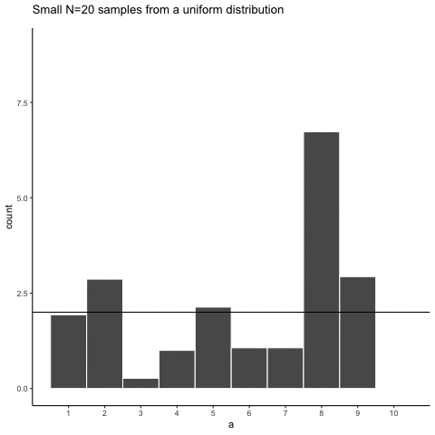
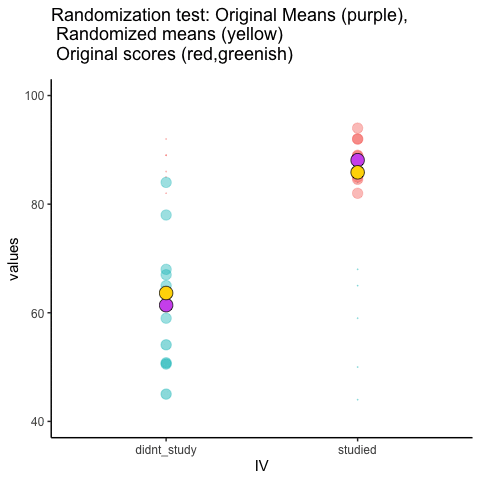

---
author:
  - Mallory L. Barnes
aliases: [redirects/foundations-for-inference.html]
---

```{r, include = FALSE}
source("global_stuff.R")
set.seed(538)
```

# Foundations for inference

> *Data and data sets are not objective; they are creations of human design. We give numbers their voice, draw inferences from them, and define their meaning through our interpretations.*
>
> Katie Crawford

**Inferential statistics** is the branch of statistics concerned with drawing conclusions about populations or causal relationships from sample data. It provides the tools to answer questions like: did our manipulation actually cause a change, or could the pattern we observed have arisen by random chance alone?

This chapter builds the conceptual foundations for inference using simulation, no formulas yet. The goal is to make the underlying logic explicit and visible before it gets formalized in later chapters.

## Brief review of Experiments

A controlled experiment is a structured method of data collection designed to support inferences about causality. Experiments involve deliberately manipulating one condition while holding others constant, then measuring the response.

Every experiment has two core components: the **independent variable**, the condition under experimental control, and the **dependent variable**, what is measured.

For example, a researcher studying the effects of wastewater discharge on stream health might compare dissolved oxygen (DO) levels at sites downstream of a discharge point against levels at unaffected reference sites, expecting DO to be lower downstream if the discharge is having an effect (wastewater typically consumes oxygen as it decomposes). Distance from discharge (affected vs. reference) is the independent variable; DO is the dependent variable.

Causal forces produce detectable change. If the discharge is truly reducing dissolved oxygen, then measurements from affected sites should differ systematically from measurements at reference sites. The experiment is designed to detect that change.

The central question becomes: how do we know if a measured difference between conditions reflects a real causal effect? Data always contain variability: measurements fluctuate even when nothing has changed. To decide whether a difference is real, we need tools that can distinguish meaningful change from background noise.

## The data came from a distribution

Understanding where data come from is foundational to inference. This section returns to sampling and distributions, but now to ask what they reveal about the process that generated our data, not just to describe them.

A **distribution** specifies what numbers are likely to occur and how often. It sets the constraints on what we can expect to see when we take measurements.

### Uniform distribution

As a reminder from last chapter, @fig-5unifagain shows that the shape of a uniform distribution is completely flat.

```{r}
#| label: fig-5unifagain
#| fig-cap: "Uniform distribution showing that the numbers from 1 to 10 have an equal probability of being sampled"

library(ggplot2)
library(dplyr)

df <- data.frame(a=1:10,b=seq(.1,1,.1))
df$a <- as.factor(df$a)

ggplot(df,aes(x=a,y=b))+
  geom_point(color="white")+
  geom_hline(yintercept=.1)+
  scale_y_continuous(limits=c(0,1), breaks=seq(0,1, by = .1))+
  theme_classic(base_size = 18)+
  ylab("Probability")+
  xlab("Number")+
  ggtitle("Uniform distribution for numbers 1 to 10")


```

The flat line is the whole point: every value from 1 to 10 has the same probability of occurring, $1/10 = 0.1$. That is what makes a distribution uniform.

Treat it as a number-generating process. Run it repeatedly and it produces each value about 10% of the time. Let's draw 100 numbers from it.

```{r}
#| echo: true
a <- round(runif(100, 1, 10))
```

Drawing a subset of observations from a process is **sampling**, and the full set of values that process could produce is the **population** (Chapter 3). Here we know the source because we chose it. But if someone handed you these 100 numbers cold, the way to check them against a uniform distribution would be to count how often each value shows up: all ten should appear about equally often, roughly 10 times each.

```{r}
#| label: fig-5histunif
#| fig-cap: "Histogram of 100 numbers randomly sampled from the uniform distribution containing the integers from 1 to 10."

ggplot(data.frame(a = a), aes(x = a)) +
  geom_histogram(binwidth = 1) +
  scale_x_continuous(breaks = 1:10) +
  labs(x = "Number", y = "Count")
```

They don't. The bars in @fig-5histunif vary in height even though every value had the same probability. That is **sampling variability**, and the gap between what a sample shows and what its distribution predicts is **sampling error**.

### Not all samples are the same, they are usually quite different

Let's look at sampling error more closely. We will sample 20 numbers from the uniform distribution. We should expect that each number between 1 and 10 occurs about two times each. As before, this expectation can be visualized in a histogram. To get a better sense of sampling error, let's repeat the above process ten times. @fig-5manysamples has 10 histograms, each showing what 10 different samples of twenty numbers looks like:

```{r}
#| label: fig-5manysamples
#| fig-cap: "Histograms for 10 different samples from the uniform distribution. Each sample contains 20 numbers. The histograms all look quite different. The differences between the samples are due to sampling error or random chance."
#| out-width: "100%"

possible_integers <- round(runif(20*10,1,10))
df <- data.frame(possible_integers, sample=rep(1:10,each=20))

ggplot(df,aes(x=possible_integers))+
  geom_histogram(bins=10, color="white")+
  scale_x_continuous(breaks=seq(1,10,1))+
  facet_wrap(~sample, nrow=2)

```

You might notice right away that none of the histograms are the same. Even though we are randomly taking 20 numbers from the very same uniform distribution, each sample of 20 numbers comes out different. That's our sampling variability.

@fig-5expectedUnif shows an animated version of the process of repeatedly choosing 20 new random numbers and plotting a histogram. The horizontal line shows the flat-line shape of the uniform distribution. The line crosses the y-axis at 2; and, we expect that each number (from 1 to 10) should occur about 2 times each in a sample of 20. However, each sample bounces around quite a bit, due to random chance.

::: {.content-visible when-format="html"}
```{r}
#| label: fig-5expectedUnif
#| fig-cap: "Animated histograms of repeated samples of 20 from a uniform distribution. The black line marks the expected count of 2 per number; the bars rarely match it."

knitr::include_graphics(path="imgs/gifs/sampleUnifExpected-1.gif")
```
:::

::: {.content-visible when-format="pdf"}
{#fig-5expectedUnif width="75%"}
:::

Small samples show high variability because random chance can produce very uneven counts even when every value is equally likely. This variability is sampling error, and it makes it harder to identify the true distribution from a single sample.

### Large samples are more like the distribution they came from

Let's refresh the question. Which of the two samples in @fig-5whichone do you think came from a uniform distribution?

```{r}
#| label: fig-5whichone
#| fig-cap: "Which of these two samples came from a uniform distribution?"

a<-round(runif(20*2,1,10))
df<-data.frame(a,sample=rep(paste("Distribution",1:2),each=20))

ggplot(df,aes(x=a))+
  geom_histogram(bins=10, color="white")+
  facet_wrap(~sample)+
  theme_classic(base_size = 16)+
  theme(panel.border = element_rect(color = "grey40", fill = NA))+
  scale_x_continuous(breaks=seq(1,10,1))

```

Trick question. Both samples came from the uniform distribution, yet neither histogram looks flat. Sampling error can obscure the true shape of a distribution, even with a sample of this size.

Increasing the **sample size** makes it easier to see whether a sample came from a uniform distribution. We'll often use the letter `n` for sample size: the number of observations in a sample.

Increasing each sample from 20 to 100 observations, and again creating 10 samples drawn from the same uniform distribution, we'd now expect each number from 1 to 10 to occur about 10 times per sample. The histograms are shown in @fig-5unifsamp100.

```{r}
#| label: fig-5unifsamp100
#| fig-cap: "Histograms for different samples from a uniform distribution. N = 100 for each sample."
#| out-width: "100%"

a<-sample(1:10,100*10,replace=T)
df<-data.frame(a,sample=rep(1:10,each=100))

ggplot(df,aes(x=a))+
  geom_histogram(bins=10, color="white")+
  facet_wrap(~sample, nrow=2)+
  ylim(0,20)+
  scale_x_continuous(breaks=seq(1,10,1))

```

Again, most of these histograms don't look very flat: the bars still vary up and down instead of sitting exactly at 10 each. Sampling error is still there, and it always will be, at any sample size.

Increasing $N$ from 100 to 1000 observations per sample, we'd now expect every number to appear about 100 times each.

```{r}
#| label: fig-5unifsamp1000
#| fig-cap: "Histograms for different samples from a uniform distribution. N = 1000 for each sample."
#| out-width: "100%"

a<-sample(1:10,1000*10,replace=T)
df<-data.frame(a,sample=rep(1:10,each=1000))

ggplot(df,aes(x=a))+
 geom_histogram(bins=10, color="white")+
  facet_wrap(~sample, nrow=2)+
  ylim(0,200)+
  scale_x_continuous(breaks=seq(1,10,1))

```

@fig-5unifsamp1000 shows the histograms starting to flatten out. The bars are still not perfectly at 100, because there is still sampling error, but a flat-looking histogram from a large sample gives more confidence that the numbers came from a uniform distribution.

Pushing sample size further, to 100,000 observations per sample, we'd expect each number to occur about 10,000 times each.

```{r}
#| label: fig-5sampunifALOT
#| fig-cap: "Histograms for different samples from a uniform distribution. N = 100,000 for each sample."
#| out-width: "100%"

a<-sample(1:10,100000*10,replace=T)
df<-data.frame(a,sample=rep(1:10,each=100000))

ggplot(df,aes(x=a))+
  geom_histogram(bins=10, color="white")+
  facet_wrap(~sample, nrow=2)+
  ylim(0,20000)+
  scale_x_continuous(breaks=seq(1,10,1))

```

@fig-5sampunifALOT shows the histograms for each sample starting to look the same. With 100,000 observations each, chance has enough opportunity to distribute the numbers evenly, so the bars all land very close to 10,000, right where they should be for a uniform distribution.

:::: {.callout-tip title="Tip: Key pattern"}
The pattern behind a sample will tend to stabilize as sample size increases. Small samples show a wider variety of patterns because of sampling error (chance).
::::

Before returning to experiments, one more comparison, and this time it isn't a trick question: in @fig-5whichoneB, one of the two 20-observation samples really did come from a different distribution than the other.

```{r}
#| label: fig-5whichoneB
#| fig-cap: "Which of these samples came from a uniform distribution?"

a<-c(sample(1:10,20,replace=T),round(rnorm(20,5,2.5)))
df<-data.frame(a,sample=rep(paste("Distribution",1:2),each=20))

ggplot(df,aes(x=a))+
  geom_histogram(bins=10, color="white")+
  facet_wrap(~sample)+
  theme_classic(base_size = 16)+
  theme(panel.border = element_rect(color = "grey40", fill = NA))+
  scale_x_continuous(breaks=seq(1,10,1))

```

If you're not confident in the answer, that's because **sampling error** (randomness) is obscuring the histograms, even though the two samples really do come from different distributions this time.

Here's the same question again, this time with 1,000 observations per sample. Which histogram in @fig-5whichoneC do you think came from a uniform distribution, and which did not?

```{r}
#| label: fig-5whichoneC
#| fig-cap: "Which of these samples came from a uniform distribution?"

a<-c(sample(1:10,1000,replace=T),round(rnorm(1000,5,1.25)))
df<-data.frame(a,sample=rep(paste("Distribution",1:2),each=1000))

ggplot(df,aes(x=a))+
  geom_histogram(bins=10, color="white")+
  facet_wrap(~sample)+
  theme_classic(base_size = 16)+
  theme(panel.border = element_rect(color = "grey40", fill = NA))+
  scale_x_continuous(breaks=seq(0,10,1))

```

Now that we have increased N, we can see the pattern in each sample becomes more obvious. Distribution 1 has bars near 100, not perfectly flat, but it resembles a uniform distribution. Distribution 2 is not flat looking at all.

By comparing the two histograms, we've already performed a basic statistical inference: Distribution 2 did not come from a uniform distribution. This is the same logic underlying the formal tests covered in later chapters: arrange the data to make the source distribution visible, then judge whether the observed pattern is consistent with a hypothesized one.

```{=html}
<!--
## Playing with distributions

talk about a few different distribution. Embed shiny app

SHINY APP here

-->
```
## Is there a difference?

Back to experiments. We want to know if an independent variable (our manipulation) causes a change in a dependent variable (measurement); if it does, we should see differences in the measurement as a function of the manipulation.

Some manipulations produce effects too large and consistent to need any statistics at all:

:::: {.callout-note title="Note: Light switch experiment"}
Flip the switch up (condition 1) and the light goes on (measurement). Flip it down (condition 2) and the light goes off (measurement). The light changes as a direct function of the switch position, every time. When an effect is this large and this consistent, there's no ambiguity: you don't need a statistical test to tell you the manipulation is working.
::::

Most environmental effects aren't like the light switch. They're a real signal buried in noisy, variable measurements, which is exactly the kind of case inference is built for.

### Chance can produce differences

Random chance can produce apparent differences between groups even when no real difference exists. We have already seen this with sampling: two samples from the same distribution come out differently. The same principle applies when we compare group means. This is a fundamental problem for inference.

To make this concrete, consider a scenario where we expect to find no real difference. A researcher surveys 10 bat hibernacula for white-nose syndrome, a fungal disease that has killed millions of North American bats. At each site they capture 20 bats and count how many show visible signs of infection. All 10 sites are drawn from the same population: no treatment, no environmental gradient, no systematic difference between them, so the true infection rate is identical everywhere. The sites are arbitrarily divided into two groups of 5 (Group A and Group B). Even though there is no real difference, we might still observe a difference in the mean number of infected bats simply because of sampling error.

Here is data from one run of this scenario:

```{r,echo=F}
group <- rep(c("A", "B"), each = 5)
infected <- rbinom(10, size = 20, prob = 0.40)
df <- data.frame(group, infected)

knitr::kable(df, col.names = c("Group", "Infected bats (of 20)"))
```

This is a long-format table. Each row is one site. The first column shows the group assignment, and the second shows how many of the 20 captured bats were infected. Did Group A have more infected bats on average than Group B?

It is easier to see the comparison in a bar graph (@fig-5gumballA), which shows the mean count for each group.

```{r}
#| label: fig-5gumballA
#| fig-cap: "Mean number of infected bats per site for two groups drawn from the same population. Note the zoomed y-axis, which does not start at 0."

mean_df <- aggregate(infected ~ group, df, mean)
ggplot(mean_df, aes(x = group, y = infected)) +
  xlab("Group") +
  ylab("Mean infected bats") +
  geom_bar(stat = "identity") +
  coord_cartesian(ylim = c(6, 10)) +
  theme_classic(base_size = 20)

```

The bars are not the same height: Group A and Group B have different mean counts. But both groups were drawn from the very same population of sites, so this isn't a real difference in infection risk, it's sampling error.

This is the core inference problem: differences appear even when nothing real caused them. **How can we tell whether an observed difference is real or just the result of chance?**

### Differences due to chance can be simulated

Chapter 2 showed that chance alone can produce spurious correlations. The same is true for group means: we can characterize exactly what chance is capable of producing in a comparison of group means. Once we know what chance typically does, and what it cannot do, we have a basis for judging whether our observed difference falls within or outside its range.

The first step is to replicate the sampling scenario many times. @fig-5gumballsims shows bar graphs of the mean infected count for Group A and Group B across 10 replications of the same survey: all 10 sites sampled from the same population, split 5+5, and means computed.

```{r}
#| label: fig-5gumballsims
#| fig-cap: "Ten replications of surveying 10 hibernacula and splitting them arbitrarily into two groups of 5. Every difference here is chance alone."
#| out-width: "100%"

group <- rep(rep(c("A", "B"), each = 5), 10)
experiment <- rep(1:10, each = 10)
infected <- rbinom(10 * 10, size = 20, prob = 0.40)
df <- data.frame(experiment, group, infected)
mean_df <- aggregate(infected ~ experiment * group, df, mean)

ggplot(mean_df, aes(x = group, y = infected)) +
  geom_bar(stat = "identity") +
  xlab("Group") +
  ylab("Mean infected bats") +
  facet_wrap(~experiment, nrow = 2)

```

These 10 replications show that chance produces different mean differences each time. Sometimes Group A is higher, sometimes Group B is higher, sometimes the means are nearly equal. All of this variation arises from sampling error alone: there is no real difference in the population.

## Chance makes some differences more likely than others

We have seen that chance can produce group mean differences. But we still need to characterize what chance usually does and what it rarely does. If we can establish the range of differences that chance produces, we can build a window: differences inside the window could plausibly have arisen by chance; differences outside the window could not.

We summarize each replication as a single **difference score**: the mean count for Group A minus the mean count for Group B. @fig-5gumballdiffs shows those difference scores for the 10 replications above.

```{r}
#| label: fig-5gumballdiffs
#| fig-cap: "Difference in mean infected count between Group A and Group B across 10 replications. The true difference is zero, but sampling error produces non-zero differences each time."

differences <- mean_df[mean_df$group == "A", ]$infected -
  mean_df[mean_df$group == "B", ]$infected

dif_df <- data.frame(experiment = c(1:10), differences)
dif_df$experiment <- as.factor(dif_df$experiment)

ggplot(dif_df, aes(y = differences, x = experiment)) +
  geom_bar(stat = "identity") +
  geom_hline(yintercept = 0) +
  theme_classic(base_size = 18) +
  xlab("Replication") +
  ylab("Difference in mean count (A - B)")
```

A bar at zero means the two groups had the same mean count in that replication. Positive values indicate Group A was higher; negative values indicate Group B was higher. The signs of the differences would flip if we reversed the subtraction order.

The differences in these 10 replications mostly fall in a narrow range. To better characterize what chance can do, we run 100 replications. The results are shown in @fig-5manydiffs.

```{r}
#| label: fig-5manydiffs
#| fig-cap: "Difference in mean infected count between Group A and Group B across 100 replications. There are many possible differences that chance can produce, but the y-axis shows the range is bounded."

group <- rep(rep(c("A", "B"), each = 5), 100)
experiment <- rep(1:100, each = 10)
infected <- rbinom(10 * 100, size = 20, prob = 0.40)
df <- data.frame(experiment, group, infected)
mean_df <- aggregate(infected ~ experiment * group, df, mean)

differences <- mean_df[mean_df$group == "A", ]$infected -
  mean_df[mean_df$group == "B", ]$infected

dif_df <- data.frame(experiment = c(1:100), differences)
dif_df$experiment <- as.factor(dif_df$experiment)

ggplot(dif_df, aes(y = differences, x = experiment)) +
  geom_bar(stat = "identity") +
  scale_x_discrete(breaks = c(1, 25, 50, 75, 100)) +
  theme_classic(base_size = 16) +
  xlab("Replication") +
  ylab("Difference in mean count (A - B)")
```

The x-axis just indexes the 100 replications; the information is on the y-axis. Many different difference sizes occur, but the range is bounded: the bars stay within a limited band around zero, and differences several times larger never show up. This begins to define the window of what chance can produce.

To get a clearer picture, we now run 10,000 replications and plot the distribution of difference scores as a histogram. This gives a precise view of which differences happen often and which are extremely rare.

```{r}
#| label: fig-5histdiffgumball
#| fig-cap: "Histogram of mean count differences between Group A and Group B over 10,000 replications. All differences arise from chance alone. The most frequent difference is near zero; larger differences occur less often. Chance cannot produce everything."

group <- rep(rep(c("A", "B"), each = 5), 10000)
experiment <- rep(1:10000, each = 10)
infected <- rbinom(10 * 10000, size = 20, prob = 0.40)
df <- data.frame(experiment, group, infected)
mean_df <- aggregate(infected ~ experiment * group, df, mean)

differences <- mean_df[mean_df$group == "A", ]$infected -
  mean_df[mean_df$group == "B", ]$infected

hist(differences, breaks = 50,
     main = NULL,
     xlab = "Difference in mean count (A - B)")
```

This histogram is the **chance window** for this study design. It shows that chance most often produces a difference near zero, the tallest bar in the center. Larger differences in either direction occur less and less frequently. The distribution has a clear boundary: extreme differences are possible but very rare.

We can use this window to evaluate any observed difference. If a study found a difference of 1 infected bat between two groups, that falls well inside the chance window: differences of that size occur frequently by random sampling alone. If the study found a difference of 6 bats, that would fall far outside the window; chance produced a difference that large 0 times out of 10,000. When an observed result almost never happens by chance, we have grounds to conclude that something other than chance produced it.

## Simulation-Based Inference

Most of the inference done throughout the rest of this course comes down to one question: did chance produce the difference in the data? In an experiment, we want to know if our manipulation caused a difference in our measurement. But everything we measure has natural variability, so we'll always find *some* difference between conditions, whether the manipulation matters or not. What we want to know is whether that difference could plausibly have been produced by chance alone. If chance is a very unlikely explanation, we infer that something about the manipulation, not chance, produced the difference.

:::: {.callout-caution title="Warning: Beyond ruling out chance"}
Ruling out chance is not all that statistics does. The same tools generalize to asking which of several competing models could have produced the data, weighing them against each other rather than only rejecting the unlikely one. Those methods are beyond this book.
::::

The simulation-based approach here answers that question the same way every formal test in later chapters does. The advantage of starting with simulation is that every step is visible before any formulas are introduced.

### Intuitive methods

The approach in this section uses only simple arithmetic operations that you already understand to build a tool for inference. Specifically, we will use:

1.  Sampling numbers randomly from a distribution
2.  Adding and subtracting
3.  Division, to find the mean
4.  Counting
5.  Graphing and drawing lines
6.  No formulas

### Part 1: Frequency-based intuition about occurrence

**Question**: How many times does something need to happen for it to happen "a lot"? How rare does something need to be before you stop worrying about it?

Environmental scientists already have a working vocabulary for this: the **100-year flood**. A "100-year flood" doesn't mean floods that size happen once a century on a schedule; it means that in any given year, there's about a 1-in-100 chance of a flood that severe. Would you build a house in that floodplain? Many people do, and often regret it, because a 1% annual chance still adds up over a 30-year mortgage (roughly a 26% chance of at least one such flood in that span). A location with a 1-in-10,000 annual flood risk is very different: over the same 30 years, the cumulative chance is under 0.3%. Same underlying logic, wildly different practical decisions.

That's the intuition we need going forward: **rare events still happen, but how rare something is changes what you're willing to conclude from seeing it.** Later in this chapter, we'll use 1-in-10,000 as our own working definition of "rare enough to call surprising."

### Part 2: Judgment and Decision-making

We already have everything we need to make this concrete: the bat simulation above gave us 10,000 mean differences that chance alone can produce when there is no real difference between groups. That histogram (@fig-5histdiffgumball) *is* our reference distribution. Now we use it to make a decision.

Let's draw some lines on that same histogram and label two kinds of regions:

1.  **Region of chance.** Chance did it. Chance could have done it.
2.  **Region of not chance.** Chance didn't do it. Chance couldn't have done it.

The boundaries are the minimum and maximum values chance actually produced across the 10,000 replications. @fig-5simdecision shows this applied to our count differences.

```{r}
#| label: fig-5simdecision
#| fig-cap: "Decision boundaries applied to the histogram of mean count differences from @fig-5histdiffgumball. Green marks differences chance never produced in 10,000 replications; red marks the range chance did produce; grey marks a zone chance produced only rarely."

diff_min <- min(differences)
diff_max <- max(differences)
pad <- (diff_max - diff_min) * 0.6
grey_width <- (diff_max - diff_min) * 0.15

ggplot(data.frame(differences), aes(x = differences)) +
  annotate("rect", xmin = diff_min, xmax = diff_max, ymin = 0, ymax = Inf,
           alpha = 0.4, fill = "red") +
  annotate("rect", xmin = diff_min, xmax = diff_min + grey_width, ymin = 0, ymax = Inf,
           alpha = 0.6, fill = "grey70") +
  annotate("rect", xmin = diff_max - grey_width, xmax = diff_max, ymin = 0, ymax = Inf,
           alpha = 0.6, fill = "grey70") +
  annotate("rect", xmin = -Inf, xmax = diff_min, ymin = 0, ymax = Inf,
           alpha = 0.5, fill = "lightgreen") +
  annotate("rect", xmin = diff_max, xmax = Inf, ymin = 0, ymax = Inf,
           alpha = 0.5, fill = "lightgreen") +
  geom_histogram(binwidth = 0.2, center = 0, color = "white") +
  geom_vline(xintercept = c(diff_min, diff_max)) +
  coord_cartesian(xlim = c(diff_min - pad, diff_max + pad)) +
  annotate("text", x = 0, y = Inf, vjust = 2, fontface = "bold", label = "CHANCE") +
  annotate("text", x = diff_min - pad * 0.4, y = Inf, vjust = 2, fontface = "bold", label = "NOT\nCHANCE") +
  annotate("text", x = diff_max + pad * 0.4, y = Inf, vjust = 2, fontface = "bold", label = "NOT\nCHANCE") +
  xlab("Difference in mean count (Group A - Group B)") +
  ylab("Count")

```

Here's how the decision works. A difference beyond the green boundary (roughly `r round(diff_min,1)` to `r round(diff_max,1)` bats, from our 10,000 simulated replications) never happened by chance in this simulation, so observing something out there would give real grounds to suspect it wasn't just sampling error. A difference well inside the red zone, close to 0, is exactly what chance produces routinely: no grounds for suspicion.

The grey bands are the honest part: differences near the edge of what chance can do, but not quite past it. Chance *could* produce something in the grey zone, it's technically still inside the red window, but it does so rarely. That's not a clean yes/no; it's a "probably not chance, but I can't rule it out," and how you handle that ambiguity is a judgment call, not a fact. More conservative researchers shrink the grey zone (fewer false alarms, more missed real effects); more permissive researchers expand it (the reverse trade-off). Chapter 5 formalizes this trade-off with a standard convention ($\alpha = .05$) so that researchers aren't each inventing their own boundary from scratch.

**Making decisions and being wrong.**

No matter how you plan to make decisions about your data, you will always be prone to making some mistakes. You might call one finding real, when in fact it was caused by chance. This is called a **type I** error, or a false positive. You might ignore one finding, calling it chance, when in fact it wasn't chance (even though it was in the window). This is called a **type II** error, or a false negative.

How you make decisions influences how often you make errors over time. A researcher who only accepts results as real when they fall in the strict "no chance" zone will make few type I errors, but will also make more type II errors, missing real effects that the decision criterion happened to call chance. A researcher who accepts results in the grey zone as real will make more type I errors but fewer type II errors. Using cutoff regions for decision-making forces this trade-off. The Bayesian view sidesteps it somewhat: rather than a binary real/not-real decision, it treats confidence as continuous, updated by each new experiment, which avoids committing to a fixed trade-off between the two error types.

There's also a way to reduce both error types, and increase confidence in your results, before you even run the experiment: designing the study well in the first place.

### Part 3: Study Design and Sensitivity

Study design directly controls how sensitive an analysis is. It's often possible, and important, to choose a design that can actually detect the size of effect you care about.

Two forces govern whether a study can detect a real effect: the size of the effect, and the amount of noise in the data. The main design choice under your control is sample size, which determines how much that noise obscures the signal.

Recall what happens to the sampling distribution of the mean as sample size increases: it narrows. The same is true for the distribution of mean differences. As $n$ increases, the range of differences that chance alone produces shrinks. This means that with enough sites or plots, even a small real effect can be reliably distinguished from noise, while with too few, even a fairly large real effect can get lost in it.

Let's return to the hibernacula scenario, but now vary the number of sites surveyed per group: 5 (what we started with), 10, 20, and 40.

```{r}
#| label: fig-5sampleDistNormal
#| fig-cap: "The width of the chance window for mean count differences shrinks as the number of sites per group increases."

ns <- c(5, 10, 20, 40)
sims <- 5000
all_df <- data.frame(
  sample = c(sapply(ns, function(x) replicate(sims, mean(rbinom(x, 20, 0.40)) - mean(rbinom(x, 20, 0.40))))),
  sample_size = rep(ns, each = sims)
)

ggplot(all_df, aes(x = sample)) +
  geom_histogram(binwidth = 0.2, center = 0, color = "white") +
  facet_wrap(~sample_size) +
  theme_classic(base_size = 13) +
  ggtitle("Chance window for mean count differences, by sites per group") +
  ylab("Count") +
  xlab("Difference in mean count (Group A - Group B)")

```

```{r}
#| label: tbl-5minmax
#| tbl-cap: "Smallest and largest mean count differences produced by chance, by sites per group."

the_range <- all_df %>%
  group_by(sample_size) %>%
  summarize(smallest = round(min(sample), 2),
            largest  = round(max(sample), 2))

knitr::kable(the_range, col.names = c("Sites per group", "Smallest", "Largest"))
```

The pattern is clear: the chance window is wide with only 5 sites per group and narrows steadily as sites are added. Consider what this means for a real study. Suppose a treatment applied inside the hibernacula is expected to reduce infections by about 2 bats per site. With only 5 sites per group, that effect size sits well inside the chance window in the table above, so a real 2-bat effect could easily be mistaken for sampling noise, or a sampling-noise result could be mistaken for a real effect. With 40 sites per group, the same 2-bat difference sits outside the window chance can produce, and you could detect it with real confidence.

**The design of a study determines the size of effect it can reliably detect.** Sample size is the main lever, but not the only one: taking repeated measurements at each site (reducing measurement noise) and choosing conditions with a genuinely strong contrast both help too. This idea, how sensitive a given design is to a real effect of a given size, has a name, **statistical power**, which Chapter 5 develops formally alongside the standard $\alpha = .05$ convention.

### Summary of Simulation-Based Inference

We built the core logic of inference using nothing but sampling, arithmetic, and histograms: simulate what chance alone can produce, compare an observed result to that simulated distribution, and use where it falls to judge whether chance is a plausible explanation. The comparison isn't perfectly clean. There's a grey zone near the edges where judgment has to do the work, and the width of the chance window itself depends on how much data you collect.

## The randomization test (permutation test)

This is the first formal inferential statistic in this textbook. Everything so far has built the intuition; now we formalize it into a **randomization test**, which uses random chance to judge whether an experimental finding was likely due to chance or not. The ideas behind it are exactly the ideas already developed in this chapter, now assembled and given a name.

When you run an experiment and collect data, you find out what happened that one time. Because you ran it only once, you don't find out what **could have happened**. The randomization test gives you that missing half, so you can compare **what did happen** in your experiment against it.

### Pretend example: does distance from a highway affect NO₂ levels?

Let's say you are monitoring nitrogen dioxide (NO₂) concentrations at air quality sites near a major highway. You assign 20 monitoring sites to a "near" group (within 50 m of the highway) and 20 different sites to a "far" group (500 m or more from the highway). If highway traffic is a meaningful source of NO₂, then the near group should have higher concentrations on average than the far group.

Let's say the data looked like this:

```{r}

near <- round(runif(20, 35, 65))
far  <- round(runif(20, 10, 40))

no2_df <- data.frame(site = seq(1:20), near_ppb = near, far_ppb = far)

no2_df <- no2_df %>%
  rbind(c("Sums", colSums(no2_df[, 2:3]))) %>%
  rbind(c("Means", colMeans(no2_df[, 2:3])))
knitr::kable(no2_df)

```

So, did the near-highway sites have higher NO₂ than the far sites? The mean for near sites was `r mean(near)` ppb, and for far sites was `r mean(far)` ppb. Just looking at the means, it looks like proximity to the highway matters.

But could this just be chance? Maybe the near sites happened to be in a windier or more industrialized area, so their higher readings reflect those conditions rather than the highway itself, or maybe the difference arose simply from random sampling variation. That's a legitimate concern worth taking seriously. We already know how the data came out; what we want to know is how they *could have* come out, across all the possibilities.

The data would have come out a bit different if some sites from the near group had been placed in the far group, and vice versa. There are many ways the 40 sites could have been assigned to two groups, and the group means would come out differently depending on the assignment.

It's not practical to run the experiment every possible way, that would take too long, but we can estimate how those experiments might have turned out using simulation.

We take all 40 NO₂ readings from both groups, pool them together, then randomly assign 20 to a "near" group and 20 to a "far" group, as if the original assignment had been done differently. We compute the new group means and their difference, and repeat this process many times to build up a picture of what the difference could have been under random assignment.

**Doing the randomization.**

Before we do that, let's show how the randomization part works. We'll use fewer numbers to make the process easier to look at. Here are the first 5 NO₂ readings from each group.

```{r}
no2_df_small <- no2_df[1:5, ]
no2_df_small$near_ppb <- as.numeric(no2_df_small$near_ppb)
no2_df_small$far_ppb  <- as.numeric(no2_df_small$far_ppb)

no2_df_small <- no2_df_small %>%
  rbind(c("Sums", colSums(no2_df_small[, 2:3]))) %>%
  rbind(c("Means", colMeans(no2_df_small[, 2:3])))
knitr::kable(no2_df_small)

```

Things could have turned out differently if some of the near-highway sites had been placed in the far group instead, and vice versa. Here's how we can do some random switching using R.

```{r, echo=TRUE}
all_readings      <- c(near[1:5], far[1:5])
randomize_scores  <- sample(all_readings)
new_near          <- randomize_scores[1:5]
new_far           <- randomize_scores[6:10]
print(new_near)
print(new_far)
```

We have taken the first 5 readings from each group and put them all into a variable called `all_readings`. Then we use the `sample` function in R to shuffle the readings. Finally, we take the first 5 readings from the shuffled numbers and put them into `new_near`, and the last five into `new_far`.

Repeating this a couple of times and putting the results in a table shows the group means shifting each time the sites are shuffled around:

```{r, echo=FALSE}
no2_df_small <- no2_df[1:5, ]
no2_df_small$near_ppb <- as.numeric(no2_df_small$near_ppb)
no2_df_small$far_ppb  <- as.numeric(no2_df_small$far_ppb)

all_readings     <- c(near[1:5], far[1:5])
randomize_scores <- sample(all_readings)
near2 <- randomize_scores[1:5]
far2  <- randomize_scores[6:10]

no2_df_small <- cbind(no2_df_small, near2, far2)

all_readings     <- c(near[1:5], far[1:5])
randomize_scores <- sample(all_readings)
near3 <- randomize_scores[1:5]
far3  <- randomize_scores[6:10]

no2_df_small <- cbind(no2_df_small, near3, far3)

no2_df_small <- no2_df_small %>%
  rbind(c("Sums", colSums(no2_df_small[, 2:7]))) %>%
  rbind(c("Means", colMeans(no2_df_small[, 2:7])))
knitr::kable(no2_df_small)

```

**Simulating the mean differences across the different randomizations.**

In our pretend study we found that the mean NO₂ for near-highway sites was `r mean(near)` ppb, and for far sites was `r mean(far)` ppb. The mean difference (near − far) was `r mean(near) - mean(far)` ppb. This is a pretty big difference. This is **what did happen**. But, **what could have happened**? If we tried out all the possible ways to assign 40 sites to two groups, what does the distribution of the possible mean differences look like? Let's find out. This is what the randomization test is all about.

When we do our randomization test we will measure the mean difference in NO₂ between the near and far groups. Every time we randomize we will save the mean difference.

@fig-5randtest animates what's happening in a randomization test, using data from a different fake study (we'll return to the NO₂ example after). The purple dots show the original mean of each group (lower-exposure vs. higher-exposure sites); since one sits below the other, we want to know whether chance could produce a difference that size. The light green and red dots are the individual readings from each of 10 sites per group, the raw data the purple means are built from. As the animation randomizes, those readings shuffle between groups, and the moving yellow dots show the resulting new group means after each shuffle. The spread of the yellow dots shows the range of differences chance alone could produce.

::: {.content-visible when-format="html"}
```{r}
#| label: fig-5randtest
#| fig-cap: "Animation of a randomization test. Purple dots are the original condition means, yellow dots the means after each reshuffle, and blue and red dots track how individual scores move."

knitr::include_graphics(path="imgs/gifs/randomizationTest-1.gif")
```
:::

::: {.content-visible when-format="pdf"}
{#fig-5randtest width="75%"}
:::

```{r rtestGif, eval=F}
study <- round(runif(10, 80, 100))
no_study <- round(runif(10, 40, 90))

study_df <- data.frame(student = seq(1:10), study, no_study)
mean_original <- data.frame(IV = c("studied", "didnt_study"),
                            means = c(mean(study), mean(no_study)))
t_df <- data.frame(
  sims = rep(1, 20),
  IV = rep(c("studied", "didnt_study"), each = 10),
  values = c(study, no_study),
  rand_order = rep(c(0, 1), each = 10)
)

raw_df <- t_df
for (i in 2:10) {
  #all<-sample(c(study,no_study))
  #mean_study[i]<-mean(all[1:20])
  #mean_no_study[i]<-mean(all[21:40])
  #t_df<-data.frame(sims=rep(i,20),
  #                 IV=rep(c("studied","didnt_study"),each=10),
  #                 values=c(all[1:20],all[21:40]))
  new_index <- sample(1:20)
  t_df$values <- t_df$values[new_index]
  t_df$rand_order <- t_df$rand_order[new_index]
  t_df$sims <- rep(i, 20)
  raw_df <- rbind(raw_df, t_df)
}

raw_df$rand_order <- as.factor(raw_df$rand_order)
rand_df <- aggregate(values ~ sims * IV, raw_df, mean)
names(rand_df) <- c("sims", "IV", "means")

#rand_df <- data.frame(sims=rep(1:10,2),means=c(mean_study,mean_no_study),
#  IV=rep(c("studied","didnt_study"),each=10))

a <- ggplot(raw_df, aes(
  x = IV,
  y = values,
  color = rand_order,
  size = 3
)) +
  geom_point(stat = "identity", alpha = .5) +
  geom_point(
    data = mean_original,
    aes(x = IV, y = means),
    stat = "identity",
    shape = 21,
    size = 6,
    color = "black",
    fill = "mediumorchid2"
  ) +
  geom_point(
    data = rand_df,
    aes(x = IV, y = means),
    stat = "identity",
    shape = 21,
    size = 6,
    color = "black",
    fill = "gold"
  ) +
  theme_classic(base_size = 15) +
  coord_cartesian(ylim = c(40, 100)) +
  theme(legend.position = "none") +
  ggtitle(
    "Randomization test: Original Means (purple),
          \n Randomized means (yellow)
          \n Original scores (red,greenish)"
  ) +
  transition_states(sims,
                    transition_length = 1,
                    state_length = 2) + enter_fade() +
  exit_shrink() +
  ease_aes('sine-in-out')

animate(a, nframes = 100, fps = 5)

```

We are engaging in some visual statistical inference. By looking at the range of motion of the yellow dots, we are watching what kind of differences chance can produce. In this animation, the purple dots, representing the original difference, are generally outside of the range of chance. The yellow dots don't move past the purple dots, as a result chance is an unlikely explanation of the difference.

If the purple dots were inside the range of the yellow dots, we would know that chance is capable of producing the difference we observed, and that it does so fairly often. As a result, we should not conclude the manipulation caused the difference, because it could have easily occurred by chance.

Let's return to the NO₂ example. After we randomize our readings many times and compute the new means and mean differences, we will have loads of mean differences to look at, which we can plot in a histogram. The histogram gives a picture of **what could have happened**. Then, we can compare **what did happen** with **what could have happened**.

Here's the histogram of the mean differences from the randomization test. For this simulation, we randomized the results from the original study 10,000 times. This is what could have happened. The blue line in @fig-5randhist shows where the observed difference lies on the x-axis.

```{r}
#| label: fig-5randhist
#| fig-cap: "A histogram of simulated mean differences in NO₂ (ppb) for a randomization test. The blue vertical line marks the observed difference from our study."

mean_differences <- length(10000)
for (i in 1:10000) {
  all <- sample(c(near, far))
  mean_differences[i] <- mean(all[1:20]) - mean(all[21:40])
}

rand_df <- data.frame(sims = 1:10000, mean_differences)

ggplot(rand_df, aes(x = mean_differences)) +
  geom_histogram(color = "white") +
  xlab(expression("Mean difference in NO"[2]*" (ppb)")) +
  geom_vline(color = "#1446a0", xintercept = (mean(near) - mean(far)))

```

This histogram is another window of chance: the mean differences that could have occurred if the 40 sites had been assigned to the near and far groups differently. The differences range from negative to positive, symmetric around a most-frequent value of 0, and grow less frequent the larger they get in either direction. The blue line, **the observed difference** from our study, sits well out to the right, outside the histogram entirely.

So could the observed difference have been caused by chance? Probably not. It is rare under chance alone, which makes it more consistent with a real effect of highway proximity on NO₂.

**Important:** **what could have happened** always means what could have happened **by chance**. That comparison is the whole test.

Now suppose we'd gotten a much smaller mean difference when we first ran the study. New lines (blue and red) represent smaller differences we might have found instead.

```{r}
#| label: fig-5randquestion
#| fig-cap: "Would you expect a mean difference represented by the blue line to occur more or less often by chance compared to the mean difference represented by the red line?"

ggplot(rand_df, aes(x = mean_differences)) +
  geom_histogram(color = "white") +
  xlab(expression("Mean difference in NO"[2]*" (ppb)")) +
  geom_vline(color = "#1446a0", xintercept = 10) +
  geom_vline(color = "#b22222", xintercept = 5)

```

Look at the blue line in @fig-5randquestion, a mean difference of 10 ppb. It sits inside the chance window: differences that size do happen sometimes by chance. You might lean toward "probably not chance" since it's near the edge, but with some real skepticism. The red line, a difference of +5 ppb, sits well inside the chance window, and differences that size happen fairly often, so it would take more evidence before concluding highway proximity was driving it.

## Chapter Summary

**Why it matters.** This chapter is the conceptual hinge of the course. Every formal test that follows is a shortcut for what we did here by hand: work out what chance alone could produce, then check whether your result sits inside that range.

**Core ideas**

-   **The question inference actually asks.** Not "is there a difference," but "where did this difference come from?" Chance alone produces differences between groups all the time, so the real question is whether chance is a sufficient explanation for yours.
-   **Simulate what chance can do.** Randomly reshuffling your data breaks any real relationship while keeping everything else intact. Doing that many times builds a picture of the differences chance alone can generate for a dataset your size.
-   **Then compare.** If your observed difference sits comfortably inside that chance window, chance remains a plausible explanation. If it sits far outside, chance becomes hard to defend as the whole story.
-   **The grey zone is real.** Results near the edge of the chance window are genuinely ambiguous, and where you draw the line is a judgment call rather than a fact. The next chapter adopts a convention ($\alpha = .05$) so researchers aren't each inventing their own boundary.
-   **Design determines what you can detect.** Sample size is the main lever, but repeated measurements and a stronger contrast between conditions matter too. A study can fail to find a real effect simply because it was never built to see one.
-   **The picture becomes a number.** From here on we replace the histogram with a single summary, the probability that chance could have produced your result. That number is the $p$-value, and the next few chapters build toward it.

