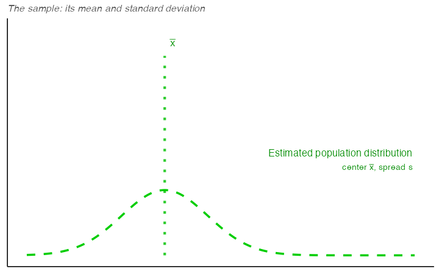
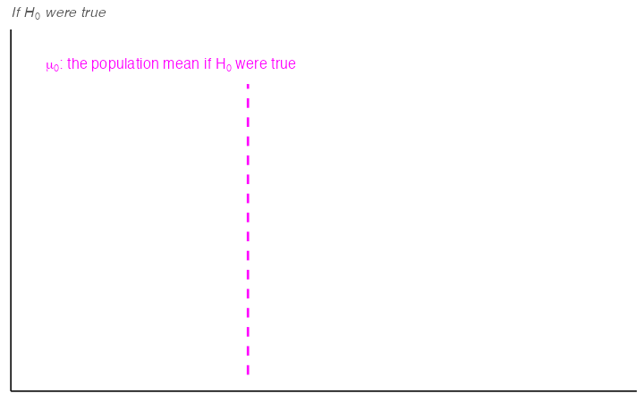
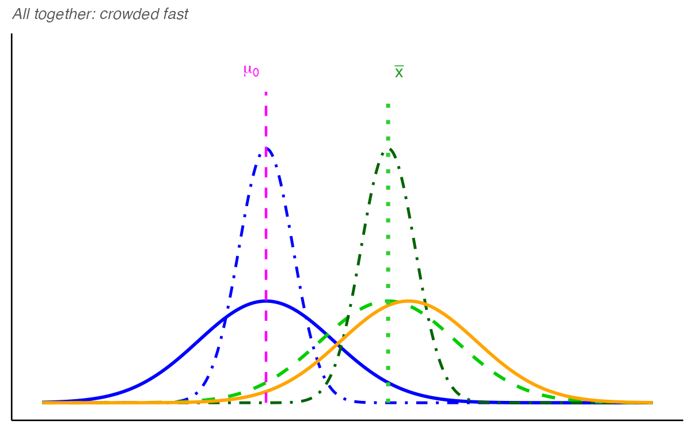

---
author:
  - Mallory L. Barnes
aliases: [redirects/foundations-for-inference.html]
---

```{r, include = FALSE}
source("global_stuff.R")
set.seed(538)
```

# Inference and Hypothesis Testing

> *Data and data sets are not objective; they are creations of human design. We give numbers their voice, draw inferences from them, and define their meaning through our interpretations.*
>
> Kate Crawford

Inferential statistics is the branch of statistics concerned with drawing conclusions about populations or causal relationships from sample data. It answers questions such as whether a manipulation caused a change, or whether a gap in infected-bat counts between two groups of caves could have arisen by random chance alone.

Chapter 3 built the sampling distribution of the sample mean and used it to estimate a confidence interval. This chapter uses the same tools to test a hypothesis, in two parts. The first part builds the logic by simulation, with no formulas. We work out what chance alone can produce, then compare a result against it. The rest of the chapter replaces the simulation with a standard hypothesis test. Once you can assume a known reference distribution, such as the normal curve, you no longer have to rebuild the chance window from scratch every time.

```{r, include=FALSE}
library(ggplot2)
library(dplyr)
library(gridExtra)
library(kableExtra)

# COLOUR SCHEME (decided 2026-08-18): keep this bespoke six-colour scheme, do not
# convert to e538_palette. This figure carries six semantic roles (null, sampling
# distribution, estimated population, true population, mu_0, rejection region) and the
# house palette has five, one of which (beige) is unusable as a data colour. The palette
# literally cannot express this figure without collapsing two distinctions.
# Consistency with Ch 3 was handled from the other side instead: Ch 3's CLT figures were
# recoloured to match this scheme where the roles overlap (population = orange,
# sampling distribution of the sample mean = dark green). Before that, Ch 3 used red for the
# population and blue for the sampling distribution, which collided with red = rejection
# region and blue = null here.

plot_distributions <- function(null_mean, null_sd, sample_mean, sample_sd, inferred_mean, inferred_sd, true_mean, true_sd, show_ci = TRUE, show_samp = TRUE, y_top = 1.4, show_null = TRUE, show_true = TRUE, show_xbar = FALSE) {
  x_vals <- seq(-6, 6, by=0.01)
  
  h0 <- dnorm(x_vals, mean=null_mean, sd=null_sd)
  sampling_mean <- dnorm(x_vals, mean=sample_mean, sd=sample_sd)
  inferred_parent <- dnorm(x_vals, mean=inferred_mean, sd=inferred_sd)
  true_parent <- dnorm(x_vals, mean=true_mean, sd=true_sd)
  CI_left <- qnorm(0.025, mean=sample_mean, sd=sample_sd)
  CI_right <- qnorm(0.975, mean=sample_mean, sd=sample_sd)
  y_intersect = dnorm(null_mean, mean=null_mean, sd=null_sd)

  
  p <- ggplot() + 
    { if (show_null) geom_line(aes(x=x_vals, y=h0, color="Null population distribution"), size=1.5) } +
    { if (show_samp) geom_line(aes(x=x_vals, y=sampling_mean, color="Sampling distribution of the sample mean"), linetype="dotdash", size=1) } +
    { if (show_true) geom_line(aes(x=x_vals, y=true_parent, color="True population distribution"), size=1.5) } +
    geom_line(aes(x=x_vals, y=inferred_parent, color="Estimated population distribution"), linetype="dashed", size=1.5) +
    { if (show_ci) geom_segment(aes(x = CI_left, xend = CI_right, y = 0., yend = 0), color="darkgreen", size=1.5) } +
    { if (show_xbar) annotate("segment", x = inferred_mean, xend = inferred_mean, y = 0, yend = y_top * 0.92, colour = "limegreen", linetype = "dotted", linewidth = 1.6) } +
    { if (show_xbar) annotate("text", x = inferred_mean, y = y_top * 0.97, label = "bar(x)", parse = TRUE, colour = "#1E9E1E", fontface = "bold", size = 4.5) } +
    { if (show_null) geom_segment(aes(x = null_mean, xend = null_mean, y = y_intersect, yend = 0), linetype="dashed", color="magenta", size=1) } +
    coord_cartesian(xlim = c(-4.5, 4.5), ylim = c(0, y_top)) +  # shared axes across the four-color figures
    theme_classic() + 
    theme(legend.position='bottom', 
          axis.text = element_blank(), 
          axis.title = element_blank(), 
          axis.ticks = element_blank(), 
          legend.text = element_text(size = 12)) + 
    guides(color=guide_legend(title=NULL, nrow=2)) +
    scale_color_manual(values=c("Null population distribution"="blue", 
                                "Sampling distribution of the sample mean"="darkgreen", 
                                "Estimated population distribution"="green3", 
                                "True population distribution"="orange"))

  return(p)
}

```

## What chance alone can produce

An experiment asks whether a manipulation causes a change in what we measure. Some manipulations are so overwhelming that no statistics are required to see them. Flip a light switch up and the light comes on; flip it down and it goes off, every time. You don't need a $t$-test to tell you that flipping the light switch is the cause of the change in brightness.

Few effects in environmental science behave like this. An effect is a real signal in measurements that also contain noise. Flipping the switch changes the outcome *on average*, but not in every instance and not by the same amount every time.

Random chance can produce apparent differences between groups even when no real difference exists. We have already seen this with sampling: two samples from the same distribution come out differently. The same principle applies when we compare group means. So a difference between group means is not, by itself, evidence of a real effect.

Consider a scenario where we expect to find no real difference. A researcher surveys 10 caves for white-nose syndrome, a fungal disease that has killed millions of North American bats, capturing 20 bats at each cave and counting how many show visible signs of infection. @fig-4batdesign lays out the design.

```{r}
#| label: fig-4batdesign
#| fig-cap: "The bat-cave scenario study design. The split into two groups is arbitrary, so there is no real difference for the test to find."
#| fig-alt: "Study design schematic. IV: group assignment, arbitrary. Two boxes labeled Group A and Group B, each with n = 5 caves. DV: infected bats out of 20 captured."
#| fig-asp: 0.34
#| out-width: "100%"

design_groups("Group assignment (arbitrary)", c("Group A", "Group B"), 5, "caves",
              "Infected bats (of 20 captured)",
              "With no real difference, what can chance alone produce?")
```

All 10 caves are drawn from the same population. There is no treatment, no environmental gradient, nothing systematic separating them, so the true infection rate is identical everywhere. In this example every cave has the same 40% infection rate, so on average 8 of the 20 bats captured at a cave show signs of infection. The counts in the figures below are simulated from that rate. We chose the 40%, and chance produced everything else. Splitting the 10 caves into two groups of 5 is arbitrary. Any difference we see between those groups therefore *has* to be sampling error, so this scenario shows what chance alone can produce.

@fig-4batonerun shows one run of this scenario: the mean number of infected bats in each group.

```{r}
#| label: fig-4batonerun
#| fig-cap: "Mean number of infected bats per site for two groups drawn from the same population. Note the zoomed y-axis, which does not start at 0."
#| fig-alt: "Bar chart with two bars, Group A and Group B, showing the mean number of infected bats. The y-axis is zoomed to run from 6 to 10, so a modest difference between the two bars looks larger than it would on a full 0-to-20 scale."

group <- rep(c("A", "B"), each = 5)
infected <- rbinom(10, size = 20, prob = 0.40)
df <- data.frame(group, infected)

mean_df <- aggregate(infected ~ group, df, mean)
ggplot(mean_df, aes(x = group, y = infected)) +
  xlab("Group") +
  ylab("Mean infected bats") +
  geom_bar(stat = "identity") +
  coord_cartesian(ylim = c(6, 10))

```

Group A and Group B have different mean counts, `r sprintf("%.1f", mean_df$infected[1])` and `r sprintf("%.1f", mean_df$infected[2])` infected bats. Both groups were drawn from the same population of caves, with the same infection risk, so the gap is sampling error.

Differences appear even when nothing real caused them, so we need a way to tell whether an observed difference is real or the result of chance.

Chapter 2 built a chance window for correlations by repeating a random draw 1,000 times. We can build one for group means the same way, by running the same arbitrary split many times and recording each result. We summarize each run as a single **mean difference**: the mean count for Group A minus the mean count for Group B. @fig-4batdiffs shows the mean differences for 10 replications of the survey, each one sampling all 10 caves from the same population, splitting them 5 and 5, and computing the means.

```{r}
#| label: fig-4batdiffs
#| fig-cap: "Difference in mean infected count between Group A and Group B across 10 replications. The true difference is zero, but sampling error produces a non-zero difference in almost every replication."
#| fig-alt: "Bar chart of the A-minus-B mean difference for each of 10 replications, with a horizontal reference line at zero. Bars extend above and below the line by varying amounts, some replications favoring Group A, others favoring Group B."

group <- rep(rep(c("A", "B"), each = 5), 10)
experiment <- rep(1:10, each = 10)
infected <- rbinom(10 * 10, size = 20, prob = 0.40)
df <- data.frame(experiment, group, infected)
mean_df <- aggregate(infected ~ experiment * group, df, mean)

differences <- mean_df[mean_df$group == "A", ]$infected -
  mean_df[mean_df$group == "B", ]$infected

dif_df <- data.frame(experiment = c(1:10), differences)
dif_df$experiment <- as.factor(dif_df$experiment)

ggplot(dif_df, aes(y = differences, x = experiment)) +
  geom_bar(stat = "identity") +
  geom_hline(yintercept = 0) +
  xlab("Replication") +
  ylab("Difference in mean count (A - B)")
```

A bar at zero means the two groups had the same mean count in that replication. Positive values indicate Group A was higher; negative values indicate Group B was higher. Chance produces a new difference every time, but across these 10 replications no difference was larger than `r round(max(abs(dif_df$differences)), 1)` bats in either direction. To see which sizes are common and which are rare, we run 10,000 replications and plot the mean differences as a histogram.

**Before you look.** Each replication gives one mean difference, the Group A mean minus the Group B mean. The height of a bar in @fig-4histdiffbat counts how many of the 10,000 replications produced a difference of that size. Decide where you expect the tallest bar to be, and how far from zero you expect the differences to reach.

```{r}
#| label: fig-4histdiffbat
#| fig-cap: "Histogram of mean count differences between Group A and Group B over 10,000 replications. All differences arise from chance alone. The most frequent difference is near zero; larger differences occur less often. Differences beyond about ±3 are rare. The blue dot-dash curve is a normal curve with mean 0 and standard deviation 1.39."
#| fig-alt: "Histogram of 10,000 A-minus-B mean differences, tallest at zero in the center and tapering off symmetrically toward both larger positive and larger negative differences, with almost nothing beyond roughly plus or minus 3. A blue dot-dash bell curve drawn over the bars follows their heights closely."

group <- rep(rep(c("A", "B"), each = 5), 10000)
experiment <- rep(1:10000, each = 10)
infected <- rbinom(10 * 10000, size = 20, prob = 0.40)
df <- data.frame(experiment, group, infected)
mean_df <- aggregate(infected ~ experiment * group, df, mean)

differences <- mean_df[mean_df$group == "A", ]$infected -
  mean_df[mean_df$group == "B", ]$infected

# Normal curve for a difference between two means of 5 binomial(20, 0.4) counts,
# scaled to counts: 10,000 replications times the bin width of 1
sd_diff <- sqrt(2 * 20 * 0.4 * 0.6 / 5)
curve_df <- data.frame(x = seq(-6, 6, by = 0.02))
curve_df$y <- 10000 * 1 * dnorm(curve_df$x, mean = 0, sd = sd_diff)

ggplot(data.frame(differences), aes(x = differences)) +
  geom_histogram(binwidth = 1, color = "white", linewidth = 0.2) +
  geom_line(data = curve_df, aes(x = x, y = y), colour = "blue", linetype = "dotdash", linewidth = 1.1) +
  labs(x = "Difference in mean count (A - B)", y = "Count")
```

Most replications produced a difference near zero, so the tallest bar is the one at zero. Larger differences in either direction occur less and less frequently, and differences beyond about $\pm 3$ are possible, but only `r round(100 * mean(round(abs(differences), 1) > 3), 1)`% of the 10,000 replications produced one. This histogram is the **chance window** for this study design.

We can use this window to evaluate any observed difference. If a study found a difference of 1 infected bat between two groups, that falls well inside the chance window, because `r round(100 * mean(round(abs(differences), 1) >= 1))`% of the 10,000 replications produced a difference at least that large. If the study found a difference of 6 bats, that would fall outside the window. Chance never produced a difference that large in 10,000 replications. When an observed result almost never happens by chance, we have grounds to conclude that *something other than chance* produced it.

::: {.callout-note title="Note: Which direction?"}
**Still probability, model → data.** The chance window starts from a world we chose, every cave at the same infection rate, and shows the differences that world produces. The 1-bat and 6-bat results above are hypothetical, used to show what the window can tell us. No real study's data have entered yet.
:::

## Chance vs. not chance

Where to draw the line between "chance could have" and "chance didn't" is a judgment call. The window tells us what chance can do, but it does not tell us where that line goes.

@fig-4simdecision draws lines on the same bat histogram from above. The boundaries are the smallest and largest differences chance actually produced across the 10,000 replications.

```{r}
#| label: fig-4simdecision
#| fig-cap: "Decision boundaries applied to the histogram of mean count differences from @fig-4histdiffbat. Gray marks the range chance did produce across 10,000 replications; gold marks the edges of that range, which chance reached only rarely; red marks the differences chance never produced at all."
#| fig-alt: "The same histogram of 10,000 mean differences, now overlaid with colored zones. A gray band across the middle, labeled CHANCE, covers the full range chance actually produced. Narrow gold slivers mark the two edges of that gray band, and red zones beyond them on both sides, labeled NOT CHANCE, mark differences chance never produced in any of the 10,000 replications."

diff_min <- min(differences)
diff_max <- max(differences)
pad <- (diff_max - diff_min) * 0.6
grey_width <- (diff_max - diff_min) * 0.15

ggplot(data.frame(differences), aes(x = differences)) +
  annotate("rect", xmin = diff_min, xmax = diff_max, ymin = 0, ymax = Inf,
           alpha = 0.35, fill = "grey75") +
  annotate("rect", xmin = diff_min, xmax = diff_min + grey_width, ymin = 0, ymax = Inf,
           alpha = 0.5, fill = "#f5d547") +
  annotate("rect", xmin = diff_max - grey_width, xmax = diff_max, ymin = 0, ymax = Inf,
           alpha = 0.5, fill = "#f5d547") +
  annotate("rect", xmin = -Inf, xmax = diff_min, ymin = 0, ymax = Inf,
           alpha = 0.18, fill = "red") +
  annotate("rect", xmin = diff_max, xmax = Inf, ymin = 0, ymax = Inf,
           alpha = 0.18, fill = "red") +
  geom_histogram(binwidth = 1, center = 0, color = "white") +
  geom_vline(xintercept = c(diff_min, diff_max)) +
  coord_cartesian(xlim = c(diff_min - pad, diff_max + pad)) +
  annotate("text", x = 0, y = Inf, vjust = 2, fontface = "bold", label = "CHANCE") +
  annotate("text", x = diff_min - pad * 0.4, y = Inf, vjust = 2, fontface = "bold", label = "NOT\nCHANCE") +
  annotate("text", x = diff_max + pad * 0.4, y = Inf, vjust = 2, fontface = "bold", label = "NOT\nCHANCE") +
  xlab("Difference in mean count (Group A - Group B)") +
  ylab("Count")

```

Across the 10,000 replications, chance produced differences from about `r round(diff_min,1)` to `r round(diff_max,1)` bats.

- **Chance (gray).** Chance produced differences like this routinely, so there is no reason for suspicion.
- **Ambiguous (gold).** The gold zones are the edges of what chance produced. Chance *can* produce differences this large, but rarely, so chance is unlikely here but not ruled out.
- **Not chance (red).** Chance never produced a difference this large in 10,000 tries, which gives grounds to suspect something beyond sampling error.

### How rare is rare enough?

Environmental scientists already describe rarity with the **100-year flood**. A 100-year flood is a flood with about a 1-in-100 chance of happening in any given year. It does not arrive once a century on a schedule. @tbl-4flood follows that chance over a 30-year mortgage and sets it beside a much rarer flood, one with a 1-in-10,000 annual chance. The second column is $1 - (1 - \text{annual chance})^{30}$, the chance that at least one of the 30 years has the flood.

```{r}
#| label: tbl-4flood
#| tbl-cap: "Chance of at least one flood over a 30-year mortgage, for two annual flood risks."

annual <- c(0.01, 0.0001)
flood_tbl <- data.frame(
  annual = c("1 in 100 (1%)", "1 in 10,000 (0.01%)"),
  thirty = paste0(signif(100 * (1 - (1 - annual)^30), 2), "%")
)
knitr::kable(flood_tbl, col.names = c("Annual chance", "Chance of at least one in 30 years"), align = "lr")
```

A 1% annual chance adds up to roughly a 26% chance of at least one such flood over the mortgage. A 1-in-10,000 annual risk stays under 0.3% over the same 30 years.

Rare events still happen, as the 26% chance over a 30-year mortgage shows. A difference in the gold zone of @fig-4simdecision can also occur by chance, and how rare it is changes what we are willing to conclude from it.

Where the gold zone ends is a judgment call. A stricter line means fewer false alarms and more missed real effects. A looser line means the reverse. Researchers standardize that call with a convention, $\alpha = 0.05$, defined later in this chapter. It is 1 in 20, so the most extreme 500 of the 10,000 replications would count as rare enough, far looser than the red zone, which chance never reached.

## Hypothesis tests

### The null and alternative hypotheses

The chance window described a world where nothing but chance is at work. A formal test gives that world a name. In the bat example, "nothing but chance" meant no real difference between groups.

From here on we compare a single sample against a specific value, such as a regulatory limit or a historical average. Later in this chapter, for example, a county compares its average daily PM2.5 with its target of 12 µg/m³.

**The null hypothesis, $H_0$,** is the claim that the population mean equals that specific value, written $\mu_0$. If $H_0$ is true, any gap between the sample mean and $\mu_0$ is sampling error.

**The alternative hypothesis, $H_a$,** is the claim that the population mean does not equal $\mu_0$. It can also point in one direction only, larger or smaller. @sec-tails covers when that is justified.

$$H_0:\ \mu = \mu_0 \qquad H_a:\ \mu \neq \mu_0$$

**Null value notation.** In this chapter, hypotheses are about the population mean $\mu$, compared with the constant $\mu_0$. The sample mean $\bar{x}$ is never part of $H_0$ or $H_a$. It is the evidence we bring to test them.

### From simulation to a formal test

Everything so far was built by simulation: 10,000 replications, plotted as a histogram, with hypothetical results compared against it. Chapter 3 already supplies a shortcut that saves rebuilding a chance window for every question. Sample means have a predictable distribution of their own: centered on the population mean, with spread $\sigma/\sqrt{n}$, and close to normal once the sample is large enough (the central limit theorem). That lets us replace the simulated chance window with a curve whose shape we already know.

We can check the shortcut on the bat histogram. The blue dot-dash curve drawn over it in @fig-4histdiffbat is a normal curve with mean 0 and standard deviation `r round(sd_diff, 2)`, worked out from the 40% infection rate and the 5 caves per group. One cave's count, 20 bats at a 40% infection rate, has standard deviation 2.19, so a 5-cave group mean has standard error $2.19/\sqrt{5} = 0.98$. The histogram shows a difference between two such means, and its spread is $\sqrt{0.98^2 + 0.98^2} = 1.39$. Chapter 6 gives the general formula for the spread of a difference between two means. The curve follows the 10,000 simulated differences closely, so it could have replaced the simulation.

@tbl-4sim-formal lines up each piece of the simulation with the piece of the formal test that replaces it.

| Idea | Simulation (bat example) | Formal test |
|---|---|---|
| What chance alone produces | Histogram of 10,000 mean differences (@fig-4histdiffbat) | Sampling distribution of the sample mean under $H_0$ |
| Where the line is drawn | Gold and red edges, set by eye | Critical values, set by $\alpha$ |
| How rare our result is | Count of replications at least as extreme (0 of 10,000 for a 6-bat difference) | $p$-value |
| Verdict | Inside or outside the window | Reject or fail to reject $H_0$ |

: The simulated chance window and the formal test it turns into. {#tbl-4sim-formal}

Tests read their answers off the sampling distribution of the sample mean, not off the population. That distribution is close to normal once the sample is large enough, whatever the population's shape (the central limit theorem). With a small sample, it is normal only if the population is roughly normal. The first check is the sample's histogram, which should show no strong skew and no extreme outliers, and Chapter 6 adds more. When the checks fail, the nonparametric tests in Chapter 7 take over.

### The players

A test is about $\mu$, the true population mean, which we never observe. Everything we know about it comes from one sample. The null hypothesis proposes a value for it, $\mu_0$. We reject $H_0$ only if the sample mean, $\bar{x}$, is farther from $\mu_0$ than sampling error would plausibly produce if the null were true.

Several distributions and values take part in that comparison. @tbl-4players lists every one, with the line each is drawn with in this chapter's figures. They fall into three groups: what we would expect if $H_0$ were true, what the sample gives us, and the truth we never see.

```{r}
#| label: tbl-4players
#| html-table-processing: none
#| results: asis
#| tbl-cap: "The players in a hypothesis test, and the line each is drawn with in this chapter's figures."

swatch <- function(name, col, lt, lw, vertical = FALSE) {
  f <- file.path("imgs", "ch4_players", paste0(name, ".png"))
  p <- ggplot() + theme_void() + coord_cartesian(xlim = c(0, 1), ylim = c(0, 1))
  p <- if (vertical) {
    p + annotate("segment", x = 0.5, xend = 0.5, y = 0.05, yend = 0.95, colour = col, linetype = lt, linewidth = lw)
  } else {
    p + annotate("segment", x = 0.05, xend = 0.95, y = 0.5, yend = 0.5, colour = col, linetype = lt, linewidth = lw)
  }
  ggsave(f, p, width = 1.2, height = 0.4, dpi = 200, bg = "white")
  f
}
dir.create(file.path("imgs", "ch4_players"), showWarnings = FALSE, recursive = TRUE)

players <- data.frame(
  group = c("If $H_0$ were true", "If $H_0$ were true", "If $H_0$ were true",
            "From the sample", "From the sample", "From the sample", "From the sample",
            "The truth"),
  line = "",
  player = c("$\\mu_0$", "Null population distribution",
             "Sampling distribution of the sample mean under $H_0$",
             "$\\bar{x}$", "Estimated population distribution",
             "Sampling distribution of the sample mean", "Confidence interval",
             "True population distribution"),
  what = c("The population mean if $H_0$ were true",
           "The population if $H_0$ were true: centered at $\\mu_0$, as wide as the population",
           "How $\\bar{x}$ would vary across many samples if $H_0$ were true: centered at $\\mu_0$, spread = standard error",
           "The sample mean: the one value we observe",
           "Centered at $\\bar{x}$, with the sample's standard deviation as its spread: our best picture of the true population",
           "Our estimate of how sample means vary from sample to sample: centered at $\\bar{x}$ (our best guess for $\\mu$), spread = standard error",
           "$\\bar{x} \\pm 1.96$ standard errors, built from the sampling distribution of the sample mean",
           "The population the data actually came from. Never known. $H_a$ is a claim about where it is")
)
swatches <- c(
  swatch("mu0",     "magenta",   "22",      2.2, vertical = TRUE),
  swatch("nullpop", "blue",      "solid",   1.4),
  swatch("sampH0",  "blue",      "dotdash", 1.2),
  swatch("xbar",    "limegreen", "11",      3.0, vertical = TRUE),
  swatch("estpop",  "green3",    "dashed",  1.4),
  swatch("samp",    "darkgreen", "dotdash", 1.2),
  swatch("ci",      "darkgreen", "solid",   4),
  swatch("truepop", "orange",    "solid",   1.4)
)

# The page's MathJax reads \( \) in raw HTML tables; the PDF build reads $ $.
if (knitr::is_html_output()) {
  players[] <- lapply(players, function(col) gsub("\\$([^$]+)\\$", "\\\\(\\1\\\\)", col))
}

# HTML: hand-built table so the group labels can span their rows, sideways, in their own
# column. PDF: a plain kable with the group in the first column.
if (knitr::is_html_output()) {
  # Rotated text and MathJax do not mix: plain HTML subscript for the group label
  players$group <- gsub("\\(H_0\\)", "H<sub>0</sub>", players$group, fixed = TRUE)
  groups <- rle(players$group)
  first_row <- cumsum(c(1, head(groups$lengths, -1)))
  rows <- vapply(seq_len(nrow(players)), function(i) {
    g <- match(i, first_row)
    group_cell <- if (!is.na(g)) sprintf(
      '<td rowspan="%d" style="vertical-align: middle; border-right: 1px solid #ccc; padding: 0 6px; box-shadow: none; background: white;"><span style="writing-mode: vertical-rl; transform: rotate(180deg); font-style: italic; color: #555; white-space: nowrap;">%s</span></td>',
      groups$lengths[g], groups$values[g]) else ""
    top <- if (!is.na(g)) "border-top: 1px solid #999;" else ""
    sprintf('<tr style="%s">%s<td style="padding: 6px 10px; text-align: left; vertical-align: middle; box-shadow: none; background: white;"></td><td style="padding: 6px 10px; text-align: left; vertical-align: middle; box-shadow: none; background: white; font-weight: 600;">%s</td><td style="padding: 6px 10px; text-align: left; vertical-align: middle; box-shadow: none; background: white;">%s</td></tr>',
            top, group_cell, swatches[i], players$player[i], players$what[i])
  }, character(1))
  cat('```{=html}', '<table style="width: auto; margin: 0 auto 1em auto; border-collapse: collapse; background: white; font-size: 0.95em;">',
      '<thead><tr style="border-bottom: 2px solid #333;"><th></th><th style="text-align: left;">Line</th><th style="text-align: left;">Player</th><th style="text-align: left;">What it is</th></tr></thead><tbody>',
      rows, '</tbody></table>', '```', sep = "\n")
} else {
  kbl(players, escape = FALSE, col.names = c("", "Line", "Player", "What it is"), booktabs = TRUE) |>
    column_spec(2, image = spec_image(swatches, 120, 40))
}
```

### Seeing them together

The figures below draw the players a curve or two at a time.

The population curves in these figures are drawn as normal for clarity. As explained above, a test does not need them to be.

**Notation reminder.** Chapter 3 wrote a normal curve as $X \sim \text{Normal}(\mu, \sigma)$, with the standard deviation second. From here on we use the more common shorthand $X \sim N(\mu, \sigma^2)$, read "the random variable $X$ is normally distributed with mean $\mu$ and variance $\sigma^2$." A normal curve needs just those two numbers, a center and a spread. In this shorthand the second number is the variance, the square of the standard deviation. A population with mean 12 and standard deviation 6, for example, is $N(12, 36)$.

**1. The null population distribution.**

Start with the null population distribution: the population we would have if $H_0$ were true. Its center, $\mu_0$, comes from $H_0$ itself, and @fig-4key.null_alone draws it as a blue curve centered on the magenta line at $\mu_0$. Its spread is the population standard deviation, $\sigma$. In practice $\sigma$ is almost never known, so we use the sample's standard deviation, $s$, in its place. This chapter treats $\sigma$ as known as a simplification. A known $\sigma$ with an unknown $\mu$ does happen, for example when years of daily readings from one air monitor show how much its readings vary and the question is whether this year's mean has shifted. Chapter 6's $t$-tests adjust for using $s$ instead of $\sigma$, and they are what analyses use in practice.

```{r}
#| label: fig-4key.null_alone
#| fig-height: 1.47
#| fig-cap: 'Null population distribution: the population we would have if $H_0$ were true, centered at $\mu_0$.'
#| fig-alt: "A single blue bell-shaped curve centered on a magenta dashed vertical line. Text reads H sub 0 colon mu equals mu sub 0."
#| out-width: "100%"

x_vals <- seq(-4.5, 4.5, by=0.01)
h0 <- dnorm(x_vals, mean=0, sd=1)

p_null <- ggplot() +
  geom_line(aes(x_vals, h0, color="Null population distribution"), linetype="solid", size=1) +
  annotate("text", x = -2.5, y = 0.35, label = expression("H"[0] ~ ": " ~ mu == mu[0]), size = 5) +
  geom_vline(aes(xintercept=0), linetype="dashed", color="magenta", linewidth=1) +
  scale_color_manual(values=c("Null population distribution"="blue")) +
  theme_classic() +
  theme(legend.position="none", axis.text = element_blank(), axis.title = element_blank(), axis.ticks = element_blank())

# Same vertical scale as the four-color figures, with the empty space above the curve cropped
print(p_null + annotate("text", x = 0.12, y = 0.43, label = "mu[0]", parse = TRUE, hjust = 0, colour = "magenta", size = 5) +
      coord_cartesian(xlim = c(-4.5, 4.5), ylim = c(0, 0.45)))
```

**2. Null vs. true population.**

In an idealized world where $H_0$ is exactly true, the true population and the null population distribution are identical. In @fig-4key.null_identical_sample the blue null curve is drawn on top of the orange true population curve, so the two make a single bell shape. In reality, we never know the true population.

```{r}
#| label: fig-4key.null_identical_sample
#| fig-height: 1.47
#| fig-cap: 'True population distribution equals the null population distribution ($H_0$ true): $\mu=\mu_0$.'
#| fig-alt: "A single bell-shaped curve, since the orange true population curve and the blue null population distribution curve overlap exactly, both centered at the same point marked with a dashed vertical line. Text reads H sub 0 colon mu equals mu sub 0."
#| out-width: "100%"

# Define the data and functions
x_vals <- seq(-4.5, 4.5, by=0.01)
h0 <- dnorm(x_vals, mean=0, sd=1)

# Plot: Two identical distributions
p3 <- ggplot() + 
  geom_line(aes(x_vals, h0, color="True population distribution"), linetype="solid", size=4, alpha=1) +
  geom_line(aes(x_vals, h0, color="Null population distribution"), linetype="solid", size=1) +
  annotate("text", x = -2.5, y = 0.35, label = expression("H"[0] ~ ": " ~ mu == mu[0]), size = 5) +
  geom_vline(aes(xintercept=0), linetype="dashed", color="magenta", linewidth=1) +
scale_color_manual(values=c("Null population distribution"="blue", "True population distribution"="orange"))+
  theme_classic() + 
  theme(legend.position="none", axis.text = element_blank(), axis.title = element_blank(), axis.ticks = element_blank())

# Same vertical scale as the four-color figures, with the empty space above the curve cropped
print(p3 + coord_cartesian(xlim = c(-4.5, 4.5), ylim = c(0, 0.45)))
```

::: {.callout-note title="Note: Which direction?"}
**The switch to statistics, data → model.** Steps 1 and 2 came from $H_0$, a model we proposed. Step 3 starts from the sample we actually have and works back toward the population it came from.
:::

**3. The sample's picture of the truth.** We never see the true population, but we do have a sample. From the sample's mean, $\bar{x}$, and its standard deviation we build the **estimated population distribution**: our best picture of the true population, drawn here as a normal curve. With a representative sample, the two line up closely, as the light-green dashed and orange curves do in @fig-4key.perfectly_representative_sample.

```{r}
#| label: fig-4key.perfectly_representative_sample
#| fig-height: 2.52
#| fig-cap: 'A representative sample: the estimated population distribution, built from the sample, lines up closely with the true population distribution.'
#| fig-alt: "Two wide bell curves nearly on top of one another, the solid orange true population and the light-green dashed estimated population, with a lime-green dotted line labeled x-bar at the center of the estimated population."
#| out-width: "100%"

p4 <-  plot_distributions(null_mean=0.5, null_sd=1, sample_mean=0.52, sample_sd=0.3, inferred_mean=0.52, inferred_sd=1, true_mean=0.54, true_sd=1, show_ci = FALSE, show_samp = FALSE, show_null = FALSE, show_xbar = TRUE, y_top = 0.53)  # wide curves only: crop the empty space, same scale
print(p4)

```

**4. From individual readings to sample means.** By the central limit theorem, the sampling distribution of the sample mean is close to a normal curve once the sample is large enough, so it needs only a center and a spread. Its center is $\bar{x}$, the same as the estimated population. Its spread is the standard error: the standard deviation divided by $\sqrt{n}$. With real data that is the sample's standard deviation, $s$, divided by $\sqrt{n}$, not $\sqrt{n-1}$, because the $n-1$ already went into computing $s$ in Chapter 3. This chapter treats $\sigma$ as known, so the standard error here is $SE_{\bar{x}} = \sigma/\sqrt{n}$. In the shorthand, it is $N(\bar{x}, SE_{\bar{x}}^2)$, with the same center as the estimated population and a much smaller spread.

@fig-4key.sample_to_sampling then makes the population right-skewed while keeping its standard deviation. The skew leaves the spread of the sampling distribution unchanged at every $n$, because that spread is still the standard deviation divided by $\sqrt{n}$. Only the normal shape depends on the central limit theorem, and it needs a large enough sample.

::: {.content-visible when-format="html"}
```{r}
#| label: fig-4key.sample_to_sampling
#| fig-cap: 'From individual readings to sample means. The sampling distribution of the sample mean (dark-green dot-dash) shares the estimated population''s center, $\bar{x}$, with the standard error as its spread. When the population turns right-skewed with the same standard deviation, the sampling distribution keeps the same spread, and once the sample is large enough it keeps its normal shape as well.'
#| fig-alt: "Animation. A wide light-green dashed bell curve centered on a lime-green dotted line labeled x-bar, labeled estimated population, center x-bar, spread s. A much narrower dark-green dot-dash curve appears at the same center, labeled sampling distribution of the sample mean, N of x-bar and S E sub x-bar squared, same center, spread S E sub x-bar equals sigma over the square root of n. The wide curve then gradually becomes mildly right-skewed, with a longer right tail, while the narrow dot-dash curve stays exactly the same; the final label reads same sampling distribution of the sample mean, once n is large enough."
#| out-width: "100%"


```
:::

::: {.content-visible when-format="pdf"}
{#fig-4key.sample_to_sampling width="100%"}
:::

**5. From the null population to sample means.** The **sampling distribution of the sample mean under $H_0$**, $N(\mu_0, SE_{\bar{x}}^2)$, is centered at $\mu_0$. Its spread is again the standard error, the null population's standard deviation divided by $\sqrt{n}$. With $\sigma$ treated as known, this is the same standard error as in step 4. @fig-4key.null_to_sampling draws it as a blue dot-dash curve, much narrower than the null population distribution. It describes how $\bar{x}$ would vary across many samples if $H_0$ were true, which makes it the formal version of the chance window in @fig-4histdiffbat. The critical values later in the chapter come from it.

```{r}
#| label: fig-4key.null_to_sampling
#| fig-cap: 'From the null population to sample means: the null population distribution (blue solid) and the sampling distribution of the sample mean under $H_0$ (blue dot-dash) share a center, $\mu_0$. Dividing the spread by $\sqrt{n}$ makes the second much narrower.'
#| fig-alt: "A wide solid blue bell curve and a much narrower, taller blue dot-dash bell curve, both centered on a magenta dashed line."
#| out-width: "100%"

xs_null <- seq(-6, 6, by = 0.01)
null_pair <- rbind(
  data.frame(x = xs_null, y = dnorm(xs_null, 0, 1),   curve = "Null population distribution"),
  data.frame(x = xs_null, y = dnorm(xs_null, 0, 0.4), curve = "Sampling distribution of the sample mean under H0")
)
null_pair_labels <- c("Null population distribution" = "Null population distribution",
                      "Sampling distribution of the sample mean under H0" =
                        expression(paste("Sampling distribution of the sample mean under ", H[0])))
ggplot(null_pair, aes(x, y, color = curve, linetype = curve)) +
  geom_line(linewidth = 1.3) +
  annotate("segment", x = 0, xend = 0, y = 0, yend = 1.3, linetype = "dashed", color = "magenta", linewidth = 1) +
  annotate("text", x = 0.12, y = 1.34, label = "mu[0]", parse = TRUE, hjust = 0, colour = "magenta", size = 5) +
  scale_color_manual(values = c("Null population distribution" = "blue",
                                "Sampling distribution of the sample mean under H0" = "blue"),
                     labels = null_pair_labels) +
  scale_linetype_manual(values = c("Null population distribution" = "solid",
                                   "Sampling distribution of the sample mean under H0" = "dotdash"),
                        labels = null_pair_labels) +
  coord_cartesian(xlim = c(-4.5, 4.5), ylim = c(0, 1.4)) +  # shared axes across the four-color figures
  theme_classic() +
  theme(legend.position = "bottom", legend.title = element_blank(), legend.text = element_text(size = 12),
        axis.text = element_blank(), axis.title = element_blank(), axis.ticks = element_blank()) +
  guides(color = guide_legend(nrow = 2), linetype = guide_legend(nrow = 2))
```

**All of them at once.** With every player on one set of axes the picture is crowded, so the rest of the book shows only the pieces a given question needs. @fig-4players-gif adds them one at a time, grouped as in @tbl-4players, and ends with all of them together.

::: {.content-visible when-format="html"}
```{r}
#| label: fig-4players-gif
#| fig-cap: 'The players, added one at a time: first everything built from $H_0$, then everything built from the sample, then the true population, ending with all of them on one set of axes.'
#| fig-alt: "Animation. Curves appear one at a time on shared axes, each with a colored label: a magenta dashed line for mu sub 0; a wide blue null population curve; a narrow blue dot-dash sampling distribution under H sub 0; a lime-green dotted line for x-bar; a wide light-green dashed estimated population; a narrow dark-green dot-dash sampling distribution of the sample mean; a wide orange true population. The last frame shows all of them together, crowded."
#| out-width: "100%"


```
:::

::: {.content-visible when-format="pdf"}
{#fig-4players-gif width="100%"}
:::

**The two curves a decision uses.** Strip the picture back to the two sampling distributions of the sample mean (@fig-4two-sampling). The next section uses only these two: the critical values and the $p$-value come from the one built from $H_0$, and the confidence interval comes from the one built from the sample.

```{r}
#| label: fig-4two-sampling
#| fig-cap: 'The two curves a decision uses: the sampling distribution of the sample mean under $H_0$ (blue dot-dash), centered at $\mu_0$, and the sampling distribution of the sample mean from the sample (dark-green dot-dash), centered at $\bar{x}$. Both have the standard error as their spread.'
#| fig-alt: "Two narrow dot-dash bell curves of the same width on shared axes: a blue one centered on a magenta dashed line labeled mu sub 0, and a dark-green one centered on a lime-green dotted line labeled x-bar, to its right."
#| out-width: "100%"

mu0_2 <- -1.2; xbar_2 <- 0.6; se_2 <- 0.4
xs2 <- seq(-4.5, 4.5, by = 0.01)
ggplot() +
  geom_line(aes(xs2, dnorm(xs2, mu0_2, se_2)), colour = "blue", linetype = "dotdash", linewidth = 1.2) +
  geom_line(aes(xs2, dnorm(xs2, xbar_2, se_2)), colour = "darkgreen", linetype = "dotdash", linewidth = 1.2) +
  annotate("segment", x = mu0_2, xend = mu0_2, y = 0, yend = 1.22, colour = "magenta", linetype = "dashed", linewidth = 1) +
  annotate("segment", x = xbar_2, xend = xbar_2, y = 0, yend = 1.22, colour = "limegreen", linetype = "dotted", linewidth = 1.6) +
  annotate("text", x = mu0_2 - 0.1, y = 1.3, label = "mu[0]", parse = TRUE, hjust = 1, colour = "magenta", size = 5) +
  annotate("text", x = xbar_2 + 0.1, y = 1.3, label = "bar(x)", parse = TRUE, hjust = 0, colour = "#1E9E1E", fontface = "bold", size = 5) +
  annotate("text", x = -4.4, y = 1.12, label = "'Under '*H[0]", parse = TRUE, hjust = 0, colour = "blue", size = 4.5) +
  annotate("text", x = -4.4, y = 1.03, label = "N*'('*mu[0]*', '*SE[bar(x)]^2*')'", parse = TRUE, hjust = 0, colour = "blue", size = 4) +
  annotate("text", x = 4.45, y = 1.12, label = "'From the sample'", parse = TRUE, hjust = 1, colour = "darkgreen", size = 4.5) +
  annotate("text", x = 4.45, y = 1.03, label = "N*'('*bar(x)*', '*SE[bar(x)]^2*')'", parse = TRUE, hjust = 1, colour = "darkgreen", size = 4) +
  coord_cartesian(xlim = c(-4.5, 4.5), ylim = c(0, 1.38)) +  # shared axes across the four-color figures
  labs(x = NULL, y = NULL) +
  theme_classic() +
  theme(axis.text = element_blank(), axis.ticks = element_blank())
```


## Making the decision

### Terms for decision rules

Four terms guide the decision in a hypothesis test. The first is the quantity every test computes.

**Test statistic.** A test statistic is a ratio. On top goes the effect you observed, the distance between what you measured and what $H_0$ predicted. On the bottom goes how much that distance varies by chance alone (in later chapters, an estimate of it):

$$\text{statistic}=\frac{\text{effect}}{\text{error}}$$

| Term | In this chapter |
|---|---|
| effect | $\bar{x} - \mu_0$, the distance between the sample mean and the value $H_0$ proposes |
| error | $SE_{\bar{x}} = \sigma/\sqrt{n}$, how far sample means move around by chance alone |

Put together, this chapter's test statistic is $z$:

$$z = \frac{\bar{x} - \mu_0}{\sigma/\sqrt{n}}$$

Whether a difference of 2 units is large depends on how much difference chance produces for a study of this size, which is what the chance window measured earlier in this chapter. The test statistic writes that comparison as a single number, the number of standard errors the effect spans. The $t$ and $F$ tests later in the book are versions of the same ratio.

**How the $z$ statistic relates to Chapter 3's $z$-score.**

| Chapter 3: $z$-score for one value | This chapter: $z$ statistic for a sample mean |
|---|---|
| $z = \dfrac{x - \mu}{\sigma}$ | $z = \dfrac{\bar{x} - \mu_0}{\sigma/\sqrt{n}}$ |
| How many SDs one value is from the population mean | How many SEs the sample mean is from $\mu_0$ |

Both divide a distance by a spread, but the spread comes from a different distribution. A $z$-score places one value on the population distribution, where the spread is $\sigma$. A $z$ statistic places $\bar{x}$ on the sampling distribution of the sample mean under $H_0$, which is narrower, so the spread is $SE = \sigma/\sqrt{n}$. Do not divide $\bar{x} - \mu_0$ by $\sigma$ instead of $SE$. That uses the wide curve to answer a question about the narrow one, and it makes the statistic $\sqrt{n}$ times too small.

A large statistic means the effect is big compared to the noise, and a small one means it is not. The rest of this section sets where to draw the line between a large statistic and a small one.

**Significance level ($\alpha$).** $\alpha$ is the probability of rejecting $H_0$ given that $H_0$ is true, and we choose it *before* the test. It is a conditional probability, $P(\text{reject } H_0 \mid H_0 \text{ true})$. Rejecting a true $H_0$ is called a Type I error, and Chapter 5 covers error types. A common choice is $\alpha = 0.05$. Smaller $\alpha$ makes tests more cautious and produces wider confidence intervals. At $\alpha = 0.01$, for example, the two-tailed critical value is 2.58 instead of 1.96, and the 99% interval is $\bar{x} \pm 2.58$ standard errors.

**$p$-value.** Assuming $H_0$ is true, the $p$-value is the probability of seeing a test statistic at least as extreme as what we observed. Small $p$ means our data look unusual under $H_0$.

**Confidence level.** Confidence level is the long-run proportion of confidence intervals that contain the true parameter when we repeat the entire data collection and interval procedure.

$$\text{Confidence Level} = 1 - \alpha$$

With $\alpha=0.05$, about 95% of intervals constructed this way will capture the true value. Chapter 3's warning still applies, because the 95% describes the procedure and any one interval either contains $\mu$ or misses it.

### Three equivalent ways to test $H_0$

All three routes use the same two numbers, the distance $\bar{x} - \mu_0$ and the standard error.

1.  **Test statistic / critical values.** Choose $\alpha$, find the corresponding **critical value(s)** for your test statistic, and compute your observed statistic. Reject $H_0$ if the statistic falls in the **rejection region**.

2.  **Confidence interval (two-sided).** Build a $(1-\alpha)$ CI for the parameter. Reject $H_0$ if $\mu_0$ lies outside the CI, and fail to reject if it lies inside.

3.  **$p$-value.** Compute the $p$-value for your observed statistic under $H_0$ and compare to $\alpha$. Reject $H_0$ if $p<\alpha$.

The numbers in this example are invented. A county averages daily PM2.5 over $n = 36$ days and gets $\bar{x} = 14.1$ µg/m³. The county's target is $\mu_0 = 12$, and $\sigma = 6$ is treated as known. The code below works out what each route needs, with `qnorm()` for the critical value and `pnorm()` for the $p$-value.

```{r}
#| echo: true
xbar_pm <- 14.1; mu0_pm <- 12; sigma_pm <- 6; n_pm <- 36
se_pm <- sigma_pm / sqrt(n_pm)          # standard error
z_pm  <- (xbar_pm - mu0_pm) / se_pm     # test statistic
crit_pm <- qnorm(0.975)                 # two-tailed critical value at alpha = 0.05
ci_pm <- xbar_pm + c(-1, 1) * crit_pm * se_pm   # 95% CI
p_pm  <- 2 * pnorm(-abs(z_pm))          # two-tailed p-value
```

@tbl-4routes runs this one example through all three routes. Each route reaches the same decision, reject $H_0$.

| Route | Computation | Result | Decision |
|---|---|---|---|
| Critical value | $SE = 6/\sqrt{36} = `r sprintf("%.1f", se_pm)`$, $z = (14.1 - 12)/`r sprintf("%.1f", se_pm)` = `r sprintf("%.2f", z_pm)`$ | $`r sprintf("%.2f", z_pm)` > `r sprintf("%.2f", crit_pm)`$ | Reject |
| Confidence interval | $14.1 \pm `r sprintf("%.2f", crit_pm)` \times `r sprintf("%.1f", se_pm)`$ | 95% CI [`r sprintf("%.2f", ci_pm[1])`, `r sprintf("%.2f", ci_pm[2])`] | 12 is outside, so reject |
| $p$-value | `2 * pnorm(-2.10)` | $p = `r sprintf("%.3f", p_pm)`$ | $`r sprintf("%.3f", p_pm)` < 0.05$, so reject |

: One invented PM2.5 example run through all three routes, at $\alpha = 0.05$. {#tbl-4routes}

The critical-value route gives only a decision at $\alpha$, reject. The confidence interval adds the range of values of $\mu$ consistent with the data, [`r sprintf("%.2f", ci_pm[1])`, `r sprintf("%.2f", ci_pm[2])`] µg/m³, and the $p$-value adds an exact measure of how unusual the data are under $H_0$, $p = `r sprintf("%.3f", p_pm)`$.


### Route 1: test statistic and critical values

Critical values come from the sampling distribution of the sample mean under $H_0$, built in @fig-4key.null_to_sampling.

@fig-4rejection-region draws it for the PM2.5 example, a two-tailed test at $\alpha = 0.05$, marked off in standard errors from $\mu_0$. The red lines are the critical values, 1.96 standard errors on either side of $\mu_0$. They cut off the most extreme 5% of the curve, 2.5% in each tail, and those shaded tails are the rejection regions. The county's $\bar{x} = 14.1$ is `r sprintf("%.2f", z_pm)` standard errors above $\mu_0 = 12$, inside the right-hand rejection region. Counting that distance in standard errors is exactly the test statistic from @tbl-4routes, $z = (\bar{x} - \mu_0)/SE = `r sprintf("%.2f", z_pm)`$.

Decision rule:

- If the observed test statistic falls inside the central region, we fail to reject $H_0$ because the result is consistent with chance variation.
- If it falls in either rejection region, we reject $H_0$ because the result is too extreme to attribute to chance alone at the 5% level.

$\alpha$ is the red area in @fig-4rejection-region. The $p$-value (Route 3) is the area beyond the observed statistic, in both tails. Because $\bar{x}$ is inside a red tail, the area beyond it is smaller than the red area. Here $p = `r sprintf("%.3f", p_pm)`$, below $\alpha = 0.05$.

```{r}
#| label: fig-4rejection-region
#| fig-cap: 'Two-tailed test at $\alpha = 0.05$: the sampling distribution of the sample mean under $H_0$ (blue dot-dash), centered at $\mu_0$ (magenta) and marked off in standard errors. Red lines are the critical values at $\pm 1.96$ SE. The shaded tails are the rejection regions. The PM2.5 example''s $\bar{x}$ (dotted) falls 2.10 SE above $\mu_0$, in the rejection region.'
#| fig-alt: "A blue dot-dash bell curve centered on a magenta dashed line labeled mu sub 0. The x-axis is marked mu sub 0 minus 2 SE, minus 1 SE, mu sub 0, plus 1 SE, plus 2 SE. Red vertical lines at plus and minus 1.96 SE, solid up to the curve and thin dashed above it, each labeled critical value in red, with the small tail areas beyond them shaded red and labeled rejection region. A lime-green dotted line labeled x-bar is at 2.1 SE, just inside the right-hand shaded region."
#| fig-width: 7
#| fig-height: 4.5

alpha <- 0.05
crit  <- qnorm(1 - alpha/2)
xbar_se <- z_pm   # the PM2.5 example's x-bar, in standard errors above mu0
rr <- tibble::tibble(x = seq(-4, 4, length.out = 2000), y = dnorm(x))
y_peak <- dnorm(0)

ggplot(rr, aes(x, y)) +
  geom_area(data = dplyr::filter(rr, x <= -crit), fill = "red", alpha = 0.18) +
  geom_area(data = dplyr::filter(rr, x >=  crit), fill = "red", alpha = 0.18) +
  geom_line(color = "blue", linewidth = 1.2, linetype = "dotdash") +
  annotate("segment", x = 0, xend = 0, y = 0, yend = y_peak, colour = "magenta", linetype = "dashed", linewidth = 1) +
  # critical values: solid up to the curve, thin dashed above it to the height of the mu0 line
  annotate("segment", x = c(-crit, crit), xend = c(-crit, crit), y = 0, yend = dnorm(crit), colour = "red", linewidth = 0.9) +
  annotate("segment", x = c(-crit, crit), xend = c(-crit, crit), y = dnorm(crit), yend = y_peak, colour = "red", linetype = "dashed", linewidth = 0.6) +
  annotate("text", x =  crit, y = y_peak * 1.02, label = "critical value\n(1.96 SE)", hjust = -0.05, size = 3.6, colour = "red") +
  annotate("text", x = -crit, y = y_peak * 1.02, label = "critical value\n(-1.96 SE)", hjust =  1.05, size = 3.6, colour = "red") +
  annotate("text", x =  3.1, y = 0.12, label = "rejection\nregion", size = 3.4) +
  annotate("text", x = -3.1, y = 0.12, label = "rejection\nregion", size = 3.4) +
  annotate("segment", x = xbar_se, xend = xbar_se, y = 0, yend = 0.3, colour = "limegreen", linetype = "dotted", linewidth = 1.6) +
  annotate("text", x = xbar_se, y = 0.33, label = "bar(x)", parse = TRUE, colour = "#1E9E1E", fontface = "bold", size = 4.5) +
  scale_x_continuous(breaks = -2:2,
                     labels = c(expression(mu[0] - 2*SE), expression(mu[0] - SE), expression(mu[0]),
                                expression(mu[0] + SE), expression(mu[0] + 2*SE))) +
  labs(x = NULL, y = NULL) +
  coord_cartesian(xlim = c(-4, 4), ylim = c(0, y_peak * 1.1)) +
  theme_classic(base_size = 12) +
  theme(axis.text.y = element_blank(), axis.ticks.y = element_blank())
```

### Route 2: confidence interval

The confidence-interval route makes the same decision from the sample's side. It never uses the null population distribution, only the single value $\mu_0$.

Start from the sampling distribution of the sample mean built in @fig-4key.sample_to_sampling: centered at $\bar{x}$, with the standard error as its spread. A sample mean falls within 1.96 standard errors of the true mean $\mu$ about 95% of the time, so the middle 95% of this curve, $\bar{x} \pm 1.96\,SE$, is the 95% confidence interval. It contains the values of $\mu$ that are consistent with our sample (@fig-4ci-lens-build). For the PM2.5 example the interval is 95% CI [`r sprintf("%.2f", ci_pm[1])`, `r sprintf("%.2f", ci_pm[2])`] µg/m³. Then ask where $\mu_0$ falls (@fig-4ci-lens-decision).

```{r}
#| label: fig-4ci-lens-build
#| fig-cap: 'The 95% confidence interval: the middle 95% of the sampling distribution of the sample mean, $\bar{x} \pm 1.96$ standard errors.'
#| fig-alt: "A narrow dark-green dot-dash bell curve centered on a lime-green dotted vertical line labeled x-bar, with a thick dark-green bar along the baseline under its middle, labeled 95% CI."
#| fig-width: 4.5
#| fig-height: 3.6
#| out-width: "50%"

xbar <- 0.42; pop_sd <- 1; SE <- 0.4; alpha <- 0.05
ci_lo <- xbar - qnorm(1 - alpha/2) * SE
ci_hi <- xbar + qnorm(1 - alpha/2) * SE
xs <- seq(-4.5, 4.5, by = 0.01)

ci_panel <- function() {
  ggplot() +
    coord_cartesian(xlim = c(-4.5, 4.5), ylim = c(-0.16, 1.4)) +
    theme_classic(base_size = 12) + labs(x = NULL, y = NULL) +
    theme(axis.text = element_blank(), axis.ticks = element_blank()) +
    annotate("segment", x = xbar, xend = xbar, y = 0, yend = 1.2, colour = "limegreen", linetype = "dotted", linewidth = 1.6) +
    annotate("text", x = xbar, y = 1.28, label = "bar(x)", parse = TRUE, colour = "#1E9E1E", fontface = "bold", size = 4.5)
}
with_ci <- function(p) {
  p +
    geom_line(aes(xs, dnorm(xs, xbar, SE)), color = "darkgreen", linetype = "dotdash", linewidth = 1.1) +
    annotate("segment", x = ci_lo, xend = ci_hi, y = 0, yend = 0, colour = "darkgreen", linewidth = 3) +
    annotate("text", x = xbar, y = -0.1, label = "95% CI", colour = "darkgreen", size = 4)
}

p_samp <- with_ci(ci_panel()) +
  annotate("text", x = -4.4, y = 0.6, label = "Sampling distribution\nof the sample mean", color = "darkgreen", size = 3.8, hjust = 0)

print(p_samp)
```

Decision rule:

- If $\mu_0$ lies inside the CI bar, we fail to reject $H_0$.
- If $\mu_0$ lies outside the CI bar, we reject $H_0$ at $\alpha=0.05$.

```{r}
#| label: fig-4ci-lens-decision
#| fig-cap: 'The decision for the PM2.5 sample, the same in both panels. Left: a target of $\mu_0 = 13$ (magenta) would fall inside the 95% confidence interval, so we would fail to reject $H_0$. Right: the county''s target, $\mu_0 = 12$, falls outside it, so we reject $H_0$.'
#| fig-alt: "Two panels, each showing the same narrow dark-green dot-dash curve centered on a lime-green dotted line labeled x-bar, with a thick dark-green confidence interval bar underneath. Left: a magenta dashed line labeled mu sub 0 is just left of x-bar, inside the bar, with a box reading Fail to reject. Right: the magenta line is farther left, outside the bar, with a box reading Reject."
#| fig-width: 9
#| fig-height: 3.6
#| out-width: "100%"

mu0_panel <- function(mu0) {
  inside <- mu0 >= ci_lo && mu0 <= ci_hi
  with_ci(ci_panel()) +
    annotate("segment", x = mu0, xend = mu0, y = 0, yend = 1.2, colour = "magenta", linetype = "dashed", linewidth = 1) +
    annotate("text", x = mu0 - 0.1, y = 1.28, label = "mu[0]", parse = TRUE, hjust = 1, colour = "magenta", size = 5) +
    annotate("label", x = 3.1, y = 1.0, label = ifelse(inside, "Fail to reject", "Reject"),
             colour = ifelse(inside, "grey25", "red3"), size = 3.8, fill = "white", label.size = 0.2)
}

# PM2.5 example, drawn in standard-error units: a target of 13 is (14.1 - 13)/SE below x-bar, the target of 12 is z_pm SEs below
grid.arrange(mu0_panel(xbar - (xbar_pm - 13) / se_pm * SE), mu0_panel(xbar - z_pm * SE), ncol = 2)
```

In the right panel, the target of 12 µg/m³ is only `r sprintf("%.1f", xbar_pm - mu0_pm)` µg/m³ from $\bar{x}$, about `r sprintf("%.2f", (xbar_pm - mu0_pm) / sigma_pm)` population standard deviations, so a single day at 12 µg/m³ would be unremarkable. It is not a plausible value for the *mean*, because sample means vary less than individual readings do. Measured in standard errors, the same distance is `r sprintf("%.2f", z_pm)`, beyond the 1.96 that bounds the 95% interval.

For common models, a two-tailed level-$\alpha$ test of $H_0:\ \mu=\mu_0$ is equivalent to checking whether $\mu_0$ lies inside the $100(1-\alpha)\%$ confidence interval. The CI shows both the decision (reject or not) *and* the range of parameter values still consistent with the data.

### Route 3: $p$-value

The $p$-value is an area under the curve, so it comes from `pnorm()`, which Chapter 3 introduced as the area to the left of a value. For the PM2.5 example's $z = `r sprintf("%.2f", z_pm)`$ in @fig-4pvalue-lens, `pnorm(-2.10)` gives the area below $-2.10$, about `r sprintf("%.3f", pnorm(-z_pm))`, which by symmetry equals the area above $+2.10$. A two-tailed test counts both tails, so $p$ = `2 * pnorm(-2.10)` $\approx `r sprintf("%.3f", p_pm)`$. Reject if $p<\alpha$. Here $`r sprintf("%.3f", p_pm)` < 0.05$, so we reject.

```{r}
#| label: fig-4pvalue-lens
#| fig-cap: '$p$-value lens: the two-tailed $p$-value is the gray area beyond the observed statistic (dotted line), in both tails, under the null. Red lines mark the critical values.'
#| fig-alt: "A blue dot-dash standard normal curve centered at zero, marked with a magenta dashed vertical line at the center for the null value and a lime-green dotted vertical line further right labeled 'observed z' at about 2.1. The areas beyond plus and minus 2.1 in both tails are shaded gray. Red vertical lines at plus and minus 1.96, solid up to the curve and thin dashed above it, mark the critical values, a little closer to the center than the start of the gray shading. Text on the left reports a two-tailed p-value of 0.036, labeled reject."
#| out-width: "100%"

library(tidyverse)

alpha <- 0.05
z_obs <- z_pm     # the PM2.5 example's z
p_two <- 2*pnorm(-abs(z_obs))   # two-tailed p under N(0,1)

x <- tibble(
  x = seq(-4, 4, length.out = 2000),
  y = dnorm(x)
)

ggplot(x, aes(x, y)) +
  # shaded tails: the two-tailed p-value is this area
  geom_area(data = filter(x, x >=  abs(z_obs)), fill = "grey60", alpha = 0.35) +
  geom_area(data = filter(x, x <= -abs(z_obs)), fill = "grey60", alpha = 0.35) +
  geom_line(color = "blue", linewidth = 1.2, linetype = "dotdash") +
  # critical values (red, as in the rejection-region figure)
  # solid up to the curve, thin dashed above it to the height of the mu0 line
  annotate("segment", x = c(-1, 1) * qnorm(1 - alpha/2), xend = c(-1, 1) * qnorm(1 - alpha/2),
           y = 0, yend = dnorm(qnorm(1 - alpha/2)), colour = "red", linewidth = 0.8) +
  annotate("segment", x = c(-1, 1) * qnorm(1 - alpha/2), xend = c(-1, 1) * qnorm(1 - alpha/2),
           y = dnorm(qnorm(1 - alpha/2)), yend = dnorm(0), colour = "red", linetype = "dashed", linewidth = 0.6) +
  # mu0 reference (magenta dashed at 0)
  annotate("segment", x = 0, xend = 0, y = 0, yend = dnorm(0),
           linetype = "dashed", colour = "magenta", linewidth = 1) +
  # observed statistic (lime-green dotted, like x-bar elsewhere in this chapter and in Chapter 5)
  annotate("segment", x = z_obs, xend = z_obs, y = 0, yend = dnorm(0)*0.9,
           colour = "limegreen", linetype = "dotted", linewidth = 1.6) +
  annotate("text", x = z_obs, y = dnorm(0)*0.95,
           label = expression(paste("observed ", z)),
           hjust = ifelse(z_obs > 0, -0.05, 1.05), size = 4, colour = "#1E9E1E", fontface = "bold") +
  annotate("text", x = -3.15, y = dnorm(0)*0.75,
           label = paste0("two-tailed p = ", sprintf("%.3f", p_two),
                          ifelse(p_two < alpha, "\n(reject)", "\n(fail to reject)")),
           size = 4.2) +
  labs(x = "z", y = "Density") +
  coord_cartesian(ylim = c(0, dnorm(0)*1.05))
```

**A $p$-value is a conditional probability.** Chapter 3 introduced conditional probability and its notation, $P(A \mid B)$, which puts the event you are asking about to the left of the bar and the condition you already know to the right. A $p$-value has exactly that form:

$$p = P(\text{a statistic at least this extreme} \mid H_0 \text{ is true})$$

To the right of the bar is what you have assumed, that $H_0$ is true. To the left are the data. The $p$-value is the probability of data like yours if $H_0$ is true.

**Flipping the bar gives a different probability.** In Chapter 3's stream example, flipping the two sides of the bar turned $P(\text{exceed} \mid \text{heavy rain}) = 0.60$ into $P(\text{heavy rain} \mid \text{exceed}) = 0.30$. Here, it is tempting to read $p = `r sprintf("%.3f", p_pm)`$ as "a `r sprintf("%.1f", 100 * p_pm)`% chance the null is true." That is a different conditional probability, and a test cannot give it to you:

| Probability | What it means | Does a test give it? |
|---|---|---|
| $P(\text{data this extreme} \mid H_0 \text{ true})$ | How often chance alone produces data like yours, if $H_0$ holds | Yes, this is the $p$-value |
| $P(H_0 \text{ true} \mid \text{data})$ | How likely the null is, given what you observed | No |

A $p$-value keeps $H_0$ to the right of the bar, the way $P(\text{exceed} \mid \text{heavy rain})$ keeps heavy rain there. The test assumes $H_0$ and asks how unusual the data would be under it. It never computes how likely $H_0$ is. Under the approach in this book, $H_0$ is either true or false, so there is no probability for the test to report. In the PM2.5 example, $p \approx `r sprintf("%.3f", p_pm)`$ means that if $H_0$ were true, a statistic at least `r sprintf("%.2f", z_pm)` standard errors from $\mu_0$ in either direction would turn up about `r sprintf("%.1f", 100 * p_pm)`% of the time. It does not mean there is a `r sprintf("%.1f", 100 * p_pm)`% chance that $H_0$ is true.

### Reject or fail to reject

Test outcomes are binary: we either reject $H_0$ or fail to reject $H_0$. We never *accept* $H_0$, because sampling variability means we can't prove it's true. We can show only that the data are consistent with it. Similarly, we don't formally *accept* $H_a$, but we can say the results provide support for $H_a$ when $H_0$ is rejected.

Report the exact $p$ and the confidence interval. For the PM2.5 example, that is $p = `r sprintf("%.3f", p_pm)`$ and 95% CI [`r sprintf("%.2f", ci_pm[1])`, `r sprintf("%.2f", ci_pm[2])`] µg/m³. Chapter 5 adds effect size to this list.

A two-tailed test has two possible outcomes.

1.  **Reject the null hypothesis (two-tailed test).** The sample mean falls beyond the critical values, in the rejection region. The confidence interval also excludes the null mean. In @fig-4key.reject_2_two_tailed, $\bar{x}$ is 3.75 standard errors from $\mu_0$ ($z = -3.75$), well past the critical values of $\pm 1.96$, and the two-tailed $p$-value is below 0.001, far below $\alpha = 0.05$. All three routes say reject.

```{r}
#| label: fig-4key.reject_2_two_tailed
#| fig-cap: 'Two-tailed test, reject $H_0$. Blue: the sampling distribution of the sample mean under $H_0$, with its rejection regions shaded beyond $\pm 1.96$ SE. $\bar{x}$ falls in one. Green: the sampling distribution of the sample mean from the sample, with its 95% confidence interval. $\mu_0$ falls outside it.'
#| fig-alt: "A blue dot-dash bell curve centered on a magenta dashed line labeled mu sub 0, with red critical-value lines and shaded tails. A dark-green dot-dash bell curve of the same width is well to the left, centered on a lime-green dotted line labeled x-bar, which lies inside the left shaded rejection region. A thick dark-green confidence interval bar under the green curve does not reach mu sub 0."
#| out-width: "100%"

decision_panel <- function(xbar, se = 0.4, mu0 = 0, xlim = c(-3.2, 1.8)) {
  xs_d <- seq(xlim[1], xlim[2], by = 0.005)
  crit <- 1.96 * se
  h0 <- data.frame(x = xs_d, y = dnorm(xs_d, mu0, se))
  ggplot() +
    geom_area(data = subset(h0, x <= mu0 - crit), aes(x, y), fill = "red", alpha = 0.18) +
    geom_area(data = subset(h0, x >= mu0 + crit), aes(x, y), fill = "red", alpha = 0.18) +
    geom_line(data = h0, aes(x, y), colour = "blue", linetype = "dotdash", linewidth = 1.2) +
    geom_line(aes(xs_d, dnorm(xs_d, xbar, se)), colour = "darkgreen", linetype = "dotdash", linewidth = 1.2) +
    # critical values: solid up to the curve, thin dashed above it to the height of the mu0 and x-bar lines
    annotate("segment", x = mu0 + c(-crit, crit), xend = mu0 + c(-crit, crit), y = 0, yend = dnorm(crit, 0, se), colour = "red", linewidth = 0.8) +
    annotate("segment", x = mu0 + c(-crit, crit), xend = mu0 + c(-crit, crit), y = dnorm(crit, 0, se), yend = 1.22, colour = "red", linetype = "dashed", linewidth = 0.6) +
    annotate("segment", x = xbar - crit, xend = xbar + crit, y = -0.04, yend = -0.04, colour = "darkgreen", linewidth = 3) +
    annotate("segment", x = mu0, xend = mu0, y = -0.04, yend = 1.22, colour = "magenta", linetype = "dashed", linewidth = 1) +
    annotate("segment", x = xbar, xend = xbar, y = -0.04, yend = 1.22, colour = "limegreen", linetype = "dotted", linewidth = 1.6) +
    annotate("text", x = mu0 + 0.1, y = 1.3, label = "mu[0]", parse = TRUE, hjust = 0, colour = "magenta", size = 5) +
    annotate("text", x = xbar - 0.1, y = 1.3, label = "bar(x)", parse = TRUE, hjust = 1, colour = "#1E9E1E", fontface = "bold", size = 5) +
    annotate("text", x = xlim[2] - 0.05, y = 1.12, label = "'Under '*H[0]", parse = TRUE, hjust = 1, colour = "blue", size = 4.5) +
    annotate("text", x = xlim[1] + 0.05, y = 1.12, label = "From the sample", hjust = 0, colour = "darkgreen", size = 4.5) +
    coord_cartesian(xlim = xlim, ylim = c(-0.08, 1.38)) +  # narrower x range: only the two sampling distributions
    labs(x = NULL, y = NULL) +
    theme_classic() +
    theme(axis.text = element_blank(), axis.ticks = element_blank())
}

decision_panel(xbar = -1.5)
```

2.  **Fail to reject the null hypothesis (two-tailed test).** The sample mean falls in the non-rejection region, and the confidence interval includes the null mean. Here $\bar{x}$ is 1 standard error from $\mu_0$ ($z = -1.00$), inside the critical values, and the two-tailed $p$-value is 0.32, above $\alpha = 0.05$. All three routes say the evidence is consistent with chance variation, so we fail to reject $H_0$.

```{r}
#| label: fig-4key.reject_1
#| fig-cap: 'Two-tailed test, fail to reject $H_0$. $\bar{x}$ is 1 standard error from $\mu_0$, inside the critical values of $\pm 1.96$ SE, and the confidence interval from the sample includes $\mu_0$.'
#| fig-alt: "A blue dot-dash bell curve centered on a magenta dashed line labeled mu sub 0, with red critical-value lines and shaded tails. A dark-green dot-dash bell curve of the same width is just to its left, heavily overlapping it, centered on a lime-green dotted line labeled x-bar that lies between the critical values. The thick dark-green confidence interval bar under the green curve reaches past mu sub 0."
#| out-width: "100%"

decision_panel(xbar = -0.4)
```

::: {.callout-caution title="Warning: A significant result does not say what caused it"}
Every hypothesis test in this book asks one question, whether chance alone could have produced this result. Other methods start from two or more candidate explanations, say a steady linear decline versus a sharp threshold response, and ask which one the data support better.

Rejecting chance as the explanation tells you that *something* is going on, but not always *what*.
:::

## One- and two-tailed tests {#sec-tails}

$H_a$ is a claim about where the true population mean could be. A two-tailed alternative says it might be below $\mu_0$ or above it. A one-tailed alternative says it can only be on one side (@fig-4tails-claims).

```{r}
#| label: fig-4tails-claims
#| fig-cap: 'What $H_a$ claims. The null population distribution (blue) is centered at $\mu_0$. The orange curves are possible true population distributions under $H_a$: on either side for a two-tailed alternative (left), on one side only for a one-tailed alternative (middle and right).'
#| fig-alt: "Three panels. Left, titled H sub a colon mu not equal to mu sub 0: a blue bell curve in the center with an orange bell curve of the same shape shifted to each side. Middle, titled H sub a colon mu less than mu sub 0: the blue curve with one orange curve to its left. Right, titled H sub a colon mu greater than mu sub 0: the blue curve with one orange curve to its right."
#| fig-width: 9
#| fig-height: 2.4
#| out-width: "100%"

xc <- seq(-6, 6, by = 0.01)
claims_panel <- function(shifts, ttl) {
  p <- ggplot() + geom_line(aes(xc, dnorm(xc)), color = "blue", linewidth = 1.1)
  alt <- do.call(rbind, lapply(shifts, function(m) data.frame(x = xc, y = dnorm(xc, m), g = m)))
  p <- p + geom_line(data = alt, aes(x, y, group = g), color = "orange", linewidth = 1.1, alpha = 0.7)
  p + annotate("segment", x = 0, xend = 0, y = 0, yend = dnorm(0), colour = "magenta", linetype = "dashed", linewidth = 0.8) +
    labs(x = NULL, y = NULL, title = ttl) +
    coord_cartesian(xlim = c(-6, 6), ylim = c(0, 0.45)) +
    theme_classic(base_size = 11) +
    theme(axis.text = element_blank(), axis.ticks = element_blank(), plot.title = element_text(size = 11, hjust = 0.5))
}
grid.arrange(
  claims_panel(c(-3, 3), expression(H[a] * ": " * mu != mu[0])),
  claims_panel(-3,       expression(H[a] * ": " * mu < mu[0])),
  claims_panel(3,        expression(H[a] * ": " * mu > mu[0])),
  ncol = 3)
```

The test builds in those claims by where it places $\alpha$. A two-tailed test splits $\alpha$ between both tails of the sampling distribution of the sample mean under $H_0$. A one-tailed test puts all of $\alpha$ in the one tail $H_a$ points toward (@fig-4tails).

```{r}
#| label: fig-4tails
#| fig-cap: 'Where $\alpha$ goes. Both panels show the sampling distribution of the sample mean under $H_0$ (blue dot-dash), in standard-error units. Left, two-tailed ($H_a:\ \mu \neq \mu_0$): $\alpha/2$ in each tail, critical values at $\pm 1.96$. Right, one-tailed ($H_a:\ \mu > \mu_0$): all of $\alpha$ in the right tail, critical value at 1.645.'
#| fig-alt: "Two panels, each a blue dot-dash bell curve centered on a magenta dashed line. Left panel, titled two-tailed with an arrow pointing both ways: small red shaded areas in both tails beyond red vertical lines labeled -crit = -1.96 and +crit = 1.96. Right panel, titled one-tailed with an arrow pointing right: a single, larger red shaded area in the right tail beyond a red vertical line labeled +crit = 1.645, which is closer to the center than 1.96. Each red line is solid up to the curve and thin dashed above it."
#| fig-width: 9
#| fig-height: 3.6
#| out-width: "100%"

alpha <- 0.05
z2 <- qnorm(1 - alpha/2); z1 <- qnorm(1 - alpha)
tail_df <- tibble::tibble(x = seq(-4, 4, length.out = 2000), y = dnorm(x))

tail_panel <- function(cuts, ttl, arrow_dir) {
  p <- ggplot(tail_df, aes(x, y))
  for (cv in cuts) {
    shade <- if (cv > 0) dplyr::filter(tail_df, x >= cv) else dplyr::filter(tail_df, x <= cv)
    p <- p + geom_area(data = shade, fill = "red", alpha = 0.18)
  }
  p <- p +
    geom_line(color = "blue", linewidth = 1.1, linetype = "dotdash") +
    annotate("segment", x = 0, xend = 0, y = 0, yend = dnorm(0), colour = "magenta", linetype = "dashed", linewidth = 0.9) +
    # critical values: solid up to the curve, thin dashed above it to the height of the mu0 line
    annotate("segment", x = cuts, xend = cuts, y = 0, yend = dnorm(cuts), colour = "red", linewidth = 0.8) +
    annotate("segment", x = cuts, xend = cuts, y = dnorm(cuts), yend = dnorm(0), colour = "red", linetype = "dashed", linewidth = 0.6) +
    annotate("text", x = cuts + ifelse(cuts > 0, 0.08, -0.08), y = dnorm(0) + 0.025, hjust = ifelse(cuts > 0, 0, 1),
             label = ifelse(cuts > 0, "+crit = ", "-crit = ") |>
               paste0(ifelse(abs(abs(cuts) - 1.645) < 0.01, "1.645", sprintf("%.2f", cuts))),
             size = 3.6, colour = "red") +
    labs(x = "Standard errors from the null mean", y = NULL, title = ttl) +
    coord_cartesian(ylim = c(0, 0.55)) +
    theme_classic(base_size = 12) +
    theme(axis.text.y = element_blank(), axis.ticks.y = element_blank())
  if (arrow_dir == "both") {
    p <- p + annotate("segment", x = 0.3, xend = 2.9, y = 0.52, yend = 0.52, arrow = arrow(length = unit(0.15, "cm"))) +
      annotate("segment", x = -0.3, xend = -2.9, y = 0.52, yend = 0.52, arrow = arrow(length = unit(0.15, "cm")))
  } else {
    p <- p + annotate("segment", x = 0.3, xend = 2.9, y = 0.52, yend = 0.52, arrow = arrow(length = unit(0.15, "cm")))
  }
  p
}

grid.arrange(
  tail_panel(c(-z2, z2), expression("Two-tailed:  " * H[a] * ": " * mu != mu[0]), "both"),
  tail_panel(z1,         expression("One-tailed:  " * H[a] * ": " * mu > mu[0]), "right"),
  ncol = 2)
```

### One- or two-tailed: which and why?

**Use this rule of thumb:**

- Two-tailed (default): You care whether $\mu$ differs from $\mu_0$ in either direction.
- One-tailed (only if justified): Differences in the opposite direction are scientifically irrelevant and would not change your decision or action.

Default to two-tailed unless your theory rules out the other direction. Chapter 5 turns the second bullet, whether a result in the other direction would change your action, into a question you can answer before collecting data.

At $\alpha = 0.05$, a one-tailed test's critical value is 1.645 instead of 1.96, so it rejects on less evidence, but only in the direction you named in advance. If the effect goes the other way, a one-tailed test cannot detect it at all, however large it is. That is usually too high a price, because a result in the unexpected direction is often the most useful thing a study finds.

Choose the direction before you see the data. Picking the tail afterward, because it gives the smaller $p$-value, makes your actual chance of a false positive higher than the $\alpha$ you report.

## Chapter Summary

**Why it matters.** This chapter connects describing data to drawing conclusions from it. Every test after this point follows the same steps: work out what chance alone could produce, then ask whether your result is rare enough under chance, by a standard set in advance ($\alpha$), to reject chance as the explanation.

**Core ideas**

- **Chance produces differences on its own.** Split one population into two arbitrary groups and their means will differ anyway, from sampling error alone. The question to ask is whether the difference is bigger than chance can account for.
- **You can build the chance window.** Repeat a study thousands of times under conditions where you know nothing real is going on, collect the differences, and you have a picture of exactly what chance is capable of for a design your size.
- **Rarity is a judgment, and it needs a convention.** The 100-year flood uses the same reasoning outside statistics. A 1% annual chance is small, but over a 30-year mortgage it adds up to about a 26% chance. $\alpha = 0.05$ standardizes that judgment so researchers do not each draw their own line.
- **A hypothesis test is the practical shortcut.** Once you can assume a known reference distribution, the simulated chance window becomes a curve and the decision becomes a calculation, with the same logic as the simulation.
- **One pair of curves comes from the sample and one from $H_0$.** From the sample: the estimated population distribution and the sampling distribution of the sample mean, which gives the confidence interval. Under $H_0$: the null population distribution and the sampling distribution of the sample mean under $H_0$, which gives the critical values and $p$-value. The true population distribution is never known.
- **Three routes give the same decision.** A test statistic against a critical value, a confidence interval, and a $p$-value are three ways of asking the same question. For a two-tailed test at the same $\alpha$, they always agree.
- **Commit to one- or two-tailed in advance.** Default to two-tailed. Choosing after seeing the data raises your actual error rate above the $\alpha$ you claimed.
