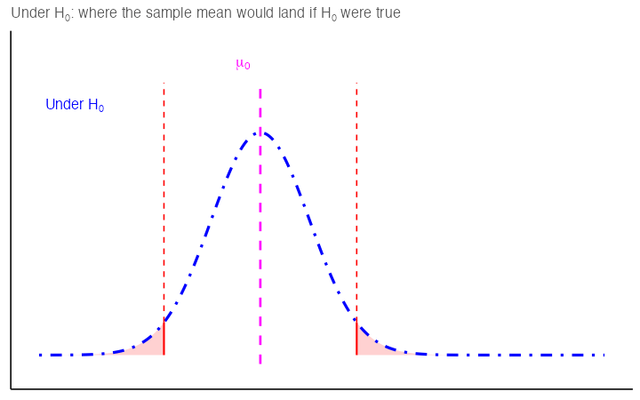

```{r, include = FALSE}
source("global_stuff.R")
```

```{r, include=FALSE}
library(ggplot2)
library(dplyr)
library(gridExtra)
library(kableExtra)

# Type I / Type II figures: Chapter 4's reject/fail figure (decision_panel()),
# same curves, colors, line types and labels, plus the truth in orange:
# the true population distribution and a line at its mean, mu.
# x-bar is lime (label a darker green for legibility) so it reads first.
# Positions are in standard errors. Type I x-bar matches where the recap GIF stops.
err_se      <- 0.4   # standard error, as in Ch4's decision figures
err_sigma   <- 0.8   # population SD: twice the standard error, so n = 4
t1_xbar_se  <- 2.4   # Type I:  mu = mu0, x-bar 2.4 SE out, past the critical value
t2_mu_se    <- 4.0   # Type II: mu 4.0 SE from mu0
t2_xbar_se  <- 1.5   # Type II: x-bar 1.5 SE from mu0, inside the critical value, 2.5 SE below mu

error_panel <- function(xbar, mu, se = err_se, sigma = err_sigma, mu0 = 0,
                        xlim = c(-2.2, 3.6), y_top = 1.38, verdict = NULL) {
  k <- y_top / 1.38
  xs <- seq(xlim[1], xlim[2], by = 0.005)
  crit <- 1.96 * se
  h0 <- data.frame(x = xs, y = dnorm(xs, mu0, se))
  ggplot() +
    geom_area(data = subset(h0, x <= mu0 - crit), aes(x, y), fill = "red", alpha = 0.18) +
    geom_area(data = subset(h0, x >= mu0 + crit), aes(x, y), fill = "red", alpha = 0.18) +
    geom_line(aes(xs, dnorm(xs, mu, sigma)), colour = "orange", linewidth = 1.2) +
    geom_line(data = h0, aes(x, y), colour = "blue", linetype = "dotdash", linewidth = 1.2) +
    geom_line(aes(xs, dnorm(xs, xbar, se)), colour = "darkgreen", linetype = "dotdash", linewidth = 1.2) +
    annotate("segment", x = mu0 + c(-crit, crit), xend = mu0 + c(-crit, crit), y = 0,
             yend = dnorm(crit, 0, se), colour = "red", linewidth = 0.8) +
    annotate("segment", x = xbar - crit, xend = xbar + crit, y = -0.04 * k, yend = -0.04 * k,
             colour = "darkgreen", linewidth = 3) +
    # orange mu line first, so where mu = mu0 the magenta dashes show over it
    annotate("segment", x = mu, xend = mu, y = -0.04 * k, yend = 1.22 * k, colour = "orange", linewidth = 0.9) +
    annotate("segment", x = mu0, xend = mu0, y = -0.04 * k, yend = 1.22 * k, colour = "magenta",
             linetype = "dashed", linewidth = 1) +
    annotate("segment", x = xbar, xend = xbar, y = -0.04 * k, yend = 1.22 * k, colour = "limegreen", linetype = "dotted", linewidth = 1.6) +
    annotate("text", x = mu0 - 0.08, y = 1.3 * k, label = "mu[0]", parse = TRUE, hjust = 1, colour = "magenta", size = 5) +
    annotate("text", x = mu + 0.08, y = 1.3 * k, label = "mu", parse = TRUE, hjust = 0, colour = "orange", size = 5) +
    # x-bar label level with the others; drops only if it would collide with the mu label
    annotate("text", x = xbar + 0.08, y = if (xbar < mu && mu - xbar < 0.35) 1.18 * k else 1.3 * k,
             label = "bar(x)", parse = TRUE, hjust = 0, colour = "#1E9E1E", size = 5.5, fontface = "bold") +
    annotate("text", x = xlim[1] + 0.05, y = 1.12 * k, label = "'Under '*H[0]", parse = TRUE, hjust = 0, colour = "blue", size = 4.5) +
    annotate("text", x = xlim[1] + 0.05, y = 1.02 * k, label = "From the sample", hjust = 0, colour = "darkgreen", size = 4.5) +
    annotate("text", x = xlim[1] + 0.05, y = 0.92 * k, label = "The truth", hjust = 0, colour = "orange", size = 4.5) +
    coord_cartesian(xlim = xlim, ylim = c(-0.08 * k, y_top)) +
    { if (!is.null(verdict)) annotate("label", x = xlim[2] - 0.1, y = 0.55 * y_top, label = verdict, hjust = 1,
                                      size = 7, fontface = "bold", colour = if (verdict == "Reject") "red3" else "grey25",
                                      fill = "white", label.size = 0.9, label.padding = unit(0.35, "lines")) } +
    labs(x = NULL, y = NULL) +
    theme_classic() +
    theme(axis.text = element_blank(), axis.ticks = element_blank())
}
```

# Errors, Power, and Effect Size

> *It is better to be roughly right than precisely wrong.*
>
> Attributed to John Maynard Keynes

Chapter 4 ended with a hypothesis test that either rejects $H_0$ or fails to reject it.

This chapter first asks how often that decision is wrong, and in which direction. It then asks how large the effect is and whether the study had enough data to detect it. It closes with how to report a result.

## Errors in hypothesis testing

Sometimes, even when we apply the test correctly, sampling variability can lead us to the wrong conclusion.

-   **Type I error ($\alpha$):** Rejecting $H_0$ when it is actually true. It is a false alarm, like a smoke alarm going off when there is no fire. By convention, $\alpha$ is often set at 0.05 (5%).

-   **Type II error ($\beta$):** Failing to reject $H_0$ when it is actually false. It is a missed signal, like a smoke alarm staying silent when there *is* a fire.

The table crosses the two possible decisions with the two possible truths, giving two correct outcomes and two errors.

| Decision                 | If the null hypothesis is True | If the null hypothesis is False |
|---------------------|-------------------------|--------------------------|
| **Reject $H_0$**         | Type I error (prob = $\alpha$) | Correct (prob = 1 - $\beta$)    |
| **Fail to reject $H_0$** | Correct (prob = 1 - $\alpha$)  | Type II error (prob = $\beta$)  |

For a fixed sample size and effect size, lowering $\alpha$ raises $\beta$, because a stricter standard for rejecting $H_0$ makes it easier to miss a real difference. Rows 2 and 3 of @tbl-5power-sims later show this in numbers for one design.

@fig-5recap-gif recaps the test from Chapter 4. The distance between the two sampling distributions, in standard errors, decides whether we reject $H_0$.

```{r}
#| label: fig-5recap-gif
#| fig-cap: 'The two sampling distributions of the sample mean from Chapter 4. The distance between them, in standard errors, decides the test. When the distance passes 1.96, the test rejects $H_0$.'
#| fig-alt: "Animation. A blue dot-dash bell curve centered on a magenta dashed line labeled mu sub 0, with red critical-value lines and shaded tails, appears first. A dark-green dot-dash curve of the same width is added, centered on a lime-green dotted line labeled x-bar, with a confidence interval bar underneath and an arrow showing the distance between mu sub 0 and x-bar in standard errors. The green curve slides right in steps from 0.8 to 2.4 standard errors; a gray Fail to reject box turns into a red Reject box once the distance passes 1.96."
#| out-width: "100%"


```

-   In @fig-5key.type1_error, the true population mean (orange) is the same as $\mu_0$. By chance, however, the sample mean is `r t1_xbar_se` standard errors from $\mu_0$, and the CI excludes $\mu_0$. The test rejects $H_0$ even though it is true, which is a Type I error.

```{r}
#| label: fig-5key.type1_error
#| fig-cap: 'Type I error: $H_0$ is true ($\mu=\mu_0$), but the sample leads us to reject $H_0$.'
#| fig-alt: "A blue dot-dash bell curve centered on a magenta dashed line labeled mu sub 0, with red critical-value lines and shaded tails. A solid orange line labeled mu lies exactly on the magenta line, and a wide, low orange bell curve is centered there too. A dark-green dot-dash bell curve of the same width as the blue one is to the right, centered on a thick lime-green dotted line labeled x-bar that lies just past the right critical value. The thick dark-green confidence interval bar under it starts just to the right of mu sub 0, so it excludes mu sub 0."
#| out-width: "100%"

error_panel(xbar = t1_xbar_se * err_se, mu = 0, verdict = "Reject")
```

-   In @fig-5key.type2_error, the true population mean (orange) is `r t2_mu_se` standard errors from $\mu_0$. By chance, however, the sample mean is only `r t2_xbar_se` standard errors from $\mu_0$, inside the critical value, and the CI includes $\mu_0$. The test fails to reject $H_0$ even though it is false, which is a Type II error.

```{r}
#| label: fig-5key.type2_error
#| fig-cap: 'Type II error: $H_0$ is false (true population mean differs from $\mu_0$), but the sample leads us to fail to reject $H_0$.'
#| fig-alt: "A blue dot-dash bell curve centered on a magenta dashed line labeled mu sub 0, with red critical-value lines and shaded tails. Well to the right, a solid orange line labeled mu marks the center of a wide, low orange bell curve. A dark-green dot-dash bell curve of the same width as the blue one is between them, centered on a thick lime-green dotted line labeled x-bar that lies inside the right critical value. The thick dark-green confidence interval bar under it reaches back past mu sub 0, so it includes mu sub 0."
#| out-width: "100%"

error_panel(xbar = t2_xbar_se * err_se, mu = t2_mu_se * err_se, verdict = "Fail to reject")
```

Those two figures show what a wrong conclusion looks like for one unlucky sample. They do not show how *often* it happens. The green curve in them is built from that one sample, centered on its $\bar{x}$. To see how often an error happens, center the sampling distribution on a possible truth instead. A sampling distribution centered on a possible truth shows how far from $\mu_0$ the sample mean would be across all the samples we could have drawn.

@fig-5alpha-beta does that. The blue curve is the sampling distribution of the sample mean under $H_0$, the one that sets the critical values. The orange curve is the sampling distribution of the sample mean if $\mu = \mu_a$. Because it shows sample means, it has the same width as the blue curve, and it is half as wide as the orange population curve in the last two figures.

Chapter 4 drew the possible true populations under $H_a$ as a family of curves on either side of $\mu_0$, and $\mu_a$ is the center of one of them. Because we never know the true $\mu$, we choose a value for $\mu_a$ and ask how the test would perform if that value were true. The farther $\mu_a$ is from $\mu_0$, the less likely the test is to miss the difference.

-   $\alpha$ is the red area in the tails of the blue curve, past the critical values. If $H_0$ is true, that is how often the sample mean falls in the rejection region anyway.
-   $\beta$ is the gray area under the orange curve *between* the critical values. If $\mu = \mu_a$, that is how often the sample mean fails to reach the rejection region and a real difference goes undetected.
-   Power, $1-\beta$, is the rest of the orange curve, the part past the critical values.

```{r}
#| label: fig-5alpha-beta
#| fig-cap: 'The two error rates, drawn on sampling distributions. Top: $\alpha$ is the red area in the tails of the curve under $H_0$. Bottom: the curve for one specific alternative value $\mu_a$ is added. $\beta$ is the gray area under it between the critical values, and power is the orange area past the right critical value.'
#| fig-height: 6.6
#| fig-alt: "Two stacked panels sharing the same axes. The top panel shows a single blue dot-dash bell curve centered at the null mean, marked with a magenta dashed vertical line labeled mu sub 0, with red vertical lines labeled minus crit and plus crit at the critical values on either side and small red shaded tails beyond them, each labeled alpha over two. The bottom panel repeats that curve and adds an orange dot-dash bell curve of the same width centered well to the right. The region under the orange curve lying between the two critical-value lines is shaded gray and labeled beta, while the part of the orange curve past the right critical line is shaded orange and labeled power."
#| out-width: "100%"

mu0_ab <- 0; mua_ab <- 2.5; se_ab <- 1; crit_ab <- 1.96
x_ab <- seq(-4, 6.5, length.out = 3000)
d_ab <- data.frame(x = x_ab,
                   null = dnorm(x_ab, mu0_ab, se_ab),
                   alt  = dnorm(x_ab, mua_ab, se_ab))

beta_ab  <- pnorm(crit_ab, mua_ab, se_ab) - pnorm(-crit_ab, mua_ab, se_ab)
power_ab <- 1 - beta_ab

leg_ab <- c(
  expression(paste("Sampling distribution of the sample mean under ", H[0])),
  expression(paste("Sampling distribution of the sample mean if ", mu == mu[a])))

# Critical values and mu0 run the full height and are labeled at the top,
# so it is clear where each boundary comes from.
shell_ab <- function(p) {
  p +
    annotate("segment", x = c(-crit_ab, crit_ab), xend = c(-crit_ab, crit_ab),
             y = 0, yend = .52, color = "red", linewidth = .7) +
    annotate("segment", x = mu0_ab, xend = mu0_ab, y = 0, yend = .52,
             linetype = "dashed", color = "magenta", linewidth = .9) +
    annotate("text", x = c(-crit_ab, crit_ab), y = .545,
             label = c("-crit", "+crit"), color = "red", size = 4.2) +
    annotate("text", x = mu0_ab, y = .545, label = "mu[0]", parse = TRUE,
             color = "magenta", size = 4.5) +
    scale_color_manual(values = c(null = "blue", alt = "orange"),
                       limits = c("null", "alt"), breaks = c("null", "alt"),
                       labels = leg_ab, drop = FALSE) +
    coord_cartesian(xlim = c(-4, 6.5), ylim = c(0, 0.56)) +
    theme_classic() +
    theme(legend.position = "bottom", axis.text = element_blank(),
          axis.title = element_blank(), axis.ticks = element_blank(),
          legend.text = element_text(size = 11), plot.title = element_text(size = 11)) +
    guides(color = guide_legend(title = NULL, nrow = 2))
}

null_ab <- geom_line(data = d_ab, aes(x, null, color = "null"), linetype = "dotdash", linewidth = 1.1)
alt_ab  <- geom_line(data = d_ab, aes(x, alt,  color = "alt"),  linetype = "dotdash", linewidth = 1.1)
ashade_ab <- list(
  geom_area(data = subset(d_ab, x <= -crit_ab), aes(x, null), fill = "red", alpha = .18),
  geom_area(data = subset(d_ab, x >=  crit_ab), aes(x, null), fill = "red", alpha = .18))
bshade_ab <- geom_area(data = subset(d_ab, x > -crit_ab & x < crit_ab),
                       aes(x, alt), fill = "gray50", alpha = .35)
alabs_ab <- list(
  annotate("segment", x = -3.05, xend = -2.25, y = .088, yend = .022,
           arrow = arrow(length = unit(.14, "cm")), linewidth = .4),
  annotate("text", x = -3.2, y = .125, label = "alpha/2", parse = TRUE, size = 4.5),
  annotate("segment", x = 3.30, xend = 2.30, y = .088, yend = .022,
           arrow = arrow(length = unit(.14, "cm")), linewidth = .4),
  annotate("text", x = 3.45, y = .125, label = "alpha/2", parse = TRUE, size = 4.5))
blab_ab <- annotate("text", x = 1.30, y = .085, label = "beta", parse = TRUE, size = 5.5)
# Power is the rest of the alternative curve, past the critical value. Shade it,
# so all three quantities are readable off the same panel rather than two of three.
pshade_ab <- geom_area(data = subset(d_ab, x >= crit_ab), aes(x, alt),
                       fill = "orange", alpha = .30)
plab_ab <- annotate("text", x = 3.05, y = .15, label = "power", color = "darkorange3", size = 4.5)

ab_top <- shell_ab(ggplot() + ashade_ab + null_ab + alabs_ab) +
  ggtitle(expression(paste(alpha, ": the rate of rejecting a true ", H[0]))) +
  theme(legend.position = "none")
ab_bot <- shell_ab(ggplot() + bshade_ab + pshade_ab + ashade_ab + null_ab + alt_ab + blab_ab + plab_ab) +
  ggtitle(expression(paste(beta, ": the rate of missing a real difference of this size")))

patchwork::wrap_plots(ab_top, ab_bot, ncol = 1)
```

In @fig-5alpha-beta, $\mu_a$ is `r mua_ab / se_ab` standard errors above $\mu_0$, which leaves $\beta = `r round(beta_ab, 2)`$ and power $= `r round(power_ab, 2)`$. This design misses a real difference of that size in almost three tries out of ten. Slide the orange curve farther right, meaning a larger real difference, and the gray area shrinks. Move the red lines outward, meaning a smaller $\alpha$, and the gray area grows.

### Effect of sample size on errors

**Sample size mainly affects Type II error.** With small $n$, the sampling distribution is wide, true effects are harder to detect, and $\beta$ increases (power decreases). As $n$ grows, the sampling distribution narrows, $\beta$ falls, and power rises. With a fixed $\alpha$ and correct assumptions, the long-run Type I error rate stays at $\alpha$ for any $n$.

The actual Type I rate can differ from $\alpha$ in two cases. At small $n$, it can drift from $\alpha$ when an assumption fails, for example when the population is strongly skewed. Testing the data again each time new observations arrive also raises the Type I rate, at any $n$.

@fig-5type2-samplesize shows the effect of $n$ on Type II error with the same $\mu_0$, the same true $\mu$, and the same unlucky sample, in which $\bar{x}$ is 2.5 standard errors below $\mu$. With the smaller sample, the confidence interval still catches $\mu_0$ and we fail to reject. With four times the sample, the standard error halves, the interval clears $\mu_0$, and we reject $H_0$.

```{r}
#| label: fig-5type2-samplesize
#| fig-cap: 'The Type II situation at two sample sizes, with the same $\mu_0$, true $\mu$ and population. In both, $\bar{x}$ is 2.5 standard errors below $\mu$. Top: the confidence interval catches $\mu_0$, so we fail to reject. Bottom: with four times the sample, the standard error halves, the same bad luck leaves the interval clear of $\mu_0$, and we reject.'
#| fig-alt: "Two stacked panels on the same axes. Both show a blue dot-dash curve centered on a magenta dashed line labeled mu sub 0 with red critical lines, a wide orange curve centered on an orange line labeled mu well to the right, and a dark-green dot-dash curve centered on a lime-green dotted line labeled x-bar between them, with a dark-green confidence interval bar underneath. Top panel: the blue and green curves are wide and short, the interval bar reaches back past mu sub 0, and a gray box reads Fail to reject. Bottom panel: the blue and green curves are half as wide and twice as tall, x-bar is closer to mu, the interval bar ends well to the right of mu sub 0, and a red box reads Reject. The orange curve is the same in both panels."
#| fig-height: 9
#| out-width: "100%"

n_mu  <- t2_mu_se * err_se           # the Type II figure's true mean
n_yt  <- 2.2                         # shared y range: fits the taller 4n curves
n_vdt <- function(xb, se) if (abs(xb) >= 1.96 * se) "Reject" else "Fail to reject"
n_se  <- c(err_se, err_se / 2)       # n, then 4n
n_xb  <- n_mu - 2.5 * n_se           # the same bad luck in both: 2.5 SE below mu
patchwork::wrap_plots(
  error_panel(xbar = n_xb[1], mu = n_mu, se = n_se[1], y_top = n_yt, verdict = n_vdt(n_xb[1], n_se[1])) +
    ggtitle("Sample size n"),
  error_panel(xbar = n_xb[2], mu = n_mu, se = n_se[2], y_top = n_yt, verdict = n_vdt(n_xb[2], n_se[2])) +
    ggtitle("Sample size 4n: the standard error halves"),
  ncol = 1)
```


### How to interpret $p$-values

A $p$-value is the probability, assuming $H_0$ is true, of obtaining a test statistic at least as extreme as the one we observed. We reject at level $\alpha$ when $p<\alpha$.

**Tails.** Count only the tail or tails that $H_a$ points to: both tails for a two-tailed test, one tail for a one-tailed test.

::: {.callout-caution title="Warning: Three misreadings of a $p$-value"}
1.  $p$ is *not* the probability that $H_0$ is true.
2.  A tiny $p$ is not "super significant." It means only that the data would be very unlikely if $H_0$ were true. The effect itself can still be tiny and not worth acting on, especially with a large $n$. Report an effect size and a CI so a reader can judge whether it matters.
3.  A large $p$ does not show that there is no effect. With small $n$, true effects can yield large $p$ (low power).
:::


## Beyond the 0.05 cutoff

Effect size and power answer two questions that a decision at $\alpha = 0.05$ leaves open. People who act on a result, such as scientists, managers, and policymakers, need to know how large an effect is and how likely the study was to detect it.

**Working definitions**

-   **Statistical significance:** the result is unlikely under $H_0$, at your chosen $\alpha$.

-   **Effect:** the difference a study is about, such as how far apart two group means are, or how far a mean is from the value $H_0$ states.

-   **Practical significance:** the effect is large enough to change what someone does about it. This is a judgment about the world, not a calculation. With a large enough $n$, a result can be statistically significant and practically trivial. With too small an $n$, a result can be practically important and still not statistically significant.

-   **Effect size:** how large that difference is, in the study's units or in standard deviations.

-   **Power ($1-\beta$):** the probability your design will detect a real effect of a specified size at your chosen $\alpha$.

**Plan effect size and power before you sample.** Decide what effect is *meaningful* for your context (e.g., a 0.3 mg/L nitrate reduction) and size your study to have adequate power, commonly 80%, to detect that effect.

### One tail or two

Chapter 4 gave two versions of the rule for a one-tailed test. In the action version, a difference in the other direction would not change your action. In the stricter theory version, theory rules out the other direction, and that is hard to satisfy. Now that we have defined practical significance, you can answer the action version's question before you collect data. A one-tailed test is justified when

-   the direction is set *before* seeing the data, and
-   a result in the other direction would lead to the same action as no result.

A city testing whether a no-idling rule changed $\mathrm{PM}_{2.5}$ near schools would act on a rise just as much as on a drop, so that test stays two-tailed. For a plant checking whether its discharge exceeds a permit limit of 10 mg/L, a mean below the limit leads to the same action as a mean at the limit, which is to keep operating. That test can be one-tailed, with $H_a: \mu > 10$, as long as the plant wrote the direction down before sampling.

```{r}
#| include: false
crit1_ab  <- qnorm(0.95)
beta1_ab  <- pnorm(crit1_ab, mua_ab, se_ab)
power1_ab <- 1 - beta1_ab
```

A one-tailed test puts all of $\alpha$ in one tail, which moves the critical value in, from 1.96 to 1.645, so a real effect in that direction is easier to catch. For the design in @fig-5alpha-beta, $\beta$ drops from `r sprintf("%.2f", beta_ab)` to `r sprintf("%.2f", beta1_ab)` and power rises from `r sprintf("%.2f", power_ab)` to `r sprintf("%.2f", power1_ab)`. @fig-5one-two-tail draws both tests on that design.

```{r}
#| label: fig-5one-two-tail
#| fig-cap: 'The same alternative under a two-tailed and a one-tailed test at $\alpha = 0.05$. Top: two-tailed, with $\alpha/2$ in each tail. Bottom: one-tailed, with all of $\alpha$ in the right tail, so the critical value moves in, the gray $\beta$ area shrinks and the orange power area grows. The faint curve on the left is an effect of the same size in the other direction, which the one-tailed test never detects.'
#| fig-height: 6.6
#| fig-alt: "Two stacked panels sharing the same axes. Both show a blue dot-dash bell curve centered on a magenta dashed line labeled mu sub 0 and an orange dot-dash bell curve of the same width centered to the right. Top panel, titled two-tailed: red lines at minus crit and plus crit, a small red shaded tail on each side, a gray area under the orange curve between the red lines labeled beta, and an orange area past the right red line labeled power. Bottom panel, titled one-tailed: a single red line at plus crit, closer to mu sub 0 than in the top panel, with a larger red shaded tail on the right only. The gray beta area under the orange curve is smaller and the orange power area is larger. A faint orange curve of the same width is centered the same distance to the left of mu sub 0, with no rejection region under it, labeled never detected."
#| out-width: "100%"

# One-tailed version of the bottom panel of fig-5alpha-beta: same shell, axes,
# colors and labels, with one critical value at +1.645 instead of two at +/-1.96.
shell1_ab <- function(p) {
  p +
    annotate("segment", x = crit1_ab, xend = crit1_ab,
             y = 0, yend = .52, color = "red", linewidth = .7) +
    annotate("segment", x = mu0_ab, xend = mu0_ab, y = 0, yend = .52,
             linetype = "dashed", color = "magenta", linewidth = .9) +
    annotate("text", x = crit1_ab, y = .545, label = "+crit", color = "red", size = 4.2) +
    annotate("text", x = mu0_ab, y = .545, label = "mu[0]", parse = TRUE,
             color = "magenta", size = 4.5) +
    scale_color_manual(values = c(null = "blue", alt = "orange"),
                       limits = c("null", "alt"), breaks = c("null", "alt"),
                       labels = leg_ab, drop = FALSE) +
    coord_cartesian(xlim = c(-4, 6.5), ylim = c(0, 0.56)) +
    theme_classic() +
    theme(legend.position = "bottom", axis.text = element_blank(),
          axis.title = element_blank(), axis.ticks = element_blank(),
          legend.text = element_text(size = 11), plot.title = element_text(size = 11)) +
    guides(color = guide_legend(title = NULL, nrow = 2))
}

d1_ab <- transform(d_ab, other = dnorm(x_ab, mu0_ab - mua_ab, se_ab))
other1_ab <- list(
  geom_line(data = d1_ab, aes(x, other), color = "orange", alpha = .45,
            linetype = "dotdash", linewidth = 1.1),
  annotate("text", x = mu0_ab - mua_ab, y = .45, label = "never detected",
           color = "darkorange3", size = 4.2))
ashade1_ab <- geom_area(data = subset(d_ab, x >= crit1_ab), aes(x, null), fill = "red", alpha = .18)
bshade1_ab <- geom_area(data = subset(d_ab, x < crit1_ab), aes(x, alt), fill = "gray50", alpha = .35)
pshade1_ab <- geom_area(data = subset(d_ab, x >= crit1_ab), aes(x, alt), fill = "orange", alpha = .30)
blab1_ab <- annotate("text", x = 1.05, y = .085, label = "beta", parse = TRUE, size = 5.5)

tail2_ab <- shell_ab(ggplot() + bshade_ab + pshade_ab + ashade_ab + null_ab + alt_ab + blab_ab + plab_ab) +
  ggtitle(paste0("Two-tailed: power ", sprintf("%.2f", power_ab))) +
  theme(legend.position = "none")
tail1_ab <- shell1_ab(ggplot() + other1_ab + bshade1_ab + pshade1_ab + ashade1_ab + null_ab + alt_ab +
                        blab1_ab + plab_ab) +
  ggtitle(paste0("One-tailed: power ", sprintf("%.2f", power1_ab)))

patchwork::wrap_plots(tail2_ab, tail1_ab, ncol = 1)
```

The cost is that a one-tailed test cannot detect an effect in the other direction at all, however large it is. In the bottom panel of @fig-5one-two-tail, the faint curve on the left is an effect of the same size in the other direction, and no rejection region lies under it.

Choosing the tail after looking at which way the data went amounts to a two-tailed test at $\alpha = 0.10$. The actual Type I error rate is then 0.10, double the 0.05 you report.

## Effect size

Effect size comes in two kinds of units. You can express it in original units, which carry practical meaning, or in standardized units, which let you compare across scales.

**Practical (original units).** Use the scale stakeholders recognize.

-   Exams: "Treatment improved scores by 5 percentage points" (half a letter grade).
-   Time-on-task: "New training reduces practice time by 1,000 hours out of 10,000" (a 10% reduction).

These statements are easy to interpret, but they are hard to compare across contexts or measures. To say whether a 5-point exam gain is a larger effect than a 1,000-hour cut in practice time, you need each one measured against the variability of its own scale.

**Standardized (unitless).** When units are unfamiliar or scales differ, standardize by typical variability. The most common standardized effect size metric is **Cohen's $d$** [@Cohen1988]. It divides the raw difference, $\Delta$, by the population standard deviation:

$$d = \frac{\Delta}{\sigma}$$

$\Delta$ is $\mu_1 - \mu_2$ when comparing two groups, or $\mu - \mu_0$ when testing one mean against a reference value.

**$d$ and $z$ both put the effect in the numerator but divide by different things.** Chapter 4 gave the general shape, effect over error, and filled it in with the $z$:

$$z = \frac{\bar{x}-\mu_0}{\sigma/\sqrt{n}} \qquad \text{versus} \qquad d = \frac{\mu-\mu_0}{\sigma}$$

In $z$ the numerator is the observed effect, $\bar{x}-\mu_0$. In $d$ it is the true effect, $\mu-\mu_0$, which $\bar{x}-\mu_0$ estimates. The test statistic divides by the standard error, which shrinks as $n$ grows, so $z$ gets larger with more data even when the effect stays exactly the same. Quadrupling $n$ halves the standard error, so the same $\bar{x}-\mu_0$ gives twice the $z$. Cohen's $d$ divides by the standard deviation, which does not shrink with $n$, so $d$ reports the size of the effect itself. @tbl-5z-vs-d lines the two up.

|  | $z$ | Cohen's $d$ |
|---|---|---|
| Numerator | $\bar{x}-\mu_0$ (observed effect) | $\mu-\mu_0$ (true effect, estimated by $\bar{x}-\mu_0$) |
| Denominator | $\sigma/\sqrt{n}$ | $\sigma$ |
| As $n$ grows | Grows for the same effect | Stays the same |
| Answers | Is the effect distinguishable from 0? | How large is the effect? |

: The test statistic $z$ and the effect size $d$ compared. {#tbl-5z-vs-d}

A large test statistic therefore does not mean a large effect, and the two numbers answer different questions. With enough data, a trivial difference can produce a $z$ as large as you like, while $d$ stays small. In a one-sample test, $z = d\sqrt{n}$, so an effect of $d = 0.05$ gives $z = 0.5$ at $n = 100$ and $z = 5$ at $n = 10{,}000$. The $t$ in Chapter 6 is the same ratio with an estimated $s$ in place of a known $\sigma$, so the same holds for $t$.

**Environmental example (biodiversity index).** Suppose an index increases from 3 to 4 after reforestation.

-   In raw units: +1 index point.

-   In standardized terms:

    -   If the SD across sites is 1.0, then $d = 1.0$, a large shift.
    -   If the SD is 10, then $d = 0.10$, a small shift.

The same 1-point increase is a large effect where the index varies little across sites and a small one where it varies a lot.

**Planning starts from $\Delta$.** To plan a study, choose the value of $\Delta$ to plan for, in the units of the study. It might be the effect you expect to see, or the smallest difference that would change what you do. A power calculation also needs an estimate of $\sigma$, and with $\Delta$ and $\sigma$ you have Cohen's $d = \Delta/\sigma$. The same $d$ also lets you compare effect sizes across studies.


::: {.callout-tip title="Tip: Estimating and reporting $d$ in practice"}
-   With measured data, $\sigma$ is unknown, so estimate it from the sample. For two groups, use the pooled SD from Chapter 6.
-   Heuristics (context matters): $d \approx 0.2$ (small), $d \approx 0.5$ (medium), $d \approx 0.8$ (large).
-   A "small" $d$ can still be important (e.g., small reductions in lead or $\mathrm{PM}_{2.5}$ can matter for health).
-   Report a 95% CI with each effect size to show how precisely it was estimated.
:::

Suppose we're measuring final exam performance (percent correct). The class mean is 65% with a standard deviation of 5 percentage points. Group A is a control, while Group B receives some instructional treatment.

@fig-5.5effectdistsB shows four possible scenarios, with Group B's mean shifted by $d = 0$, 0.5, 1 and 2.

```{r}
#| label: fig-5.5effectdistsB
#| fig-cap: 'Exam scores for a control group A (mean 65, $\sigma = 5$) and a treatment group B whose mean is shifted by $d = 0$, 0.5, 1 and 2, that is, by 0, 2.5, 5 and 10 points.'
#| fig-alt: "Four panels, each showing two overlaid bell-shaped density curves for groups A and B. In the first panel the curves lie exactly on top of each other (no shift). In the next three panels group B's curve shifts progressively further right of group A's, first by a small amount, then a larger amount, and finally a 2-SD shift, where the curves overlap only in their tails."
#| out-width: "100%"


x_es <- seq(45, 95, .5)
shifts <- c("d = 0" = 65, "d = 0.5" = 67.5, "d = 1" = 70, "d = 2" = 75)

df <- do.call(rbind, lapply(names(shifts), function(lab) {
  data.frame(
    effect_size = lab,
    condition   = rep(c("A", "B"), each = length(x_es)),
    X           = rep(x_es, 2),
    Y           = c(dnorm(x_es, 65, 5), dnorm(x_es, shifts[[lab]], 5))
  )
}))
df$effect_size <- factor(df$effect_size, levels = names(shifts))

ggplot(df, aes(
  x = X,
  y = Y,
  group = condition,
  color = condition
)) +
  geom_line(linewidth = 1) +
  scale_color_manual(values = c(A = "blue", B = "orange")) +
  facet_wrap( ~ effect_size) +
  labs(x = "Exam score (%)", y = "Density", color = "Group")


```

In @fig-5.5effectdistsB, a half-SD shift ($d = 0.5$, 2.5 points) leaves the two curves mostly overlapping, and a two-SD shift ($d = 2$, 10 points) separates them.

In practice, we rarely know beforehand how big a shift to expect, so the power curves later in this chapter show power across a range of effect sizes.

## Power

A design's statistical power is how reliably it detects an effect of a given size. Effects vary in size, and designs vary in power. A design with low power will usually fail to reject $H_0$ even when a real effect exists.

Power rises when:

1.  Effect size is larger.
2.  Sample size ($n$) is larger (smaller $SE$).
3.  The test is less conservative (larger $\alpha$).
4.  Measurement noise is lower (smaller $\sigma$).

When you plan a study, you need to know how large $n$ must be to reach 80% power, with $\alpha$ fixed at 0.05, for the smallest effect that matters. @fig-5.5powercurveN answers that question for one effect size.

### Estimating power by simulation

A simulation with the exam-score example shows how design choices change power. We simulate two groups of $n=10$ each. We draw Group A (control) from a normal distribution with mean 65 and $\sigma = 5$, and Group B (treatment) from one with mean 67.5, a shift of 2.5 points, or Cohen's $d=0.5$, a medium effect. These are the two distributions in Panel 2 of @fig-5.5effectdistsB.

Each simulated experiment compares the two groups with an independent-samples $t$-test. Chapter 6 covers this test. For now, treat it as a test that returns a $p$-value for the difference between two group means, the same job the $z$ statistic in Chapter 4 does for one mean.

**Before you look.** One simulated experiment draws 10 scores for Group A and 10 for Group B, runs the $t$-test, and saves the $p$-value. The simulation repeats this 1,000 times and counts how often $p < 0.05$, which is how often the test rejects $H_0$ at $\alpha = 0.05$. In every one of the 1,000 experiments, Group B's true mean is 2.5 points higher. Decide roughly how often you expect the test to detect that difference with 10 per group.

```{r}
set.seed(2025)
p <- numeric(1000)
for(i in 1:1000){
  A <- rnorm(10, 65, 5)
  B <- rnorm(10, 67.5, 5)
  p[i] <- t.test(A,B,var.equal=TRUE)$p.value
}
power_n10 <- mean(p < 0.05)
```

```{r}
#| include: false
power_n10_exact <- power.t.test(n = 10, delta = 0.5, sd = 1, sig.level = 0.05, strict = TRUE)$power
d80_n10 <- power.t.test(n = 10, sd = 1, sig.level = 0.05, power = 0.80, strict = TRUE)$delta
```

The test detected the 2.5-point difference in about `r round(power_n10 * 100)`% of the 1,000 experiments. The proportion of simulated experiments that reject $H_0$ estimates the design's power, the probability that the test detects a real difference of this size. With $n = 10$ per group, the test misses this medium-sized effect in about `r 100 - round(power_n10 * 100)`% of experiments.

### How power changes

1.  **Larger $n$.** Doubling to $n=20$ per group divides the standard error of each group mean by $\sqrt{2}$, about 1.41.

```{r}
p <- numeric(1000)
for(i in 1:1000){
  A <- rnorm(20, 65, 5)
  B <- rnorm(20, 67.5, 5)
  p[i] <- t.test(A,B,var.equal=TRUE)$p.value
}
power_n20 <- mean(p < 0.05)
```

That increases power to about `r round(power_n20 * 100)`%, up from about `r round(power_n10 * 100)`% at $n = 10$ (rows 1 and 2 of @tbl-5power-sims).

2.  **Smaller $\alpha$.** Making the test more conservative (e.g., $\alpha=0.01$) lowers power, because only experiments with $p < 0.01$ now count as significant. We reuse the same $n=20$ simulations and change only the cutoff.

```{r}
power_n20_strict <- mean(p < 0.01)
```

Power falls to about `r round(power_n20_strict * 100)`% (row 3).

3.  **Larger effect.** If the treatment produces a 2-SD shift, so that Group B's mean is 75, we rerun the simulation with the same design at the same $\alpha=0.01$.

```{r}
p <- numeric(1000)
for(i in 1:1000){
  A <- rnorm(20, 65, 5)
  B <- rnorm(20, 75, 5)   # 2SD effect
  p[i] <- t.test(A,B,var.equal=TRUE)$p.value
}
power_big <- mean(p < 0.01)
```

The test rejected $H_0$ in `r round(power_big * 100)`% of the 1,000 experiments (row 4). A 2-SD difference is detected almost every time, even with 20 per group and $\alpha = 0.01$.

@tbl-5power-sims collects the four designs. Each row gives the simulated power and, next to it, the exact power for the same design, computed from the $t$ distribution.

```{r}
#| label: tbl-5power-sims
#| tbl-cap: "Simulated and exact power for the four designs. Group A's mean is 65 and $\\sigma = 5$ in every design."

pct <- function(x) ifelse(x < 1 & round(x * 100) >= 100,
                          sprintf("%.2f%%", x * 100), sprintf("%.0f%%", x * 100))
exact <- c(
  power.t.test(n = 10, delta = 0.5, sd = 1, sig.level = 0.05, strict = TRUE)$power,
  power.t.test(n = 20, delta = 0.5, sd = 1, sig.level = 0.05, strict = TRUE)$power,
  power.t.test(n = 20, delta = 0.5, sd = 1, sig.level = 0.01, strict = TRUE)$power,
  power.t.test(n = 20, delta = 2,   sd = 1, sig.level = 0.01, strict = TRUE)$power)
power_tab <- data.frame(
  n     = c(10, 20, 20, 20),
  alpha = c("0.05", "0.05", "0.01", "0.01"),
  B     = c("67.5 (0.5)", "67.5 (0.5)", "67.5 (0.5)", "75 (2)"),
  sim   = pct(c(power_n10, power_n20, power_n20_strict, power_big)),
  exact = pct(exact))
knitr::kable(power_tab, format = "pipe", align = "rrrrr",
             col.names = c("$n$ per group", "$\\alpha$", "Group B mean ($d$)",
                           "Simulated power (1,000 runs)", "Exact power"))
```

### Power curves

A design's power depends on how large the true effect is. A power curve plots the power of one fixed design against a range of effect sizes. @fig-5.5powercurve fixes the design at a two-sample $t$-test with $n=10$ per group and $\alpha=0.05$, and plots power against the true effect size, Cohen's $d$.

```{r}
#| label: fig-5.5powercurve
#| fig-cap: 'Power vs. effect size (Cohen’s $d$) for a two-sample $t$-test with $n=10$ per group and $\alpha=0.05$.'
#| fig-alt: "Line graph of power against effect size (Cohen's d) from 0 to 2. The curve starts near 0.05 at d = 0, rises slowly at first, then climbs steeply through the middle of the range, and flattens out near 1.0 as d approaches 2."
#| out-width: "100%"

# Exact power for a two-sample t-test (not the normal approximation):
# power.t.test uses the noncentral t, which is what the test actually uses.
effect_size <- seq(0, 2, .1)
# strict = TRUE counts both rejection tails, so power at d = 0 is exactly alpha.
power <- sapply(effect_size, function(d)
  power.t.test(n = 10, delta = d, sd = 1, sig.level = 0.05, strict = TRUE)$power)

plot_df <- data.frame(power, effect_size)

ggplot(plot_df, aes(x=effect_size, y=power))+
  geom_line(color = "#008cff", linewidth = 1.2)+
  labs(x = "Effect size (Cohen's d)", y = "Power")
```

With 10 per group, this design detects a medium effect ($d=0.5$) only about `r round(power_n10_exact * 100)`% of the time, a larger effect ($d=0.8$) about 40% of the time, and a very large effect ($d=2$) almost every time (about 99%). Only effects of about $d = `r round(d80_n10, 1)`$ or larger reach 80% power with this design.

The simulation above estimated power at $d = 0.5$ as about `r round(power_n10 * 100)`%. The two numbers differ because 1,000 simulated experiments give an estimate, while the curve is computed exactly.

The second curve holds the effect size fixed and varies the sample size. Suppose prior research suggests the effect is small ($d=0.2$). @fig-5.5powercurveN plots power against sample size for $d=0.2$, with a dashed line at 80% power, a common planning target.

```{r}
#| label: fig-5.5powercurveN
#| fig-cap: 'Power vs. sample size for detecting $d = 0.2$ with a two-sample $t$-test at $\alpha = 0.05$. The dashed line marks 0.80 power.'
#| fig-alt: "Line graph of power against sample size per group, from 10 to 800. Power starts at about 0.07 at 10 per group and rises in a curve that flattens as it approaches 1.0. A horizontal reference line at 0.80 power crosses the curve around a sample size of roughly 394 per group."
#| out-width: "100%"

n_seq <- seq(10, 800, 10)
power <- sapply(n_seq, function(n)
  power.t.test(n = n, delta = 0.2, sd = 1, sig.level = 0.05, strict = TRUE)$power)

n_for_80 <- power.t.test(delta = 0.2, sd = 1, sig.level = 0.05, power = 0.80)$n

plot_df <- data.frame(power, n_seq)

ggplot(plot_df, aes(x=n_seq, y=power))+
  geom_line(color = "#008cff", linewidth = 1.2)+
  geom_hline(yintercept=.8, color="grey40", linetype="dashed")+
  labs(x = "n per group", y = "Power")
```

At 10 per group, power to detect $d=0.2$ is about 7%, barely above $\alpha$. Reaching 80% power takes about `r ceiling(n_for_80)` per group. At that sample size, 20% of studies would still fail to reject $H_0$ for a real effect of $d = 0.2$.

Power analysis is a planning tool. The $n$ that reaches a power target such as 0.80 depends on the effect size and standard deviation you assumed. The `r ceiling(n_for_80)` per group above assumes $d = 0.2$, and assuming $d = 0.3$ instead gives `r ceiling(power.t.test(delta = 0.3, sd = 1, power = 0.80)$n)` per group. Report the assumed effect size and standard deviation alongside the $n$.

### Planning your design

Planning a study means working through the following, in order:

-   Choose the $\Delta$ to plan for. Here that is the smallest difference from $\mu_0$ that would change what you do, stated in the units of the measurement.
-   Choose $\alpha$ (often 0.05; justify if different).
-   Estimate variability, $\sigma$ (pilot data, literature, or historical monitoring). With $\Delta$ and $\sigma$ you have $d$, which is what a power calculation needs.
-   Compute $n$ for $\ge 80\%$ power (or explain tradeoffs if you can't reach it).
-   Pre-specify one- vs two-tailed before data collection.

This sequence is a **formal power analysis**. It applies when you are about to collect data and can still choose $n$, for example when deciding how many plots to establish or how many samples a permit application commits you to. When the data already exist, as in your course project, $n$ is fixed. Report the effect and its confidence interval instead.

::: {.callout-caution title="Warning: Post-hoc power"}
Do not compute power after the fact for the effect you observed. This **post-hoc power** is a restatement of the $p$-value, so a non-significant result always has low post-hoc power. Power for a difference chosen in advance, such as the smallest effect that matters, is fine to report.
:::

### Low power and very large samples

-   **A significant result from a low-power study often fails to replicate.** A design with 30% power to detect an effect that is really there rejects $H_0$ in only about 3 of 10 repeats, so a significant first result is usually followed by non-significant replications.

-   **A significant result from a small study overstates the effect.** When a small study does reach significance, its estimated effect size tends to be too large. When the null is true, that large estimate makes a false positive look convincing.

-   **Huge $n$ finds tiny effects.** With very large samples, trivial differences can register as statistically significant. For example, a utility comparing two billing designs across 2 million households can find a 0.1% difference in electricity use statistically significant, even though a difference that small would not change which design it adopts. Report an effect size and a confidence interval alongside each $p$-value so a reader can judge whether a difference matters.

@fig-5.5effectsizeType1 shows the second caution. When the null hypothesis is true, 5% of tests still give $p < 0.05$. In small samples, those false positives come with large estimated effect sizes, even though the true effect is zero. A one-sample test at $n = 10$ reaches $p < 0.05$ only when $|t| > `r sprintf("%.2f", qt(0.975, 9))`$, which means $|d| = |t|/\sqrt{10}$ must be at least `r sprintf("%.2f", qt(0.975, 9) / sqrt(10))`. At $n = 1{,}000$ the threshold is `r sprintf("%.2f", qt(0.975, 999) / sqrt(1000))`. Every significant result at $n = 10$ therefore reports an effect of at least `r sprintf("%.2f", qt(0.975, 9) / sqrt(10))`.

Each dot in @fig-5.5effectsizeType1 is one simulated study in which the true mean is exactly $\mu_0$. We ran 1,000 studies at each of four sample sizes (10, 50, 100, and 1,000) and kept only the ones that gave $p < 0.05$, about 50 at each size.

```{r}
#| label: fig-5.5effectsizeType1
#| fig-cap: 'Apparent effect size among Type I errors ($p<0.05$) under the null, by sample size, for a one-sample $t$-test. Effect sizes are shown as absolute values, since a false positive is equally likely in either direction and the sign carries no information here. Small $n$ inflates apparent effects.'
#| fig-alt: "Scatter plot of apparent effect size against p-value, restricted to the false positives with p below 0.05, colored by sample size (10, 50, 100, and 1000). Points from the smallest sample size, 10, reach the highest apparent effect sizes, well above 1. Points cluster progressively lower as sample size increases, and the points for a sample size of 1000 are close to zero across the full range of p-values."
#| out-width: "100%"

all_df<-data.frame()
for(i in 1:1000){
  for(n in c(10,50,100,1000)){
    some_data<-rnorm(n,0,1)
    p_value<-t.test(some_data)$p.value
    effect_size<-mean(some_data)/sd(some_data)
    t_df<-data.frame(sim=i,sample_size=n,p_value,effect_size)
    all_df<-rbind(all_df,t_df)
  }
}

type_I_error <- all_df[all_df$p_value<.05,]
type_I_error$sample_size<-factor(type_I_error$sample_size,
                                 levels = c(10, 50, 100, 1000))

ggplot(type_I_error, aes(x = p_value, y = abs(effect_size),
                         group = sample_size, color = sample_size)) +
  geom_point(size = 1.3) +
  theme_classic(base_size = 13) +
  xlab("p-value") +
  ylab("Apparent effect size (absolute)") +
  labs(color = "Sample size")
```


## Reporting results

A results statement is one sentence that states the finding in plain language and ends with the supporting statistics, in a fixed order, in parentheses.

**Template:** *Plain-language finding.* *(test, statistic, df or n, value of statistic, p-value, effect size/CI if relevant).*

**What to include (in order):**

1.  Test name (e.g., one-sample $z$, two-sample $t$, $\chi^2$, regression).
2.  Test statistic and its degrees of freedom (or sample size for $z$).
3.  Exact $p$ (report $p<0.001$ when very small).
4.  An effect size and/or a 95% CI when available.

**Examples**

-   **One-sample $z$.** The average mercury level within 10 km of the smelter, 0.62 mg/kg, was higher than the legal limit of 0.50 mg/kg ($z = 2.85$, $n = 32$, $p = 0.004$).

-   **One-sample $t$ with CI.** Mean nitrate exceeded the target by 0.41 mg/L ($t(31) = 2.60$, $p = 0.014$, 95% CI \[0.09, 0.73\] mg/L).

-   **Two-sample $t$ with effect size.** Downstream sites had higher turbidity than upstream sites ($t(58) = 3.10$, $p = 0.003$, Cohen's $d = 0.80$).

-   **Not significant (be explicit).** Mean canopy temperature did not differ from the baseline ($t(47) = 1.20$, $p = 0.236$), so we fail to reject $H_0$.

**Rounding and style**

-   Round statistics to 2 decimals; $p$ to 3 decimals (use $p<0.001$ when needed).
-   Use "fail to reject $H_0$" (not "accept").
-   State the direction the data went ("higher than," "lower than") when the test rejects, and "did not differ from" when it fails to reject.

**Do / Don't**

-   Do follow the sentence with one sentence on what the result means for the question.
-   Do include a CI or effect size when it aids interpretation.
-   Do give units for every value.
-   Do not restate methods.
-   Do not claim proof.


## Chapter Summary

**Why it matters.** A hypothesis test ends in reject or fail to reject, and that decision can be wrong in two ways. Effect size tells you how large the difference is, and power tells you whether the study could have detected it. Chapter 6 applies all of this to the $t$-tests.

**Core ideas**

-   **Two ways to be wrong.** A Type I error rejects a true $H_0$, at a rate you set with $\alpha$. A Type II error fails to reject a false one. For a fixed design, lowering $\alpha$ trades fewer Type I errors for more Type II errors. $\alpha = 0.05$ is a widely used convention for where to make that trade.
-   **What a $p$-value measures.** It is the probability of data at least as extreme as ours if $H_0$ were true. It is not the probability that $H_0$ is true, and it says nothing about how large an effect is.
-   **Significance and effect size answer different questions.** A significant result says the data would be unlikely if $H_0$ were true. The standard error shrinks as $n$ grows, so the same small difference produces a larger and larger test statistic. With a large enough $n$, even a trivially small difference is likely to be significant. Report an effect size and a confidence interval next to every $p$-value so a reader can judge whether the result matters.
-   **One tail only when the other direction would not change the action.** Choose a one-tailed test before seeing the data, and only when a result in the other direction would lead to the same action as no result. Choosing the tail afterward doubles the actual Type I error rate.
-   **Effect size in two kinds of units.** The same difference can be written in original units, $\Delta$, which carry practical meaning for the people who act on your result, or in standard deviations, Cohen's $d = \Delta/\sigma$, which makes results comparable across studies and scales. Report both when you can, and plan in $\Delta$, because the smallest difference worth detecting is a judgment made in the units of the measurement.
-   **Power is a design decision.** Power depends on $n$, effect size, $\alpha$, and variability together. An underpowered study usually misses real effects, and when it does reach significance, the effect it reports tends to be too large. Run a power analysis before collecting data, while $n$ can still be chosen.
-   **Report a result as a sentence.** State the direction in words, then give the test, the statistic with its df or $n$, the $p$-value, and an effect size or confidence interval.
